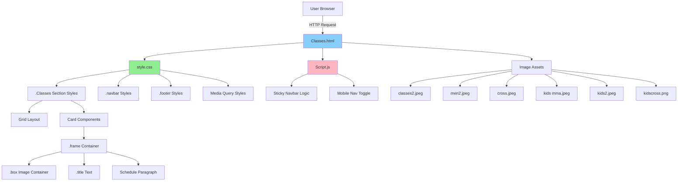
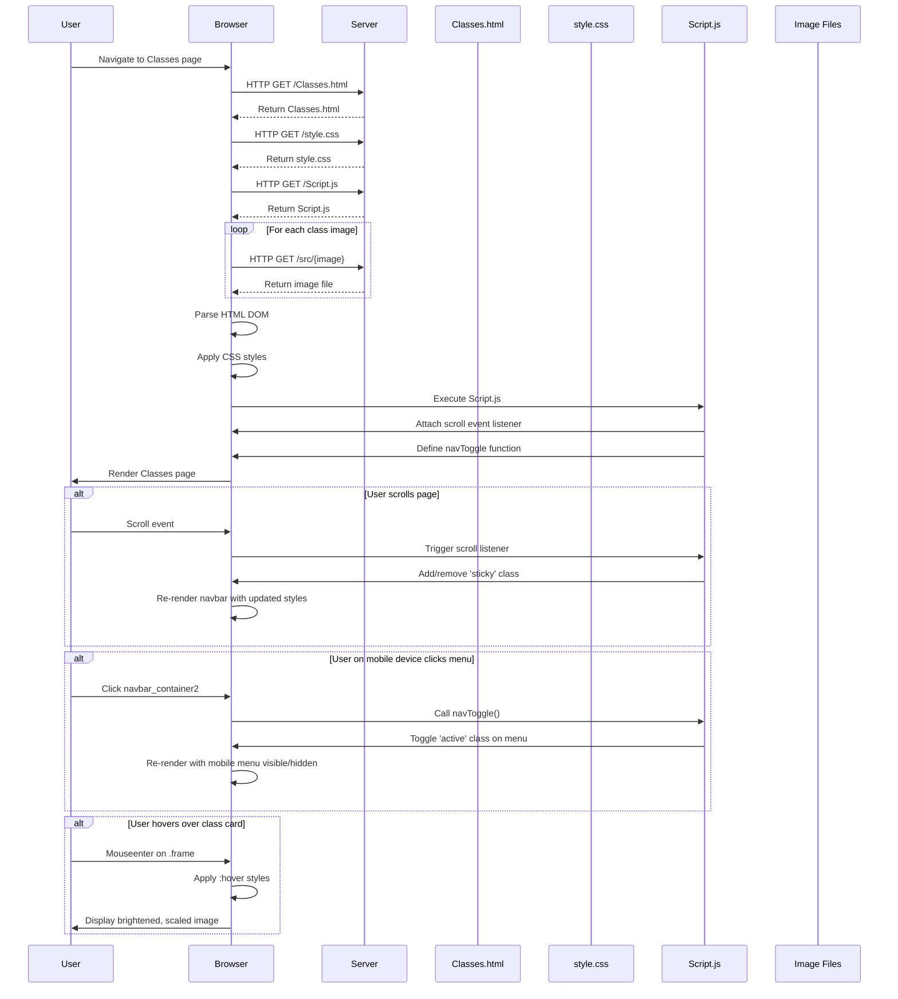

# Classes Feature Documentation

## Table of Contents

1. [Overview](#overview)
2. [Repo Use Cases](#repo-use-cases)
3. [High-Level Architecture](#high-level-architecture)
4. [Core Components](#core-components)
5. [Data Flow](#data-flow)
6. [Code Implementation](#code-implementation)
7. [Integration Points](#integration-points)
8. [Configuration](#configuration)
9. [Monitoring and Operations](#monitoring-and-operations)

## Overview

The Classes feature is a presentation subsystem within the SBG Doha MMA gym website that displays the available martial arts training programmes offered by the facility. It sits as one of six primary navigation sections in the static website (Home, About, Classes, Trainers, History, Contact).

The feature provides prospective and current members with essential information about class types, schedules, and target demographics (adults vs. kids). It is implemented as a single-page HTML view with associated CSS styling and minimal JavaScript interactivity.

**Key characteristics:**

- Displays six distinct class offerings (kickboxing, Brazilian Jiu-Jitsu, CrossFit for both adults and children)
- Presents each class as a visual card with image, title, and schedule information
- Responsive design that adapts layout for mobile and desktop viewing
- Static content with no dynamic data fetching or user interaction beyond navigation
- Integrated with site-wide navigation and footer components

## Repo Use Cases

### Use Case 1: Browse Available Classes

**Trigger:** User navigates to the Classes page via the main navigation menu or direct URL access to `Classes.html`.

**Expected Outcome:** The page displays a grid of six class cards, each showing a representative image, class name, and schedule. The user can visually scan all available class options.

**Main Components Involved:**
- `Classes.html` - provides the HTML structure and content
- `style.css` - renders the `.Classes` section with grid layout and card styling
- `Script.js` - provides navigation toggle functionality and sticky navbar behaviour

### Use Case 2: View Class Schedule Information

**Trigger:** User reads the schedule text displayed beneath each class card.

**Expected Outcome:** User obtains schedule information for each class (days and times), enabling them to determine which classes fit their availability.

**Main Components Involved:**
- Static HTML `<p>` elements within each `.frame` component in `Classes.html`
- CSS styling from `.Classes .content .frame p` rules in `style.css`

### Use Case 3: Navigate to Registration or Contact

**Trigger:** User clicks footer links or navigation elements while viewing the Classes page.

**Expected Outcome:** User is directed to the Contact page for registration or to other relevant pages via footer navigation.

**Main Components Involved:**
- Footer component in `Classes.html` (lines 89-130)
- Navigation bar component (lines 21-33)
- `Script.js` for navigation toggle on mobile devices

### Use Case 4: Mobile Responsive Viewing

**Trigger:** User accesses the Classes page from a mobile device (screen width ≤ 900px).

**Expected Outcome:** The page layout adapts with smaller card dimensions, reorganised navigation, and optimised spacing for mobile viewing.

**Main Components Involved:**
- Media query rules in `style.css` (lines 589-696)
- Mobile navigation toggle via `navToggle()` function in `Script.js`

## High-Level Architecture



**Architectural Decisions:**

1. **Static HTML Architecture**: The Classes feature uses a traditional static HTML page structure rather than a dynamic component-based framework. This decision appears driven by the simplicity of the content (no dynamic updates required) and ease of deployment as a static site.

2. **Inline Content Strategy**: All class information (titles, schedules, images) is hardcoded directly in the HTML rather than loaded from a data source. This is appropriate given the stable nature of class offerings.

3. **CSS Grid Flexbox Layout**: The implementation uses flexbox with wrapping enabled (`.Classes .content { flex-wrap: wrap; }`) to create a responsive grid that automatically adjusts card positioning based on viewport width.

4. **Shared Component Pattern**: The navigation bar and footer are duplicated across all pages rather than being loaded as separate components, which is consistent with a simple static site pattern but creates maintenance overhead.

## Core Components

### 1. Classes.html

**Purpose:** Primary HTML document defining the structure and content of the Classes page.

**Location:** `/tmp/SBG-Doha-website/Classes.html`

**Key Responsibilities:**
- Defines the semantic structure of the Classes section
- Contains hardcoded class data (names, schedules, images)
- Integrates navigation bar and footer components
- Links external stylesheets and JavaScript

**Structure:**
- Lines 21-33: Navigation bar component
- Lines 34-88: Main Classes section with six class cards
- Lines 89-130: Footer component
- Line 131: Script inclusion

### 2. style.css - Classes Section Styles

**Purpose:** Provides visual styling for the Classes section and its child elements.

**Location:** `/tmp/SBG-Doha-website/style.css`

**Key CSS Rules:**
- `.Classes .content` (lines 247-250): Flex container with wrapping enabled
- `.Classes .content .frame` (lines 251-258): Individual class card styling with background and shadow
- `.Classes .content .frame .box` (lines 259-264): Image container with fixed height and overflow handling
- `.Classes .content .frame .box img` (lines 265-272): Image styling with brightness filter and transition
- `.Classes .content .frame .box:hover img` (lines 273-276): Hover effect that brightens image and applies scale transformation
- `.Classes .content .frame .title` (lines 277-280): Class name styling with brand colour
- `.Classes .content .frame p` (lines 281-283): Schedule text styling
- Media query rules (lines 656-659): Mobile-responsive card sizing

### 3. Script.js

**Purpose:** Provides interactive JavaScript functionality for the entire website, including the Classes page.

**Location:** `/tmp/SBG-Doha-website/Script.js`

**Key Functions:**
- Scroll event listener (lines 2-5): Adds 'sticky' class to navbar when scrolling past 50px
- `navToggle()` function (lines 10-13): Toggles mobile navigation menu visibility

### 4. .frame Component (Repeated Pattern)

**Purpose:** Reusable visual container for each class offering.

**Structure:** Each frame contains:
- `.box` div with class image
- `.title` div with class name
- `<p>` element with schedule information

**Instances:** Six frames in total representing:
1. Adult Kickboxing
2. Adult Brazilian Jiu-Jitsu
3. Adult CrossFit
4. Kids Kickboxing
5. Kids Brazilian Jiu-Jitsu
6. Kids CrossFit

### 5. Navigation Bar Component

**Purpose:** Site-wide navigation providing access to all main pages.

**Implementation:** Duplicated in each HTML file including Classes.html (lines 21-33).

**Features:**
- Logo link to home page
- Ordered list of navigation links
- Click handler for mobile toggle (`onclick="navToggle()"`)

### 6. Footer Component

**Purpose:** Site-wide footer with navigation links, company information, and social media links.

**Implementation:** Duplicated in each HTML file including Classes.html (lines 89-130).

**Structure:** Four-column layout with company info, help links, class links, and social media icons.

## Data Flow

The Classes feature follows a simple static content delivery pattern with no server-side processing or dynamic data fetching. The data flow is entirely client-side.



**Data Flow Description:**

1. **Initial Page Load:** When the user navigates to the Classes page, the browser requests `Classes.html` from the server and receives the complete HTML document containing all class data.

2. **Asset Loading:** The browser parses the HTML and discovers dependencies (CSS, JavaScript, images). It makes parallel HTTP requests for these resources.

3. **Style Application:** Once `style.css` is loaded, the browser applies the `.Classes` section styles, creating the grid layout and styling each `.frame` card component.

4. **Script Execution:** `Script.js` executes, setting up event listeners for scroll and navigation toggle functionality. No manipulation of class data occurs.

5. **Static Content Display:** All class information (names, schedules, images) is directly embedded in the HTML and rendered without transformation. There is no data fetching, parsing, or dynamic population.

6. **User Interactions:** User interactions (scrolling, hovering, clicking navigation) trigger CSS transitions or JavaScript event handlers that modify visual presentation but not the underlying class data.

**Key Observations:**
- No AJAX or fetch requests occur after initial page load
- No data transformation or mapping operations exist
- Class schedule data exists only as static text within HTML
- All business logic (what classes exist, when they run) is hardcoded in HTML

## Code Implementation

This section traces the complete execution flow from page load through user interaction, showing how the Classes feature is implemented end-to-end.

### Entry Point 1: HTML Document Structure

The Classes page entry point is the HTML document itself, loaded when the user navigates to `Classes.html`.

**File: `Classes.html`**
```html
<!DOCTYPE html>
<html lang="en">
  <head>
    <meta charset="UTF-8" />
    <meta http-equiv="X-UA-Compatible" content="IE=edge" />
    <meta name="viewport" content="width=device-width, initial-scale=1.0" />
    <title>Sbg Doha</title>
    <link rel="stylesheet" type="text/css" href="style.css" />
    <link
      rel="stylesheet"
      type="text/css"
      href="https://cdnjs.cloudflare.com/ajax/libs/font-awesome/5.15.1/css/all.min.css"
    />
  </head>
```

**Explanation:** The HTML head establishes the document metadata and links to the main stylesheet (`style.css`) and Font Awesome icon library. The viewport meta tag ensures responsive rendering on mobile devices. This setup is identical across all pages in the site, providing consistent baseline styling.

---

**File: `Classes.html`**
```html
<body>
  <div class="navbar">
    <a href="index.html" class="logo">sbg<b>Dh</b>.</a>
    <div class="navbar_container2" onclick="navToggle()">
      <ol>
        <li><a href="index.html">Home</a></li>
        <li><a href="About.html">About</a></li>
        <li><a href="Classes.html">Classes</a></li>
        <li><a href="Trainers.html">Trainers</a></li>
        <li><a href="History.html">History</a></li>
        <li><a href="Contact.html">Contact</a></li>
      </ol>
    </div>
  </div>
```

**Explanation:** The navigation bar is rendered first in the document flow. The `.navbar` container includes a logo link and a navigation menu within `.navbar_container2`. The inline `onclick="navToggle()"` handler connects to the JavaScript function that manages mobile menu visibility. This component is shared across all pages.

---

### Entry Point 2: Classes Section Structure

**File: `Classes.html`**
```html
<section id="Classes" class="Classes view">
  <div class="main">
    <h2><span>C</span>lasses</h2>
    <h6>Classes that are running in Sbg Doha</h6>
  </div>
  <div class="content">
```

**Explanation:** The main Classes section begins with a header pattern used consistently across the site. The `.main` div contains a styled heading where the first letter is wrapped in a `<span>` for accent colour styling. The `.content` div serves as the flex container for the class cards.

---

### Implementation Pattern: Class Card Component

Each class offering follows an identical HTML structure. Here is the first example (adult kickboxing):

**File: `Classes.html`**
```html
<div class="frame">
  <div class="box">
    
  </div>
  <div class="title">kickboxing</div>
  <p>Monday to Friday at 5pm</p>
</div>
```

**Explanation:** This represents the atomic component pattern for a class card. The `.frame` container holds three child elements: (1) `.box` wrapping the class image with an alt attribute for accessibility, (2) `.title` displaying the class name, and (3) a paragraph element containing the schedule. This exact structure is repeated six times with different content for each class. The `./src/` path prefix indicates images are stored in a `src` directory, though examination of the file listing shows images are actually in the repository root.

---

**File: `Classes.html`**
```html
<div class="frame">
  <div class="box">
    
  </div>
  <div class="title">Brazilian Jiu-Jitsu</div>
  <p>Monday to Friday at 6pm</p>
</div>
```

**Explanation:** The second class card follows the identical structure. The pattern consistency enables straightforward CSS targeting via class selectors. Schedule information is hardcoded as plain text with no structured data format (e.g., no time elements or machine-readable schedule markup).

---

**File: `Classes.html`**
```html
<div class="frame">
  <div class="box">
    
  </div>
  <div class="title">crossfit</div>
  <p>every Monday and Thuraday at 8pm</p>
</div>
```

**Explanation:** The adult CrossFit class demonstrates a different schedule pattern (specific days rather than weekday range). The schedule text is freeform, which provides flexibility but makes programmatic parsing difficult should that ever be needed.

---

The remaining three class cards follow the same pattern for kids' classes:

**File: `Classes.html`**
```html
<div class="frame">
  <div class="box">
    
  </div>
  <div class="title">kids kickboxing</div>
  <p>Monday to Friday at 3pm</p>
</div>

<div class="frame">
  <div class="box">
    
  </div>
  <div class="title">kids Brazilian Jiu-Jitsu</div>
  <p>Monday to Friday at 4pm</p>
</div>

<div class="frame">
  <div class="box">
    
  </div>
  <div class="title">kids crossfit</div>
  <p>every Tuseday and Wednesday at 5</p>
</div>
```

**Explanation:** The kids' classes mirror the adult structure but with earlier times and images showing younger participants. Notable: the final schedule text is missing the time period indicator ("at 5" vs "at 5pm"), representing a minor content inconsistency.

---

### Styling: Grid Layout Implementation

**File: `style.css`**
```css
.Classes .content{
    flex-wrap: wrap;
}
```

**Explanation:** The `.content` container inherits flexbox display from the parent `.content` rule (line 195-201) and adds wrap behaviour. This creates a responsive grid where cards flow to new rows as needed based on viewport width, without requiring explicit row definitions.

---

**File: `style.css`**
```css
.Classes .content .frame{
    position: relative;
    width: 350px;
    padding: 20px;
    margin: 10px;
    background: #222;
    box-shadow: 0 10px 15px rgba(0,0,0,0.5);
}
```

**Explanation:** Each class card is styled as a fixed-width block (350px) with spacing, dark background consistent with the site theme, and a drop shadow for depth. The fixed width combined with flex-wrap creates a predictable grid layout. The `position: relative` establishes a positioning context for child elements.

---

**File: `style.css`**
```css
.Classes .content .frame .box{
    position: relative;
    height: 200px;
    width: 100%;
    overflow: hidden;
}
```

**Explanation:** The `.box` image container enforces a consistent aspect ratio across all class images (350px × 200px), maintaining visual uniformity. The `overflow: hidden` clips any image content that exceeds this dimension, working in conjunction with the image sizing rules.

---

**File: `style.css`**
```css
.Classes .content .frame .box img{
    position: absolute;
    height: 100%;
    width: 100%;
    object-fit: cover;
    filter: brightness(80%);
    transition: 0.2s ease-in;
}
```

**Explanation:** Images are absolutely positioned within the `.box` container and sized to fill it completely. The `object-fit: cover` property maintains aspect ratio whilst filling the container, cropping if necessary. A subtle darkening filter (`brightness(80%)`) is applied by default, preparing for the hover brightening effect. The transition property enables smooth animation of the hover state changes.

---

**File: `style.css`**
```css
.Classes .content .frame .box:hover img{
    filter: brightness(100%);
    transform: scale(1.08);
}
```

**Explanation:** On hover, the brightness filter is removed (returning to 100%) and the image scales up by 8%. Because the parent `.box` has `overflow: hidden`, the scaling creates a subtle zoom effect within the constrained space rather than expanding the card itself. This provides visual feedback to user interaction without disrupting the grid layout.

---

**File: `style.css`**
```css
.Classes .content .frame .title{
    color: #87CEFA;
    padding: 5px 0;
}
.Classes .content .frame p{
    font-size: 0.8em;
}
```

**Explanation:** The class title receives the brand accent colour (light blue, `#87CEFA`) used consistently across the site for primary text elements. The schedule paragraph is rendered at a smaller font size (0.8em) to establish visual hierarchy beneath the title.

---

### Responsive Behaviour: Mobile Adaptation

**File: `style.css`**
```css
@media screen and (max-width: 900px){
    .navbar{
        padding: 0 60px;
    }
    .navbar ol{
        display: none;
    }
    .navbar ol.active{
        top: 60px;
        left: 0;
        width: 100%;
        display: flex;
        position: fixed;
        background: #222;
        align-items: center;
        justify-content: center;
        flex-direction: column;
        height: calc(100% - 60px);
    }
```

**Explanation:** When the viewport width drops below 900px (tablet and mobile devices), the navigation behaviour transforms. The navigation list is hidden by default and becomes a full-screen overlay when the `.active` class is toggled. This creates a mobile-friendly navigation pattern.

---

**File: `style.css`**
```css
@media screen and (max-width: 900px){
    .Classes .content .frame{
        width: 260px;
        padding: 18px;
    }
}
```

**Explanation:** On mobile viewports, class cards shrink from 350px to 260px width and padding is reduced. This ensures cards fit comfortably on smaller screens whilst maintaining the multi-column grid layout where screen width permits.

---

### Interactive Behaviour: Navigation Toggle

**File: `Script.js`**
```javascript
const togglebar = document.querySelector('.navbar_container2');
const menu = document.querySelector('ol');

function navToggle(){
  togglebar.classList.toggle("active");
  menu.classList.toggle("active");
}
```

**Explanation:** The `navToggle()` function is called when the user clicks the `.navbar_container2` element (via the inline `onclick` handler in the HTML). It toggles the `.active` class on both the toggle button and the navigation menu, which triggers the CSS display changes defined in the media query rules. This pattern provides mobile navigation without requiring a framework.

---

### Scroll Behaviour: Sticky Navbar

**File: `Script.js`**
```javascript
window.addEventListener('scroll',function (){
    const navbar = document.querySelector('.navbar');
    navbar.classList.toggle("sticky", window.scrollY > 50);
});
```

**Explanation:** This scroll event listener executes on every scroll event. When the user has scrolled more than 50 pixels from the top, the `.sticky` class is added to the navbar. When scrolling back above 50px, the class is removed. The conditional class toggle syntax (`classList.toggle(className, condition)`) provides cleaner code than separate add/remove calls.

---

**File: `style.css`**
```css
.navbar.sticky{
    padding: 6px 60px;
    background: #000;
    box-shadow: 0 0 15px rgba(0,0,0,0.5) ;
}
```

**Explanation:** When the `.sticky` class is active, the navbar's padding is reduced, a solid black background is applied (replacing the transparent default), and a shadow is added. These changes provide visual feedback that the navbar is now in a persistent state and improve contrast against page content during scrolling.

---

### Footer Component

**File: `Classes.html`**
```html
<footer class="footer">
  <div class="container">
    <div class="row">
      <div class="footer-col">
        <h4>company</h4>
        <ul>
          <li><a href="About.html">about us</a></li>
          <li><a href="Classes.html">our services</a></li>
          <li><a href="Contact.html">Contact</a></li>
          <li><a href="History.html">History</a></li>
        </ul>
      </div>
      <div class="footer-col">
        <h4>get help</h4>
        <ul>
          <li><a href="index.html">FAQ</a></li>
          <li><a href="Contact.html">registiration</a></li>
          <li><a href="History.html">History</a></li>
          <li><a href="Classes.html">socials</a></li>
        </ul>
      </div>
      <div class="footer-col">
        <h4>Classes</h4>
        <ul>
          <li><a href="Classes.html">Kids kickboxing</a></li>
          <li><a href="Classes.html">Adult kickboxing</a></li>
          <li><a href="Classes.html">bjj Kids</a></li>
          <li><a href="Classes.html">bjj men</a></li>
        </ul>
      </div>
      <div class="footer-col">
        <h4>follow us</h4>
        <div class="social-links">
          <a href="#"><i class="fab fa-facebook-f"></i></a>
          <a href="#"><i class="fab fa-twitter"></i></a>
          <a href="#"><i class="fab fa-instagram"></i></a>
          <a href="#"><i class="fab fa-linkedin-in"></i></a>
        </div>
      </div>
    </div>
  </div>
</footer>
```

**Explanation:** The footer provides a four-column layout with navigation grouped by category. The "Classes" column specifically links back to `Classes.html` with anchors for individual class types, though no anchor IDs exist in the Classes page to enable smooth scrolling to specific classes. The social media icons utilise Font Awesome classes and link to placeholder `#` URLs.

---

**File: `style.css`**
```css
.footer{
    background-color: #131b2b;
    padding: 70px 0;
}
.footer-col{
   width: 25%;
   padding: 0 15px;
}
.footer-col h4::before{
  content: '';
  position: absolute;
  left:0;
  bottom: -10px;
  background-color: #87CEFA;
  height: 2px;
  box-sizing: border-box;
  width: 50px;
}
```

**Explanation:** The footer uses a four-column equal-width layout (25% each). Each column heading receives a decorative underline using a CSS pseudo-element (`::before`), styled in the brand accent colour. This creates visual consistency with other section headings across the site.

---

### Script Inclusion

**File: `Classes.html`**
```html
    <script src="Script.js"></script>
  </body>
</html>
```

**Explanation:** The JavaScript file is loaded at the end of the body, after all HTML content has been parsed. This ensures the DOM is fully available when the script executes, allowing the `document.querySelector()` calls to successfully find their target elements. This is a traditional pattern for non-critical JavaScript in static sites.

## Integration Points

The Classes feature has minimal external integration dependencies, consistent with its implementation as a static website component.

### 1. Font Awesome CDN

**Integration Type:** External stylesheet dependency

**Location:** `Classes.html` line 15-18

**Usage:** Provides icon fonts for social media links in the footer component.

```html
<link
  rel="stylesheet"
  type="text/css"
  href="https://cdnjs.cloudflare.com/ajax/libs/font-awesome/5.15.1/css/all.min.css"
/>
```

**Purpose:** Enables rendering of social media icons (Facebook, Twitter, Instagram, LinkedIn) without requiring image assets. The icons are referenced via CSS classes such as `.fab.fa-facebook-f`.

**Failure Mode:** If the CDN is unavailable, social media icons will not render but the page structure remains intact. No fallback icon strategy is evident in the codebase.

---

### 2. Google Fonts API

**Integration Type:** External font stylesheet dependency

**Location:** `style.css` lines 1-2

**Usage:** Loads custom web fonts for typography.

```css
@import url('https://fonts.googleapis.com/css2?family=Nunito+Sans:wght@200;300;400;600&display=swap');
@import url('https://fonts.googleapis.com/css2?family=Poppins:wght@300;400;500;600;700&display=swap');
```

**Purpose:** Provides the Poppins font family used throughout the site (primary) and Nunito Sans (appears to be imported but not actively used based on CSS rules).

**Failure Mode:** If Google Fonts is unavailable, browsers will fall back to the generic `sans-serif` font family specified in the CSS font stack.

---

### 3. Image Asset Dependencies

**Integration Type:** Local file system dependencies

**Location:** `Classes.html` lines 42, 50, 58, 66, 74, 82

**Referenced Images:**
- `./src/classes2.jpeg` - Adult kickboxing image
- `./src/men2.jpeg` - Adult BJJ image
- `./src/cross.jpeg` - Adult CrossFit image
- `./src/kids mma.jpeg` - Kids kickboxing image
- `./src/kids2.jpeg` - Kids BJJ image
- `./src/kidscross.png` - Kids CrossFit image

**Purpose:** Visual representation of each class offering.

**Failure Mode:** If images are missing, browsers display broken image placeholders. The alt text provides fallback description for accessibility.

**Note:** The HTML references a `./src/` directory path, but the repository file listing shows images located in the repository root, not a `src` subdirectory. This path discrepancy would cause images to fail loading unless a `src` directory is created during deployment or the repository structure differs from what was examined.

---

### 4. Internal Cross-Page Navigation

**Integration Type:** Internal site navigation via hyperlinks

**Referenced Pages:**
- `index.html` - Home page
- `About.html` - About page
- `Trainers.html` - Trainers page
- `History.html` - History page
- `Contact.html` - Contact page

**Purpose:** Enables user navigation across the site. All pages reference each other via the shared navigation bar and footer components.

**Implementation:** Standard HTML anchor elements with relative URLs. No JavaScript routing or single-page application architecture is used.

---

### 5. No Backend Integration

**Observation:** The Classes feature has no integration with:
- Backend APIs or web services
- Databases or data storage systems
- Content management systems
- Authentication or user management systems
- Analytics or tracking services (beyond what might be added at deployment)
- Payment or e-commerce platforms

All data is static and embedded directly in the HTML. Schedule changes require manual HTML editing and redeployment.

## Configuration

The Classes feature has limited configurable elements, with most settings hardcoded in HTML and CSS.

### 1. Visual Theme Configuration

**Location:** `style.css` lines 13-15

```css
:root{
    --prime: #00ff34;
}
```

**Purpose:** Defines a CSS custom property (variable) for a primary colour, though this variable is not actively used in the Classes feature. The actual brand colour (`#87CEFA` - light blue) is hardcoded throughout the stylesheet.

**Effect:** Changing this value would have no visible impact on the Classes page unless CSS rules are updated to reference `var(--prime)`.

---

### 2. Layout Dimensions

**Location:** `style.css` lines 251-258, 656-659

**Desktop Card Width:**
```css
.Classes .content .frame{
    width: 350px;
    padding: 20px;
    margin: 10px;
}
```

**Mobile Card Width:**
```css
@media screen and (max-width: 900px){
    .Classes .content .frame{
        width: 260px;
        padding: 18px;
    }
}
```

**Configuration Options:**
- Card width: 350px (desktop), 260px (mobile)
- Card padding: 20px (desktop), 18px (mobile)
- Card margin: 10px (both)
- Image container height: 200px (fixed)

**Effect:** These values determine how many cards appear per row and the overall grid density. Adjusting these requires CSS modifications.

---

### 3. Responsive Breakpoint

**Location:** `style.css` line 589

```css
@media screen and (max-width: 900px){
```

**Purpose:** Defines the viewport width threshold at which the layout switches from desktop to mobile mode.

**Current Value:** 900px

**Effect:** Viewports ≤900px receive mobile styling (smaller cards, hamburger navigation). This breakpoint applies site-wide, not just to the Classes feature.

---

### 4. Sticky Navbar Scroll Threshold

**Location:** `Script.js` line 4

```javascript
navbar.classList.toggle("sticky", window.scrollY > 50);
```

**Purpose:** Defines how many pixels the user must scroll before the navbar becomes sticky.

**Current Value:** 50px

**Effect:** Scrolling more than 50px from the top activates the sticky navbar styling.

---

### 5. Hover Animation Timing

**Location:** `style.css` line 271

```css
transition: 0.2s ease-in;
```

**Purpose:** Controls the duration of the image hover effect animation.

**Current Value:** 0.2 seconds with ease-in timing function

**Effect:** Determines how quickly images brighten and scale when hovered.

---

### 6. Class Data Configuration

**Location:** `Classes.html` lines 39-87

**Structure:** Class information is hardcoded in HTML with this data structure for each class:

```
- Image path (src attribute)
- Image alt text (alt attribute)
- Class title (text content)
- Schedule description (text content)
```

**Current Class Data:**
1. Kickboxing - Monday to Friday at 5pm
2. Brazilian Jiu-Jitsu - Monday to Friday at 6pm
3. CrossFit - every Monday and Thursday at 8pm
4. Kids Kickboxing - Monday to Friday at 3pm
5. Kids Brazilian Jiu-Jitsu - Monday to Friday at 4pm
6. Kids CrossFit - every Tuesday and Wednesday at 5

**Configuration Method:** Direct HTML editing required. No configuration file, admin interface, or data source exists.

**Limitations:**
- Schedule changes require HTML modification and redeployment
- Adding new classes requires duplicating the `.frame` HTML structure
- No schedule validation or structured data format enforced

---

### 7. Colour Scheme

**Brand Accent Colour:** `#87CEFA` (light blue / sky blue)

**Usage in Classes Feature:**
- Class title text (`.Classes .content .frame .title`)
- Section heading first letter (`span` element)
- Footer underline decoration

**Background Colours:**
- Page background: `#131b2b` (dark blue-grey)
- Card background: `#222` (near black)
- Sticky navbar: `#000` (pure black)

**Effect:** These colours establish the visual identity. Changing them requires find-and-replace across `style.css` as no centralised colour variables are consistently used.

---

### 8. No Environment-Specific Configuration

**Observation:** The codebase contains no evidence of:
- Environment variables
- Build-time configuration
- Feature flags
- API endpoints or base URLs
- Deployment-specific settings

The site appears designed for single-environment deployment (likely production-only static hosting).

## Monitoring and Operations

### Operational Characteristics

The Classes feature is implemented as static HTML/CSS/JavaScript with no server-side processing, which significantly simplifies operational concerns.

**Deployment Model:** The codebase is designed for deployment to static hosting services (the README indicates deployment to Netlify at `https://sbgdoha.netlify.app/`).

**Runtime Dependencies:**
- Web server capable of serving static files (HTML, CSS, JS, images)
- No database, application server, or runtime environment required
- No server-side code execution

---

### Error Handling

**No Explicit Error Handling:** The codebase contains no error handling mechanisms such as:
- Try-catch blocks in JavaScript
- Error boundaries or fallback UI components
- 404 handling for missing resources
- Validation of user input (not applicable as no input exists on Classes page)

**Failure Scenarios:**

1. **Missing Image Assets:** If class images are not found at the specified paths, browsers display broken image indicators. The alt text provides fallback description.

2. **CSS Loading Failure:** If `style.css` fails to load, the page renders as unstyled HTML with default browser styling. Content remains accessible but visual design is lost.

3. **JavaScript Loading Failure:** If `Script.js` fails to load:
   - Sticky navbar functionality is lost (navbar remains in default state)
   - Mobile navigation toggle is non-functional (menu cannot be opened on mobile)
   - Classes content remains fully visible and functional

4. **Font Awesome CDN Failure:** Social media icons in footer fail to render.

5. **Google Fonts Failure:** Text renders in system default sans-serif fonts.

---

### Logging and Debugging

**No Logging Implementation:** The codebase contains no logging statements or debugging instrumentation:
- No `console.log()` statements in JavaScript
- No error tracking or telemetry
- No user analytics integration evident

**Browser Developer Tools:** All debugging must be performed using browser developer tools to inspect DOM, CSS, network requests, and console messages.

---

### Performance Considerations

**Asset Loading:**
- Six JPEG/PNG images loaded for class cards (file sizes not optimised in repository)
- External CDN dependencies (Font Awesome, Google Fonts) add network latency
- All assets load synchronously during page load (no lazy loading implemented)

**Optimisation Opportunities Not Implemented:**
- Image lazy loading for below-fold content
- Responsive images with multiple sizes
- Asset minification (CSS/JS are not minified)
- Asset bundling or concatenation
- Browser caching headers (would be configured at web server level, not in code)

---

### Accessibility Considerations

**Implemented Accessibility Features:**
- Semantic HTML structure (`<section>`, `<nav>`, `<footer>`)
- Alt text on all class images
- Viewport meta tag for mobile rendering
- Focus styles inherited from browser defaults

**Missing Accessibility Features:**
- No ARIA labels or roles on navigation toggle
- No keyboard navigation handling for mobile menu
- No skip-to-content link
- Footer social media links point to `#` placeholders (non-functional)
- No focus indicators on hover effects
- Heading hierarchy may not be optimal (single `<h2>` in Classes section)

---

### Content Update Process

**Current Process:** Based on the static HTML architecture, the content update workflow is:

1. Developer edits `Classes.html` directly to modify class information
2. Changes are committed to version control (Git repository evident in file listing)
3. Updated files are deployed to hosting service (Netlify based on README)

**Limitations:**
- No content management interface for non-technical users
- Schedule updates require developer involvement
- No staged content or preview capability evident
- Risk of introducing HTML errors during manual editing

---

### Browser Compatibility

**Modern Browser Assumptions:** The code uses features that require modern browser support:
- Flexbox layout (supported in all modern browsers)
- CSS custom properties (`:root` variables)
- `classList.toggle()` with boolean parameter (widely supported)
- CSS3 transitions and transforms

**No Polyfills or Fallbacks:** The codebase contains no polyfills or progressive enhancement strategies for older browsers.

**Minimum Browser Support:** Likely requires:
- Chrome 29+
- Firefox 28+
- Safari 9+
- Edge (all versions)
- iOS Safari 9+
- Chrome for Android (recent versions)

Internet Explorer support is uncertain and likely limited due to flexbox and CSS variable usage.

---

### Health and Status Monitoring

**Not Evident from Repository:** The codebase contains no:
- Health check endpoints
- Uptime monitoring configuration
- Performance monitoring instrumentation
- User session tracking
- Error reporting integrations

Such monitoring would need to be configured at the hosting/infrastructure level rather than in application code for a static site.

---

### Maintenance Considerations

**Low Operational Overhead:** As a static site, the Classes feature requires minimal operational maintenance:
- No database migrations
- No runtime dependency updates
- No server patching (handled by hosting provider)
- No session management or state cleanup

**Required Maintenance:**
- Content updates when class schedules change
- Image asset updates when replacing class photos
- Dependency updates (Font Awesome, Google Fonts versions) if compatibility issues arise
- HTML/CSS/JS updates for design changes or new features

**Version Control:** Git repository is present (`.git` directory evident), enabling change tracking and rollback capability.
