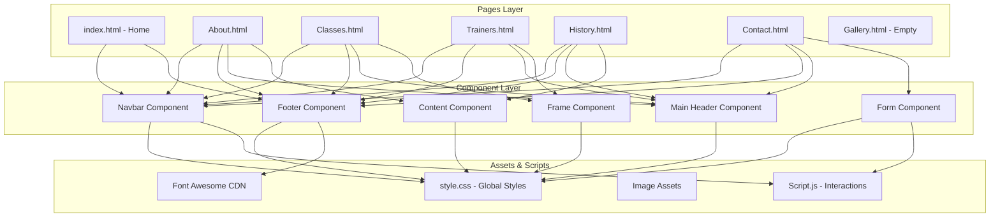
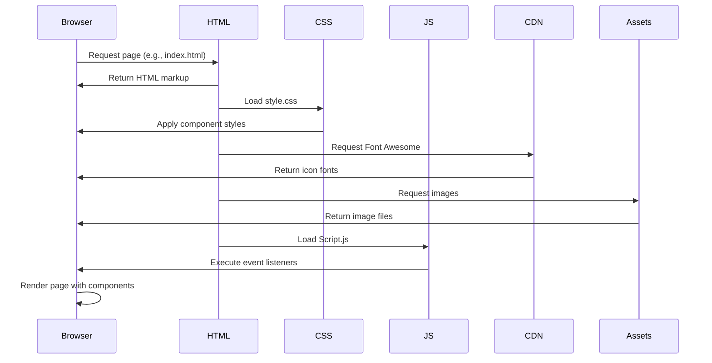

# SBG Doha Website Components Documentation

## Table of Contents

1. [Overview](#overview)
2. [Repo Use Cases](#repo-use-cases)
3. [High-Level Architecture](#high-level-architecture)
4. [Core Components](#core-components)
5. [Data Flow](#data-flow)
6. [Code Implementation](#code-implementation)
7. [Integration Points](#integration-points)
8. [Configuration](#configuration)
9. [Monitoring and Operations](#monitoring-and-operations)

## Overview

The SBG Doha website is a static, multi-page website built with HTML, CSS, and vanilla JavaScript. It serves as an informational platform for an MMA (Mixed Martial Arts) and BJJ (Brazilian Jiu-Jitsu) gym in Doha, Qatar. The website consists of reusable UI components that maintain consistency across multiple pages whilst providing different content for each section.

The component system sits at the presentation layer of this static website, with no backend services or frameworks. All components are implemented through semantic HTML markup, CSS classes, and minimal JavaScript for interactive behaviours.

**Key characteristics:**

- **Static multi-page architecture**: Six HTML pages sharing common components through consistent markup patterns
- **Component-based styling**: CSS class-based components defined in a single stylesheet (`style.css`)
- **Minimal JavaScript interactivity**: Navigation toggle and scroll-based behaviours implemented in `Script.js`
- **Responsive design**: Media queries provide mobile-friendly layouts for all components
- **External dependencies**: Font Awesome icons for social media and interface elements

## Repo Use Cases

### Navigate Between Pages Using the Navigation Bar

**Trigger**: User clicks on navigation links or loads any page
**Components involved**: Navbar component, navigation menu
**Outcome**: Consistent navigation bar appears on all pages with active links to Home, About, Classes, Trainers, History, and Contact pages

The navigation bar is rendered on every HTML page with identical markup, providing users with a fixed navigation element that becomes sticky on scroll. The logo link returns users to the home page, whilst the menu items navigate to respective sections of the website.

### Toggle Mobile Navigation Menu

**Trigger**: User clicks the hamburger menu icon on mobile devices
**Components involved**: Navbar component, navbar container, JavaScript navToggle function
**Outcome**: Navigation menu slides in/out, allowing mobile users to access all navigation links

On screens smaller than 900px, the navigation menu collapses into a hamburger icon. Clicking this icon triggers the `navToggle()` function, which toggles CSS classes to show/hide the full-screen mobile menu.

### Display Content Cards with Hover Effects

**Trigger**: User views the Classes or Trainers pages and hovers over content cards
**Components involved**: Frame component, box component (image container)
**Outcome**: Images scale up and change brightness/filter on hover, providing visual feedback

The Classes page displays six class cards (adult and kids programmes), whilst the Trainers page displays five trainer cards. Each card uses the frame component structure with hover effects applied through CSS transitions.

### Submit Contact Form

**Trigger**: User fills out and submits the contact form on the Contact page
**Components involved**: Contact form component, country selector dropdown
**Outcome**: Form collects user name, email, country selection, and message; the country dropdown is dynamically populated via JavaScript

The contact form uses HTML5 validation attributes (`required`) and includes a dynamically populated country selector. The `Script.js` file generates all country options from a hardcoded list and appends them to the select element on page load.

### View Embedded Map and Media Content

**Trigger**: User visits the About page or History page
**Components involved**: Iframe component (Google Maps), video component
**Outcome**: Users can interact with embedded Google Maps on the About page and view video content on the History page

The About page embeds a Google Maps iframe showing the gym location, whilst the History page includes an HTML5 video player with controls for viewing gym footage.

### Experience Sticky Navigation on Scroll

**Trigger**: User scrolls down any page
**Components involved**: Navbar component, scroll event listener in JavaScript
**Outcome**: Navigation bar transitions to a sticky state with modified styling (reduced padding, background colour change)

A scroll event listener in `Script.js` monitors the window scroll position. When scroll exceeds 50 pixels, the `sticky` class is toggled on the navbar, triggering CSS transitions for a more compact, opaque navigation bar.

## High-Level Architecture



**Architectural decisions visible in the codebase:**

1. **Shared component pattern through markup duplication**: Rather than using a templating engine or component framework, the website achieves consistency by duplicating identical HTML markup for navbar and footer across all pages. This is a common pattern for simple static sites but creates maintenance overhead.

2. **Single-file CSS architecture**: All component styles, layout rules, media queries, and utility classes are defined in a single 703-line `style.css` file. Styles are scoped using descendant selectors (e.g., `.Classes .content .frame`) rather than using methodologies like BEM or component-specific stylesheets.

3. **Minimal JavaScript footprint**: Only 27 lines of JavaScript handle all interactive behaviours (navbar toggle, sticky scroll, country dropdown population). This suggests a deliberate choice to keep the site lightweight and avoid framework dependencies.

4. **Section-based content organisation**: Each page uses a `<section>` element with an ID and class matching the page purpose (e.g., `<section id="Classes" class="Classes view">`), allowing CSS to target page-specific component variants.

## Core Components

The website implements seven distinct component types, each defined through CSS classes and HTML structure patterns:

### 1. Navbar Component

**Purpose**: Provides consistent site-wide navigation with responsive behaviour and scroll-based styling changes.

**Files**:
- HTML: Lines 21-37 in `index.html`, `About.html`, `Classes.html`, `Trainers.html`, `History.html`, `Contact.html`
- CSS: Lines 21-75 in `style.css`
- JavaScript: Lines 2-14 in `Script.js`

**Structure**:
- Container div with class `navbar`
- Logo link with class `logo`
- Navigation container with class `navbar_container2` containing ordered list
- Menu items as list items with anchor tags

**Variants**:
- Default state: Transparent background, large padding
- Sticky state (`.navbar.sticky`): Solid background, reduced padding, modified logo colours

### 2. Footer Component

**Purpose**: Displays consistent footer information across all pages with company links, help resources, class information, and social media links.

**Files**:
- HTML: Lines 49-90 in `index.html` (identical structure on all pages)
- CSS: Lines 368-569 in `style.css`

**Structure**:
- Footer element with class `footer`
- Container div with responsive row layout
- Four footer columns (`.footer-col`): Company, Get Help, Classes, Follow Us
- Social links with Font Awesome icons

### 3. Main Header Component

**Purpose**: Displays section titles with consistent styling and decorative elements.

**Files**:
- HTML: Lines 35-38 in `About.html`, `Classes.html`, `Trainers.html`, `History.html`, `Contact.html`
- CSS: Lines 160-194 in `style.css`

**Structure**:
- Container div with class `main`
- H2 heading with inline span elements for coloured letters
- H6 subtitle

**Styling features**:
- Decorative underline using `::before` pseudo-element
- Responsive font sizing
- Centred text alignment

### 4. Content Component

**Purpose**: Serves as a container for page-specific content layouts, using flexbox for responsive arrangement.

**Files**:
- CSS: Lines 195-246 in `style.css` (About variant), 247-283 (Classes variant), 284-367 (Trainers variant), 374-413 (History variant), 414-477 (Contact variant)

**Variants**:
- **About content**: Two-column layout with text and image
- **Classes content**: Flex-wrapped card grid
- **Trainers content**: Flex-wrapped trainer card grid
- **History content**: Vertical timeline with alternating left/right layout
- **Contact content**: Centred form layout

### 5. Frame Component

**Purpose**: Displays cards for classes and trainers with images, titles, descriptions, and interactive hover effects.

**Files**:
- HTML: Lines 40-46 in `Classes.html` (classes variant), Lines 40-60 in `Trainers.html` (trainers variant)
- CSS: Lines 251-283 in `style.css` (Classes), Lines 288-367 (Trainers)

**Structure**:
- Container div with class `frame`
- Image container div with class `box`
- Image element
- Title div (`.title` or `.headline`)
- Paragraph for description
- Optional link/button

**Interactive features**:
- Image zoom on hover (`transform: scale(1.08)`)
- Brightness/filter changes on hover
- Smooth transitions

### 6. Form Component

**Purpose**: Collects user contact information with validated inputs and dynamically populated country selector.

**Files**:
- HTML: Lines 39-47 in `Contact.html`
- CSS: Lines 418-467 in `style.css`
- JavaScript: Lines 15-26 in `Script.js`

**Structure**:
- Form element containing:
  - Text input for name
  - Email input
  - Country select dropdown
  - Textarea for message
  - Submit button with class `btn`

**Validation**: HTML5 `required` attributes on all form fields

### 7. Highlights Component

**Purpose**: Displays hero content on the homepage with call-to-action.

**Files**:
- HTML: Lines 40-46 in `index.html`
- CSS: Lines 100-159 in `style.css`

**Structure**:
- Container div with class `highlights`
- H3 heading
- H1 main title
- Tagline paragraph
- Call-to-action button with class `join`

**Special features**:
- Overlays a filtered background image (`.banner`)
- Responsive typography using viewport units
- Centred button positioning

## Data Flow

The SBG Doha website implements primarily static data flow patterns with minimal client-side state management. Data flow occurs through three main mechanisms:

### 1. Page Load and Resource Loading Flow



**Flow description**: When a user requests any page, the browser loads the HTML document first, which then triggers parallel requests for the stylesheet, JavaScript file, external CDN resources (Font Awesome), and local image assets. Once all resources load, the browser renders the page with all component styles applied.

### 2. Scroll-Based Navigation State Flow

**Input**: Window scroll position
**Output**: Modified navbar appearance (sticky state)

**File: `Script.js`**
```javascript
window.addEventListener('scroll',function (){
    const navbar = document.querySelector('.navbar');
    navbar.classList.toggle("sticky", window.scrollY > 50);
});
```

**Explanation**: This scroll event listener monitors the vertical scroll position of the window. When the scroll position exceeds 50 pixels, it adds the `sticky` class to the navbar element. When scroll position returns below 50 pixels, the class is removed. The CSS then handles the visual transformation through predefined `.navbar.sticky` styles.

**State transitions**:
1. Initial state: Navbar has transparent background, large padding (30px 120px)
2. Scroll > 50px: JavaScript adds `sticky` class
3. CSS transition: Background changes to black, padding reduces to 6px 60px, box-shadow appears
4. Scroll < 50px: JavaScript removes `sticky` class
5. CSS transition: Navbar returns to initial state

### 3. Mobile Navigation Toggle Flow

**Input**: User click on hamburger menu icon
**Output**: Expanded/collapsed mobile menu

**File: `Script.js`**
```javascript
const togglebar = document.querySelector('.navbar_container2');
const menu = document.querySelector('ol');

function navToggle(){
  togglebar.classList.toggle("active");
  menu.classList.toggle("active");
};
```

**Explanation**: The `navToggle()` function is attached as an inline event handler (`onclick="navToggle()"`) on the navbar container element. When triggered, it toggles the `active` class on both the container and the ordered list menu. The CSS rules for `.navbar ol.active` (lines 597-608 in `style.css`) define the expanded menu appearance.

**State transitions**:
1. Initial state (mobile): Menu hidden (`display: none`)
2. Click hamburger icon: `navToggle()` executes
3. Add `active` class: Menu changes to `display: flex`, covers screen
4. Click again: Remove `active` class, menu returns to hidden state

### 4. Contact Form Country Population Flow

**Input**: Page load
**Output**: Populated country dropdown with 195 countries

**File: `Script.js`**
```javascript
let countriesList = 'Afghanistan, Albania, Algeria, Andorra, Angola, Antigua & Deps, Argentina, Armenia, Australia, Austria, Azerbaijan, Bahamas, Bahrain, Bangladesh, Barbados, Belarus, Belgium, Belize, Benin, Bhutan, Bolivia, Bosnia Herzegovina, Botswana, Brazil, Brunei, Bulgaria, Burkina, Burundi, Cambodia, Cameroon, Canada, Cape Verde, Central African Rep, Chad, Chile, China, Colombia, Comoros, Congo, Congo (Democratic Rep), Costa Rica, Croatia, Cuba, Cyprus, Czech Republic, Denmark, Djibouti, Dominica, Dominican Republic, East Timor, Ecuador, Egypt, El Salvador, Equatorial Guinea, Eritrea, Estonia, Ethiopia, Fiji, Finland, France, Gabon, Gambia, Georgia, Germany, Ghana, Greece, Grenada, Guatemala, Guinea, Guinea-Bissau, Guyana, Haiti, Honduras, Hungary, Iceland, India, Indonesia, Iran, Iraq, Ireland (Republic Of), Israel, Italy, Ivory Coast, Jamaica, Japan, Jordan, Kazakhstan, Kenya, Kiribati, Korea North, Korea South, Kosovo, Kuwait, Kyrgyzstan, Laos, Latvia, Lebanon, Lesotho, Liberia, Libya, Liechtenstein, Lithuania, Luxembourg, Macedonia, Madagascar, Malawi, Malaysia, Maldives, Mali, Malta, Marshall Islands, Mauritania, Mauritius, Mexico, Micronesia, Moldova, Monaco, Mongolia, Montenegro, Morocco, Mozambique, Myanmar, (Burma), Namibia, Nauru, Nepal, Netherlands, New Zealand, Nicaragua, Niger, Nigeria, Norway, Oman, Pakistan, Palau, Panama, Papua New Guinea, Paraguay, Peru, Philippines, Poland, Portugal, Qatar, Romania, Russian Federation, Rwanda, St Kitts & Nevis, St Lucia, Saint Vincent & the Grenadines, Samoa, San Marino, Sao Tome & Principe, Saudi Arabia, Senegal, Serbia, Seychelles, Sierra Leone, Singapore, Slovakia, Slovenia, Solomon Islands, Somalia, South Africa, South Sudan, Spain, Sri Lanka, Sudan, Suriname, Swaziland, Sweden, Switzerland, Syria, Taiwan, Tajikistan, Tanzania, Thailand, Togo, Tonga, Trinidad & Tobago, Tunisia, Turkey, Turkmenistan, Tuvalu, Uganda, Ukraine, United Arab Emirates, United Kingdom, United States, Uruguay, Uzbekistan, Vanuatu, Vatican City, Venezuela, Vietnam, Yemen, Zambia, Zimbabwe'
countriesList = countriesList.split(', ')

let countriesSelect = document.querySelector('select#countries')

countriesList.forEach(element => {
    let option = document.createElement('option')
    option.value = element
    option.textContent = element

    countriesSelect.appendChild(option)
});
```

**Explanation**: On page load, this code executes in the following sequence:
1. Parse the hardcoded comma-separated string into an array
2. Query the DOM for the select element with ID `countries`
3. Iterate through each country in the array
4. For each country, create a new `<option>` element
5. Set both the value and text content to the country name
6. Append the option to the select element

**Note**: This code executes globally on every page load, but only affects pages containing a select element with ID `countries` (i.e., Contact.html).

### 5. Form Submission Flow

**Input**: User form data (name, email, country, message)
**Output**: Browser default form submission behaviour

The contact form in `Contact.html` (lines 39-47) does not specify an `action` or `method` attribute, and there is no JavaScript preventDefault handler. This indicates that form submission behaviour is not implemented—clicking the submit button would trigger browser default behaviour (page refresh with form data in URL parameters) but would not actually send data to any server.

**Data transformation**: Not evident from the provided repository. No backend integration or form handling service is configured.

## Code Implementation

This section traces the complete implementation of each component from HTML structure through CSS styling to JavaScript behaviour.

### Navigation Component Implementation

The navigation component appears on all pages and provides the primary navigation mechanism. The implementation spans HTML markup, CSS styling for both desktop and mobile views, and JavaScript for interactive behaviours.

#### HTML Structure

**File: `index.html`** (identical structure in all page files)
```html
<div class="navbar">
  <a href="index.html" class="logo">sbg<b>Dh</b>.</a>
  <div class="navbar_container2" onclick="navToggle()">
    <ol>
      <li><a href="index.html">Home</a></li>
      <li><a href="About.html">About</a></li>
      <li><a href="Classes.html">Classes</a></li>
      <li><a href="Trainers.html">Trainers</a></li>
      <li><a href="History.html">History</a></li>
      <li><a href="Contact.html">Contact</a></li>
    </ol>
  </div>
</div>
```

**Explanation**: The navbar uses a simple div-based layout with a logo link and a navigation container. The logo uses inline `<b>` tags to colour specific letters. The `onclick="navToggle()"` attribute on the container enables the mobile menu toggle. Each navigation item is a standard anchor link to the respective HTML page.

#### Default Desktop Styling

**File: `style.css`**
```css
.navbar{
    width: 100%;
    display: flex;
    position: fixed;
    padding: 30px 120px;
    background-color: transparent;
    justify-content: space-between;
    z-index: 1111;
    transition: 0.5s ease;
}
```

**Explanation**: The navbar is positioned fixed at the top of the viewport with high z-index (1111) to ensure it stays above other content. It uses flexbox for layout with space-between justification to push the logo and menu to opposite ends. The transparent background and generous padding (30px vertical, 120px horizontal) create an airy, modern appearance. The 0.5s transition prepares for smooth state changes.

**File: `style.css`**
```css
.logo{
    font-size: 2.8em;
    font-weight: 800;
    letter-spacing: 2px;
    text-transform: uppercase;
    text-decoration: none;
}
.logo B{
    color: #87CEFA;
}
```

**Explanation**: The logo styling creates a bold, uppercase brand mark with wide letter spacing. The `<b>` element within the logo is coloured sky blue (#87CEFA), creating the distinctive "sbgDh" appearance with "Dh" highlighted.

**File: `style.css`**
```css
.navbar_container2 ol{
    display: flex;
    margin: auto 0;
}
.navbar_container2 ol li{
    list-style: none;
    margin-right: 20px;
}
.navbar_container2 ol li a{
    font-size: 20px;
    font-weight: 500;
    text-decoration: none;
    text-transform: capitalize;
}
.navbar_container2 ol li:hover a{
    color: #87CEFA;
}
```

**Explanation**: The navigation menu uses flexbox to arrange links horizontally. List markers are removed, and each link is styled with medium weight and capitalised text. The hover state changes link colour to sky blue, providing visual feedback.

#### Sticky Scroll Behaviour

**File: `Script.js`**
```javascript
window.addEventListener('scroll',function (){
    const navbar = document.querySelector('.navbar');
    navbar.classList.toggle("sticky", window.scrollY > 50);
});
```

**Explanation**: A scroll event listener continuously monitors the window's vertical scroll position. When the user scrolls down more than 50 pixels, the `sticky` class is added to the navbar. When scrolling back to the top (scrollY ≤ 50), the class is removed. The `classList.toggle` method's second parameter acts as a conditional—when true, the class is added; when false, it's removed.

**File: `style.css`**
```css
.navbar.sticky{
    padding: 6px 60px;
    background: #000;
    box-shadow: 0 0 15px rgba(0,0,0,0.5);
}
.navbar.sticky .logo{
    font-size: 2em;
    color: #87CEFA;
}
.navbar.sticky .logo b{
    color: #fff;
}
```

**Explanation**: The sticky state dramatically reduces padding (from 30px to 6px vertical, 120px to 60px horizontal), making the navbar more compact. The background changes from transparent to solid black with a subtle shadow, ensuring readability over content. The logo colours are inverted: the main text becomes sky blue whilst the `<b>` element becomes white, maintaining brand identity whilst improving contrast.

The CSS transition defined on `.navbar` (0.5s ease) ensures these changes occur smoothly rather than abruptly.

#### Mobile Responsive Behaviour

**File: `style.css`**
```css
@media screen and (max-width: 900px){
    .navbar{
        padding: 0 60px;
    }
    .navbar ol{
        display: none;
    }
    .navbar ol.active{
        top: 60px;
        left: 0;
        width: 100%;
        display: flex;
        position: fixed;
        background: #222;
        align-items: center;
        justify-content: center;
        flex-direction: column;
        height: calc(100% - 60px);
    }
    .navbar ol.active li{
        margin: 8px;
    }
    .navbar ol.active li a{
        font-size: 25px;
    }
    .navbar .navbar_container2{
        height: 25px;
        width: 25px;
        margin: auto 0;
        cursor: pointer;
        background: url(menubar3.png);
        background-size: 25px;
        background-position: center;
        background-repeat: no-repeat;
        color: white;
    }
}
```

**Explanation**: On screens 900px or narrower, the navigation behaviour changes completely. The horizontal menu is hidden by default (`display: none`). The navbar container becomes a 25px × 25px hamburger icon using `menubar3.png` as a background image. When the `active` class is applied (via the `navToggle()` function), the menu transforms into a full-screen overlay: fixed position, 100% width, vertical flex layout (`flex-direction: column`), centred content, and dark background. The height calculation (`calc(100% - 60px)`) accounts for the navbar height, preventing content overflow.

**File: `Script.js`**
```javascript
const togglebar = document.querySelector('.navbar_container2');
const menu = document.querySelector('ol');

function navToggle(){
  togglebar.classList.toggle("active");
  menu.classList.toggle("active");
};
```

**Explanation**: The `navToggle()` function is called via the inline `onclick` attribute on the navbar container (visible in the HTML structure above). It queries the DOM for two elements: the container (used as the hamburger button) and the ordered list (the actual menu). It then toggles the `active` class on both elements simultaneously. This dual toggle ensures both the icon and menu states change together, though the CSS only styles the menu's active state—the icon state styling appears incomplete in the provided code (lines 628-634 reference `.navbar_container.active`, but the actual class is `navbar_container2`).

### Home Page Hero Component Implementation

The homepage features a unique hero section with a background image, prominent title, and call-to-action button.

**File: `index.html`**
```html
<section id="index" class="Home view">
  <div class="highlights">
    <h3>Get stronger with</h3>
    <h1><b>SBG</b> DOHA</h1>
    <br />
    <p class="tagline"></p>
    <button class="join"><a href="Classes.html">Join Now</a></button>
  </div>
  <div class="banner"></div>
</section>
```

**Explanation**: The hero section uses a containing `<section>` with two child divs: `highlights` for content and `banner` for the background image. The tagline paragraph is empty in the HTML, suggesting it may have been removed during development. The button wraps an anchor tag to navigate to the Classes page.

**File: `style.css`**
```css
.Home{
    display: flex;
    min-height: 120vh;
    align-items: center;
    justify-content: center;
}
.banner{
    height: 100%;
    width: 100%;
    position: absolute;
    background: url(./src/banner5.webp);
    background-size: cover;
    background-position: center;
    filter: brightness(40%);
}
```

**Explanation**: The `.Home` section uses flexbox to centre its content both vertically and horizontally, with a minimum height of 120vh (120% of viewport height) creating a full-screen hero. The banner is positioned absolutely to sit behind the content, with a background image (`banner5.webp`) that covers the entire area. The `filter: brightness(40%)` darkens the image significantly, ensuring white text remains readable.

**File: `style.css`**
```css
.highlights{
   width: 70%;
   position: relative;
   display: inline-block;
   z-index: 11;
}
.highlights h3{
    display: inline;
    font-size: 3vw;
    padding: 5px 20px;
    font-weight: lighter;
    text-transform: capitalize;
    border-left: 6px solid #87CEFA;
}
.highlights h1{
    font-size: 9vw;
    text-align: center;
    font-weight: normal;
}
.highlights b{
    color: #87CEFA;
    font-weight: 800;
    font-family: sans-serif;
}
```

**Explanation**: The highlights container is positioned relatively with z-index 11, ensuring it appears above the absolutely positioned banner. The h3 uses a left border accent in sky blue and viewport-relative font sizing (3vw), making it responsive to screen width. The h1 is dramatically large (9vw) and centred, with the `<b>` element ("SBG") coloured sky blue for brand consistency.

**File: `style.css`**
```css
.highlights .join{
    position: absolute;
    left: 50%;
    transform: translateX(-50%);
    font-weight: 800;
    padding: 5px 20px;
    font-size: 1.5vw;
    margin-top: 1.2;
    color: #87CEFA;
    border: 2px solid #87CEFA;
    border-radius: 50px;
    background: transparent;
    text-transform: uppercase;
    transition: 0.3s ease;
}
.highlights .join a{
    text-decoration: none;
}
.highlights .join:hover{
    color: floralwhite;
    cursor: pointer;
    letter-spacing: 1.5px;
    background: #87CEFA;
}
```

**Explanation**: The button is centred horizontally using absolute positioning and transform (a common centring technique). It's styled as a transparent button with sky blue border and text, creating a "ghost button" appearance. On hover, the background fills with sky blue, text colour changes to floralwhite, and letter spacing increases (1.5px), creating an engaging interactive effect. The 0.3s transition ensures smooth animation.

### Classes and Trainers Card Components Implementation

Both the Classes and Trainers pages use a similar card-based layout with frame components, but with different styling variants.

**File: `Classes.html`**
```html
<div class="frame">
  <div class="box">
    
  </div>
  <div class="title">kickboxing</div>
  <p>Monday to Friday at 5pm</p>
</div>
```

**Explanation**: Each class card uses a three-layer structure: a frame container, a box wrapper for the image (enabling cropping and hover effects), and text elements for title and schedule. The image includes descriptive alt text for accessibility.

**File: `style.css`**
```css
.Classes .content{
    flex-wrap: wrap;
}
.Classes .content .frame{
    position: relative;
    width: 350px;
    padding: 20px;
    margin: 10px;
    background: #222;
    box-shadow: 0 10px 15px rgba(0,0,0,0.5);
}
.Classes .content .frame .box{
    position: relative;
    height: 200px;
    width: 100%;
    overflow: hidden;
}
```

**Explanation**: The content container uses `flex-wrap: wrap` to create a responsive grid—cards wrap to new rows as needed. Each frame has a fixed width (350px) with dark background (#222) and shadow for depth. The box container has fixed height (200px) with `overflow: hidden`, ensuring all images are cropped to the same dimensions regardless of their original aspect ratios.

**File: `style.css`**
```css
.Classes .content .frame .box img{
    position: absolute;
    height: 100%;
    width: 100%;
    object-fit: cover;
    filter: brightness(80%);
    transition: 0.2s ease-in;
}
.Classes .content .frame .box:hover img{
    filter: brightness(100%);
    transform: scale(1.08);
}
```

**Explanation**: Images are positioned absolutely and use `object-fit: cover` to fill their container whilst maintaining aspect ratio. They're slightly dimmed by default (`brightness(80%)`). On hover, brightness returns to 100% and the image scales up to 108% of its size, creating a zoom effect. The `overflow: hidden` on the parent box ensures the zoomed image doesn't break the layout. The transition creates smooth animation over 0.2 seconds.

**File: `style.css`**
```css
.Classes .content .frame .title{
    color: #87CEFA;
    padding: 5px 0;
}
.Classes .content .frame p{
    font-size: 0.8em;
}
```

**Explanation**: Titles are coloured sky blue for visual hierarchy and brand consistency. Descriptions use smaller font size (0.8em relative to parent), creating clear typographic hierarchy: image → title → description.

**File: `Trainers.html`**
```html
<div class="frame">
  <div class="box">
    
  </div>
  <div class="headline">
    <div class="title">Keiran davern</div>
    <div class="icons">
      <i class="fa fa-facebook"></i>
      <i class="fa fa-twitter"></i>
      <i class="fa fa-linkedin"></i>
    </div>
  </div>
  <p>
    Kieran davern is the main coach in Sbg Hoha .He runs the gym and he
    is also the main kickboxing coach for the mens . He has 13 years of
    experince in the kickboxing fiel and also for the bjj and mma field
    he has repersented ireland in the euros in 2020 which he won a
    gloden medal in bjj.
  </p>
  <a href="#"> Explore</a>
</div>
```

**Explanation**: The trainers variant extends the base frame structure with a headline section containing both title and social media icons, a longer description paragraph, and an "Explore" link. The icons use Font Awesome classes loaded from the CDN (referenced in the page head).

**File: `style.css`**
```css
.Trainers .content .frame{
    position: relative;
    width: 500px;
    padding: 30px 30px 40px 30px;
    box-shadow: 0 10px 15px rgba(0,0,0,0.5);
    margin: 10px;
    background: #222;
}
.Trainers .content .frame .box{
    position: relative;
    height: 300px;
    width: 100%;
    overflow: hidden;
}
.Trainers .content .frame .box img{
    position: absolute;
    height: auto;
    width: 100%;
    filter: grayscale(1);
    object-fit: cover;
    transition: 0.2s ease-in;
}
.Trainers .content .frame .box:hover img{
    filter: grayscale(0);
    transform: scale(1.08);
}
```

**Explanation**: Trainer cards are wider (500px vs 350px) and taller (300px vs 200px) than class cards, accommodating more content. The key visual difference is the filter: trainer images use `grayscale(1)` by default (fully desaturated), returning to colour on hover (`grayscale(0)`). This creates a distinctive visual effect—black and white photos that come to life on interaction.

**File: `style.css`**
```css
.Trainers .content .frame .headline{
    display: flex;
    justify-content: space-between;
    align-items: center;
    margin: 8px 0;
}
.Trainers .content .frame .headline i{
    height: 22px;
    width: 22px;
    border: 1.5px solid #fff;
    border-radius: 50%;
    text-align: center;
    font-size: 12px;
    margin-right: 5px;
    cursor: pointer;
    line-height: 22px;
}
.Trainers .content .frame .headline i:hover{
    border: 1.5px;
    color: #87CEFA;
    background: white;
}
```

**Explanation**: The headline uses flexbox with space-between to push the title and icons to opposite ends. Social media icons are styled as circular buttons using `border-radius: 50%`, with white borders. The `line-height: 22px` (matching the height) centres the icon vertically within the circle. On hover, icons gain a white background and sky blue colour, though the border property appears incomplete (missing solid and colour).

### Contact Form Implementation

The contact form combines HTML5 validation with JavaScript-generated content for the country selector.

**File: `Contact.html`**
```html
<div class="content">
  <form>
      <input type="text" placeholder="User" required>
      <input type="email" placeholder="Email" required>
      <select id="countries" required><option value="" selected disabled hidden>Select Country:</option></select>
      <textarea rows="5" placeholder="What's on your mind" required ></textarea>
      <br>
      <input type="submit" value="send" class="btn">
      </br>
    </form>
    <div class="./src/bg.img"></div>
</div>
```

**Explanation**: The form uses HTML5 input types (`email` for email validation) and the `required` attribute on all fields for client-side validation. The select element includes a default option that is disabled and hidden, serving as a placeholder. The div with class `./src/bg.img` appears to be a typo (invalid class name with path syntax) and has no corresponding CSS.

**File: `style.css`**
```css
.Contact .content{
    min-height: 100vh;
}
.Contact .content form{
    margin: auto;
    width: 400px;
    height: 500px;
    padding: 20px;
    background: #fff;
    box-shadow: 0 10px 15px rgba(0,0,0,0.5);
    z-index: 1;
}
.Contact .content select{
    color: #555;
    width: 100%;
    padding: 10px;
    margin: 15px 0;
    font-size: 18px;
}
```

**Explanation**: The form is centred using `margin: auto` with a fixed width (400px) and white background, contrasting against the dark page background. The minimum height ensures the section fills the viewport. Form inputs use consistent spacing (15px vertical margin) and sizing.

**File: `style.css`**
```css
.Contact .content form input{
    color: #222;
    width: 100%;
    height: 50px;
    padding: 0 10px;
    font-size: 18px;
    border: 1px solid #878787;
    border-radius: 4px;
    margin: 15px 0;
    background: transparent;
}
.Contact .content form textarea{
    width: 100%;
    padding: 10px;
    color: #222;
    background: transparent;
}
.Contact .content form .btn{
    letter-spacing: 1px;
    width: 100px;
    display: inline-block;
    color: #87CEFA;
    border-color: #87CEFA;
    cursor: pointer;
    transition: 0.2s ease;
}
.Contact .content form .btn:hover{
    background: #87CEFA;
    color: #fff;
}
```

**Explanation**: All form inputs have consistent styling with grey borders, transparent backgrounds, and dark text (#222). The submit button uses the brand colour (sky blue) with hover effect that inverts colours—background fills whilst text turns white.

**File: `Script.js`**
```javascript
let countriesList = 'Afghanistan, Albania, Algeria, Andorra, Angola, Antigua & Deps, Argentina, Armenia, Australia, Austria, Azerbaijan, Bahamas, Bahrain, Bangladesh, Barbados, Belarus, Belgium, Belize, Benin, Bhutan, Bolivia, Bosnia Herzegovina, Botswana, Brazil, Brunei, Bulgaria, Burkina, Burundi, Cambodia, Cameroon, Canada, Cape Verde, Central African Rep, Chad, Chile, China, Colombia, Comoros, Congo, Congo (Democratic Rep), Costa Rica, Croatia, Cuba, Cyprus, Czech Republic, Denmark, Djibouti, Dominica, Dominican Republic, East Timor, Ecuador, Egypt, El Salvador, Equatorial Guinea, Eritrea, Estonia, Ethiopia, Fiji, Finland, France, Gabon, Gambia, Georgia, Germany, Ghana, Greece, Grenada, Guatemala, Guinea, Guinea-Bissau, Guyana, Haiti, Honduras, Hungary, Iceland, India, Indonesia, Iran, Iraq, Ireland (Republic Of), Israel, Italy, Ivory Coast, Jamaica, Japan, Jordan, Kazakhstan, Kenya, Kiribati, Korea North, Korea South, Kosovo, Kuwait, Kyrgyzstan, Laos, Latvia, Lebanon, Lesotho, Liberia, Libya, Liechtenstein, Lithuania, Luxembourg, Macedonia, Madagascar, Malawi, Malaysia, Maldives, Mali, Malta, Marshall Islands, Mauritania, Mauritius, Mexico, Micronesia, Moldova, Monaco, Mongolia, Montenegro, Morocco, Mozambique, Myanmar, (Burma), Namibia, Nauru, Nepal, Netherlands, New Zealand, Nicaragua, Niger, Nigeria, Norway, Oman, Pakistan, Palau, Panama, Papua New Guinea, Paraguay, Peru, Philippines, Poland, Portugal, Qatar, Romania, Russian Federation, Rwanda, St Kitts & Nevis, St Lucia, Saint Vincent & the Grenadines, Samoa, San Marino, Sao Tome & Principe, Saudi Arabia, Senegal, Serbia, Seychelles, Sierra Leone, Singapore, Slovakia, Slovenia, Solomon Islands, Somalia, South Africa, South Sudan, Spain, Sri Lanka, Sudan, Suriname, Swaziland, Sweden, Switzerland, Syria, Taiwan, Tajikistan, Tanzania, Thailand, Togo, Tonga, Trinidad & Tobago, Tunisia, Turkey, Turkmenistan, Tuvalu, Uganda, Ukraine, United Arab Emirates, United Kingdom, United States, Uruguay, Uzbekistan, Vanuatu, Vatican City, Venezuela, Vietnam, Yemen, Zambia, Zimbabwe'
countriesList = countriesList.split(', ')

let countriesSelect = document.querySelector('select#countries')

countriesList.forEach(element => {
    let option = document.createElement('option')
    option.value = element
    option.textContent = element

    countriesSelect.appendChild(option)
});
```

**Explanation**: This code executes immediately when `Script.js` loads. It starts with a hardcoded string of 195 countries separated by commas and spaces. The `split(', ')` method converts this string into an array. A `querySelector` locates the select element with ID `countries`. The `forEach` loop iterates through each country, creating a new `<option>` DOM element for each one, setting both its value and displayed text to the country name, and appending it to the select element. This approach avoids hardcoding 195 option elements in the HTML, but it has limitations: if JavaScript fails to load or execute, the dropdown remains empty except for the placeholder.

### Footer Component Implementation

The footer component provides site-wide links and social media integration, appearing identically on all pages.

**File: `index.html`** (lines 49-90, identical on all pages)
```html
<footer class="footer">
  <div class="container">
    <div class="row">
      <div class="footer-col">
        <h4>company</h4>
        <ul>
          <li><a href="About.html">about us</a></li>
          <li><a href="Classes.html">our services</a></li>
          <li><a href="Contact.html">Contact</a></li>
          <li><a href="History.html">History</a></li>
        </ul>
      </div>
      <div class="footer-col">
        <h4>get help</h4>
        <ul>
          <li><a href="index.html">FAQ</a></li>
          <li><a href="Contact.html">registiration</a></li>
          <li><a href="History.html">History</a></li>
          <li><a href="Classes.html">socials</a></li>
        </ul>
      </div>
      <div class="footer-col">
        <h4>Classes</h4>
        <ul>
          <li><a href="Classes.html">Kids kickboxing</a></li>
          <li><a href="Classes.html">Adult kickboxing</a></li>
          <li><a href="Classes.html">bjj Kids</a></li>
          <li><a href="Classes.html">bjj men</a></li>
        </ul>
      </div>
      <div class="footer-col">
        <h4>follow us</h4>
        <div class="social-links">
          <a href="#"><i class="fab fa-facebook-f"></i></a>
          <a href="#"><i class="fab fa-twitter"></i></a>
          <a href="#"><i class="fab fa-instagram"></i></a>
          <a href="#"><i class="fab fa-linkedin-in"></i></a>
        </div>
      </div>
    </div>
  </div>
</footer>
```

**Explanation**: The footer uses a four-column layout within a responsive container. The first three columns contain navigation links organised by category (Company, Get Help, Classes), whilst the fourth contains social media links. All social links currently use `href="#"`, indicating they are placeholders not connected to actual social media profiles.

**File: `style.css`**
```css
body{
    line-height: 1.5;
    font-family: 'Poppins', sans-serif;
}
*{
    margin:0;
    padding:0;
    box-sizing: border-box;
}
.container{
    max-width: 1170px;
    margin:auto;
}
.row{
    display: flex;
    flex-wrap: wrap;
}
```

**Explanation**: The container has a maximum width (1170px) and auto margins, centring it and preventing excessively wide layouts on large screens. The row uses flexbox with wrapping enabled, allowing columns to stack vertically on narrow screens.

**File: `style.css`**
```css
.footer{
    background-color: #131b2b;
    padding: 70px 0;
}
.footer-col{
   width: 25%;
   padding: 0 15px;
}
.footer-col h4{
    font-size: 18px;
    color: #ffffff;
    text-transform: capitalize;
    margin-bottom: 35px;
    font-weight: 500;
    position: relative;
}
.footer-col h4::before{
    content: '';
    position: absolute;
    left:0;
    bottom: -10px;
    background-color: #87CEFA;
    height: 2px;
    box-sizing: border-box;
    width: 50px;
}
```

**Explanation**: The footer uses a dark blue background (#131b2b) with generous vertical padding (70px). Each column occupies 25% width (four equal columns). The h4 headings use a pseudo-element (`::before`) to create a decorative underline in sky blue, positioned 10px below the text. This is a common design pattern for section headings.

**File: `style.css`**
```css
.footer-col ul li:not(:last-child){
    margin-bottom: 10px;
}
.footer-col ul li a{
    font-size: 16px;
    text-transform: capitalize;
    color: #ffffff;
    text-decoration: none;
    font-weight: 300;
    color: #bbbbbb;
    display: block;
    transition: all 0.3s ease;
}
.footer-col ul li a:hover{
    color: #ffffff;
    padding-left: 8px;
}
```

**Explanation**: List items have bottom margin except for the last child (using `:not(:last-child)` selector), creating even spacing. Links are styled in light grey (#bbbbbb) with light font weight (300). On hover, they transition to white and shift 8px to the right (`padding-left: 8px`), creating a subtle sliding animation enhanced by the `transition: all 0.3s ease`.

**File: `style.css`**
```css
.footer-col .social-links a{
    display: inline-block;
    height: 40px;
    width: 40px;
    background-color: #87CEFA;
    margin:0 10px 10px 0;
    text-align: center;
    line-height: 40px;
    border-radius: 50%;
    color: #ffffff;
    transition: all 0.5s ease;
}
.footer-col .social-links a:hover{
    color: #24262b;
    background-color: #ffffff;
}
```

**Explanation**: Social media icons are styled as 40px × 40px circles (using `border-radius: 50%`) with sky blue backgrounds. The `line-height: 40px` vertically centres the Font Awesome icons. On hover, colours invert: background becomes white, icon colour becomes dark grey (#24262b). The `transition: all 0.5s ease` animates the colour change over half a second.

**File: `style.css`**
```css
@media(max-width: 767px){
    .footer-col{
      width: 50%;
      margin-bottom: 30px;
  }
}
@media(max-width: 574px){
    .footer-col{
      width: 100%;
  }
}
```

**Explanation**: The footer implements progressive responsive behaviour. On tablets (≤767px), columns switch to two-column layout (50% width each). On mobile phones (≤574px), columns stack vertically (100% width each). This ensures the footer remains readable and usable across all device sizes.

### About Page Map Integration Implementation

The About page includes an embedded Google Maps iframe showing the gym location.

**File: `About.html`**
```html
<iframe
  src="https://www.google.com/maps/embed?pb=!1m14!1m8!1m3!1d207541.28470808643!2d51.323722977751!3d25.292556004834783!3m2!1i1024!2i768!4f13.1!3m3!1m2!1s0x0%3A0x23085b3e7ba39b44!2sQatar%20MMA!5e0!3m2!1sen!2sie!4v1671114199880!5m2!1sen!2sie"
  width="600"
  height="450"
  style="border: 0"
  allowfullscreen=""
  loading="lazy"
  referrerpolicy="no-referrer-when-downgrade"
></iframe>
```

**Explanation**: The iframe embeds a Google Maps view centred on "Qatar MMA" (latitude 25.29, longitude 51.32). The `loading="lazy"` attribute defers loading the map until it's near the viewport, improving initial page load performance. The `allowfullscreen` attribute enables fullscreen mode on the map interface. The `referrerpolicy="no-referrer-when-downgrade"` prevents sending referrer information to Google Maps over insecure connections.

**File: `style.css`**
```css
.About iframe{
    display: block;
    margin: 20px auto;
}
```

**Explanation**: The iframe is displayed as a block element with auto horizontal margins, centring it within the page. The 20px vertical margin provides spacing above and below the map.

### History Page Timeline Implementation

The History page implements an alternating timeline layout with images and text.

**File: `History.html`**
```html
<div class="content">
    <div class="row">
         <div class="cols a">
            <div class="heading">Sbg DOHA</div>
            <p></p>
            <h2>Trophies</h2>
            <ul>
                <li>-6 Times MMA club of the year</li>
                <li>-4 Times bjj club of the year</li>
                <li>-8 Times gym of the year</li>
            </ul>
         </div>
         <div class="cols b">
            <div class="boxes">
                
            </div>
         </div>
    </div>
</div>
```

**Explanation**: Each timeline entry uses a row containing two columns: one with class `a` for content, one with class `b` for images. The `.boxes` wrapper provides consistent image container styling.

**File: `style.css`**
```css
.History .content{
    flex-direction: column;
}
.History .content .row{
    display: flex;
    position: relative;
    width: 100%;
    padding: 20px;
    justify-content: center;
}
.History .content .row:nth-child(odd) .a{
    order: 2;
}
```

**Explanation**: The content container uses `flex-direction: column` to stack rows vertically. Each row uses flexbox to arrange two columns horizontally. The key to the alternating layout is the `:nth-child(odd)` selector combined with the `order` property: on odd-numbered rows, the content column (`.a`) receives `order: 2`, moving it to the right of the image column. On even rows, the default order applies, placing content on the left. This creates a zigzag timeline effect.

**File: `style.css`**
```css
.History .content .row .cols{
    position: relative;
    width: 600px;
    padding: 20px 50px;
}
.History .content .row .cols .heading{
    font-size: 2em;
    color: #87CEFA;
}
.History .content .row .cols:nth-child(odd) .heading{
    color: #02a3ff;
}
```

**Explanation**: Columns have fixed width (600px) with generous padding. Headings are coloured sky blue by default, but odd-numbered columns use a slightly different shade of blue (#02a3ff), adding subtle visual variety to the timeline.

**File: `style.css`**
```css
.History .content .row .cols .boxes{
    position: relative;
    width: 100%;
    height: 350px;
    padding: 20px;
    border-radius: 8px;
    background:#87CEFA ;
    box-shadow: 0 10px 15px rgba(0,0,0,0.5);
}
.History .content .row .cols .boxes img{
    height: 100%;
    width: 100%;
    object-fit: fill;
}
```

**Explanation**: Image containers have fixed height (350px) with sky blue background, rounded corners, and shadow. Images use `object-fit: fill` to stretch to container dimensions (note: this can distort images if their aspect ratios don't match the container; `object-fit: cover` would be more common).

**File: `style.css`**
```css
@media screen and (max-width: 900px){
    .History .content .row{
        flex-direction: column;
    }
    .History .content .row .cols{
        width: 100%;
    }
    .History .content .row:nth-child(odd) .a{
        order: 0;
    }
}
```

**Explanation**: On mobile (≤900px), the timeline layout changes dramatically. Rows switch to vertical layout (`flex-direction: column`), columns become full-width, and the order property is reset (`order: 0`), eliminating the zigzag pattern. This creates a simpler, stacked timeline more suitable for narrow screens.

## Integration Points

The SBG Doha website integrates with the following external services and resources:

### 1. Font Awesome Icon Library (CDN)

**Integration URL**: `https://cdnjs.cloudflare.com/ajax/libs/font-awesome/5.15.1/css/all.min.css` (version 5.15.1) and `https://cdnjs.cloudflare.com/ajax/libs/font-awesome/4.7.0/css/font-awesome.min.css` (version 4.7.0)

**Usage**: Social media icons in the footer component and trainer card headline icons

**Files**: All HTML pages include Font Awesome in the `<head>` section

**Implementation**: Icon classes (`fab fa-facebook-f`, `fab fa-twitter`, `fab fa-instagram`, `fab fa-linkedin-in`, `fa fa-facebook`, `fa fa-twitter`, `fa fa-linkedin`) are applied to `<i>` elements. The browser loads the icon fonts from Cloudflare's CDN, rendering vector icons that can be styled with CSS.

**Dependency type**: External CDN resource. If the CDN is unavailable or blocked, icons will not display.

**Note**: The codebase loads two different versions of Font Awesome (4.7.0 and 5.15.1) across different pages, which is redundant and inefficient. Version 5.15.1 includes all functionality from 4.7.0 and uses different class prefixes (`fab` for brands vs `fa` in version 4).

### 2. Google Fonts

**Integration URL**: `https://fonts.googleapis.com/css2?family=Nunito+Sans:wght@200;300;400;600&display=swap` and `https://fonts.googleapis.com/css2?family=Poppins:wght@300;400;500;600;700&display=swap`

**Usage**: Poppins font family is used throughout the site (specified in `style.css` line 7: `font-family: 'Poppins',sans-serif`). Nunito Sans is imported but not evidently used in the codebase.

**Files**: `style.css` lines 1-2

**Implementation**: The `@import` CSS rule loads font definitions from Google Fonts CDN. Browsers download the font files and apply them to text elements.

**Dependency type**: External CDN resource. If unavailable, the browser falls back to the generic `sans-serif` font family.

### 3. Google Maps Embed API

**Integration URL**: `https://www.google.com/maps/embed?pb=!1m14!1m8!1m3!1d207541.28470808643!2d51.323722977751!3d25.292556004834783!3m2!1i1024!2i768!4f13.1!3m3!1m2!1s0x0%3A0x23085b3e7ba39b44!2sQatar%20MMA!5e0!3m2!1sen!2sie!4v1671114199880!5m2!1sen!2sie`

**Usage**: Displays an interactive map showing the gym's location on the About page

**Files**: `About.html` lines 65-73

**Implementation**: An iframe embeds the Google Maps interface. The URL parameters specify the location (Qatar MMA), zoom level, and map style. Users can interact with the map (zoom, pan, fullscreen) through the Google Maps interface.

**Dependency type**: External embed service. Requires internet connectivity and Google Maps availability. No API key is visible in the embed URL (using public embed API).

### 4. Local Image Assets

**Integration**: Local filesystem references to image files in the repository root and `./src/` directory

**Usage**: Background images for hero sections, content images for classes/trainers/history, logos, and icons

**Files**: All HTML pages and `style.css` (background images)

**Implementation**: Standard `` tags with `src` attributes pointing to local files (e.g., `src="./src/classes2.jpeg"`). CSS background images use `url()` notation (e.g., `background: url(./src/banner5.webp)`).

**Assets referenced**:
- Banner images: `banner.jpeg`, `banner2.jpeg`, `banner3.jpeg`, `banner4.jpeg`, `banner5.webp`, `banner12.png`
- Trainer photos: `kieran1.jpeg`, `jamall.jpeg`, `boody.JPG`, `trainer2.jpeg`, `trainer3.webp`
- Class images: `classes2.jpeg`, `men2.jpeg`, `cross.jpeg`, `kids mma.jpeg`, `kids2.jpeg`, `kidscross.png`
- History/About images: `sui.jpeg`, `sbg.jpeg`, `sbg1.png`, `sbg2.jpeg`, `champ.jpeg`, `team.jpeg`
- Menu icons: `menubar.jpeg`, `menubar2.jpeg`, `menubar3.png`, `menubar4.png`, `close.jpeg`
- Other: `ba6.jpeg`, `kids3.jpeg`, `WhatsApp Video 2022-12-13 at 4.10.45 PM.mp4`

**Note**: Images are referenced both with and without the `./src/` prefix inconsistently throughout the codebase. Some references (e.g., in `About.html` line 61: `src="./src/sui.jpeg"`) assume a `src` subdirectory, but the repository structure shows all images in the root directory, suggesting the references may be incorrect or the directory structure may differ in deployment.

### 5. Local Video Assets

**Integration**: HTML5 video element with local video file

**Usage**: Displays promotional video on the History page

**Files**: `History.html` lines 125-129

**Implementation**: Standard `<video>` element with `controls` attribute and two `<source>` elements (MP4 and OGG formats, though both reference the same MP4 file).

**Asset**: `WhatsApp Video 2022-12-13 at 4.10.45 PM.mp4` (5.2 MB file)

## Configuration

No explicit configuration files are present in the repository. All configuration is embedded within the source files:

### CSS Configuration

**File**: `style.css`

**CSS Custom Properties**:
```css
:root{
    --prime: #00ff34;
}
```

**Explanation**: A CSS custom property `--prime` is defined with a green colour value (#00ff34), but this variable is not used anywhere in the stylesheet. The actual primary brand colour used throughout the site is sky blue (#87CEFA), which is hardcoded in multiple locations rather than defined as a variable.

**Global Styles**:
- Font family: Poppins (with sans-serif fallback)
- Base text colour: White (#fff)
- Background colour: Dark blue (#131b2b)
- Brand accent colour: Sky blue (#87CEFA, hardcoded throughout)
- Scroll behaviour: Smooth (line 11: `scroll-behavior: smooth`)

### JavaScript Configuration

**File**: `Script.js`

**Scroll Threshold**: Line 4 defines the scroll distance (50 pixels) at which the navbar transitions to sticky state. This value is hardcoded in the conditional expression.

**Countries List**: Lines 15-16 define a hardcoded string of 195 country names used to populate the contact form dropdown. This list could be externalised to a configuration file or API for easier maintenance.

### Responsive Breakpoints

**File**: `style.css`

**Breakpoints**:
- Desktop: Default (no media query)
- Tablet/Small Desktop: `@media screen and (max-width: 900px)` (line 589)
- Tablet (Footer): `@media(max-width: 767px)` (line 559)
- Mobile (Footer): `@media(max-width: 574px)` (line 565)

These breakpoints are hardcoded in media query rules and control responsive layout changes for navigation, components, and typography.

### External Resource URLs

**Font Awesome**: Two versions loaded (4.7.0 and 5.15.1)
**Google Fonts**: Poppins (weights 300, 400, 500, 600, 700) and Nunito Sans (weights 200, 300, 400, 600)

These URLs are hardcoded in HTML `<link>` tags and CSS `@import` rules. There is no centralised configuration for CDN resources.

### Deployment Configuration

**Website URL**: `https://sbgdoha.netlify.app/` (mentioned in HTML comments)

**Deployment platform**: Netlify (inferred from URL)

No Netlify configuration file (`netlify.toml`) is present in the repository, suggesting default build settings are used (static site deployment with no build process).

### Environment-Specific Configuration

Not evident from the provided repository. The website appears to use the same configuration across all environments (development, staging, production). All asset paths, external URLs, and styling values are hardcoded.

## Monitoring and Operations

### Logging

No logging implementation is evident in the codebase. The JavaScript files (`Script.js`) contain no `console.log`, `console.error`, or other logging statements. Client-side errors would appear only in the browser's developer console with default browser error reporting.

### Metrics and Analytics

No analytics integration is present in the repository. Common analytics services (Google Analytics, Plausible, Mixpanel, etc.) are not referenced in any HTML files. User interactions, page views, and engagement metrics are not being collected based on the provided code.

### Error Handling

**Client-Side Validation**: The contact form uses HTML5 validation attributes (`required`, `type="email"`) which provide basic error handling at the browser level. When users attempt to submit the form with missing or invalid data, browsers display native validation messages.

**JavaScript Error Handling**: No try-catch blocks or error handling logic is present in `Script.js`. If errors occur (e.g., if the countries select element doesn't exist when the script runs), they would be uncaught exceptions logged to the browser console.

**Resource Loading Failures**: No fallback handling for failed CDN resources (Font Awesome, Google Fonts). If these external resources fail to load, the site would display with system fonts and missing icons, but no error messages or alternatives are implemented.

### Performance Considerations

**Image Loading**: No lazy loading is implemented for images in the component cards. All images load immediately when pages are requested, which could impact initial page load time, especially on the Classes and Trainers pages with multiple high-resolution images.

**CSS/JS Optimization**: The stylesheet and JavaScript file are unminified, containing whitespace and comments. No build process or bundling is evident.

**CDN Usage**: External resources (fonts, icons) are loaded from CDNs, which provides caching benefits but creates external dependencies.

### Operational Notes

**Static Site Deployment**: The website is deployed on Netlify (based on the URL in HTML comments). As a static site with no backend, operational concerns are minimal—no database connections, server processes, or backend services to monitor.

**Browser Compatibility**: The codebase uses modern CSS features (flexbox, CSS custom properties, viewport units, pseudo-elements) and ES6 JavaScript (arrow functions, `const`/`let`, `forEach`). Compatibility with Internet Explorer 11 and older browsers is not evident and likely not supported.

**Mobile Responsiveness**: Media queries handle responsive layouts for mobile devices. The navbar toggle function specifically targets mobile users with a hamburger menu. Testing on actual mobile devices would be necessary to verify the user experience, as this cannot be confirmed from the codebase alone.

**Form Submission**: The contact form has no backend integration or JavaScript submission handler. In its current state, clicking submit would refresh the page or navigate based on browser default behaviour, without actually sending data to any server or service. This suggests the form is non-functional or requires backend implementation not present in this repository.

**Debugging Capabilities**: No debug mode, feature flags, or development-specific logging is implemented. Debugging would rely entirely on browser developer tools.

**Health Checks and Monitoring**: Not applicable for a static website. As long as the hosting service (Netlify) is operational and serving files, the website is functional. No application-level health endpoints or monitoring hooks are present.
