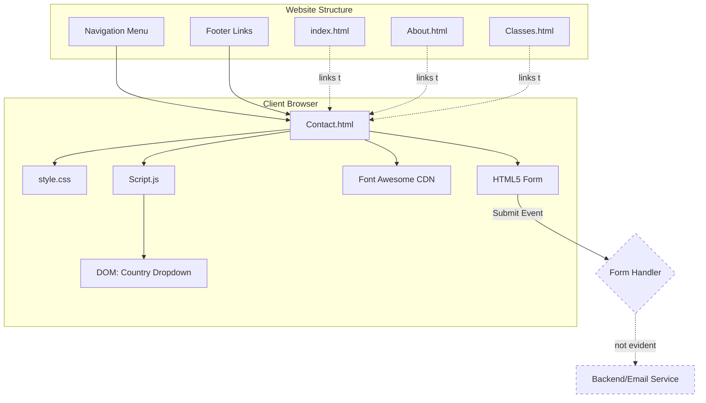
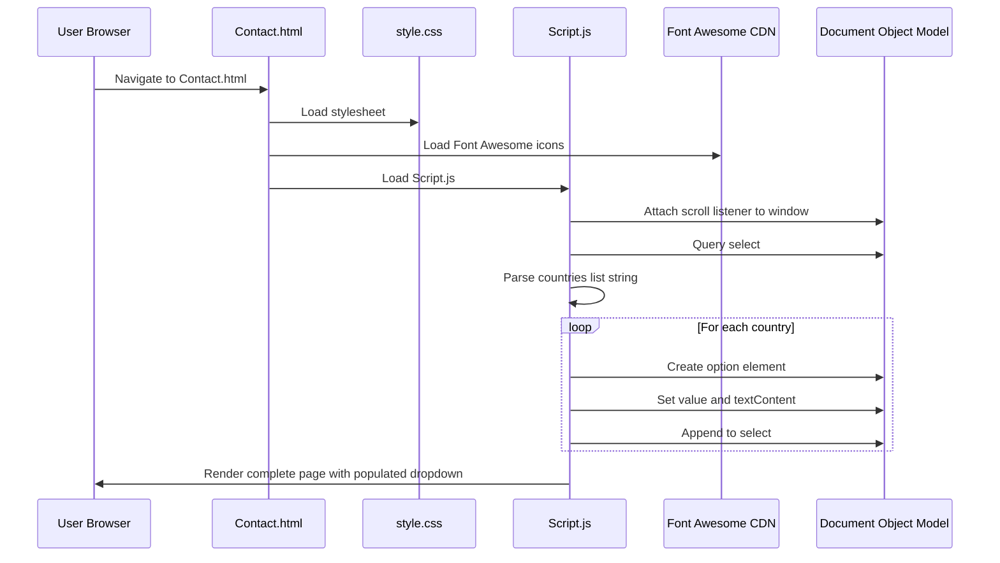
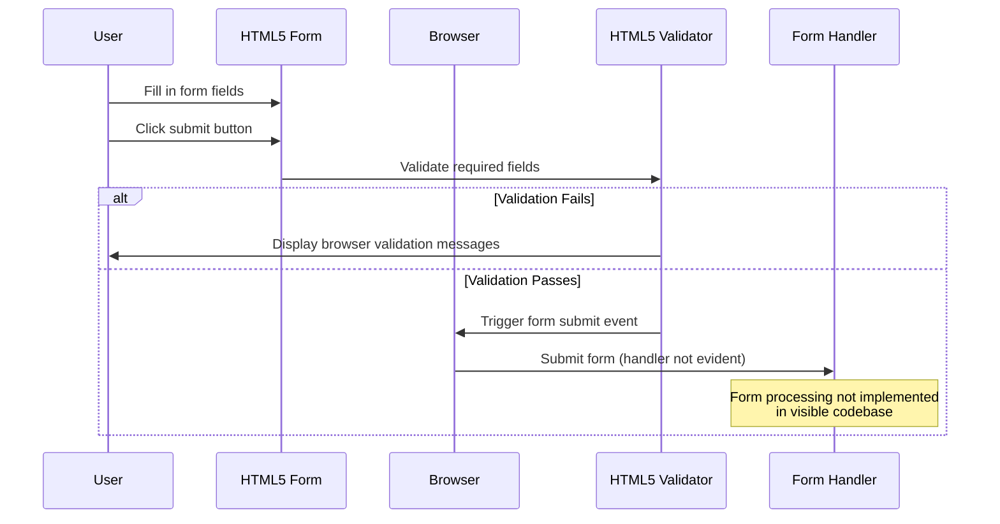

# Contact Feature Documentation

## Table of Contents

1. [Overview](#overview)
2. [Repo Use Cases](#repo-use-cases)
3. [High-Level Architecture](#high-level-architecture)
4. [Core Components](#core-components)
5. [Data Flow](#data-flow)
6. [Code Implementation](#code-implementation)
7. [Integration Points](#integration-points)
8. [Configuration](#configuration)
9. [Monitoring and Operations](#monitoring-and-operations)

---

## Overview

The Contact feature provides a client-side contact form interface within the SBG Doha MMA Gym website. It serves as a visitor engagement mechanism enabling prospective gym members or interested parties to submit enquiries through a structured web form. The feature is implemented as a standalone HTML page (`Contact.html`) integrated within the wider static website architecture.

Key characteristics:

- **Client-side form interface**: HTML5 form with validation attributes
- **Dynamic country selection**: JavaScript-driven dropdown population with 195+ countries
- **Responsive design**: Mobile-friendly layout using CSS Grid and Flexbox
- **Consistent navigation**: Integrated with site-wide navigation and footer components
- **Form validation**: Built-in HTML5 validation for required fields and email format

The Contact feature sits within a multi-page static website structure alongside Home, About, Classes, Trainers, History, and Gallery pages. It is accessible via the primary navigation menu and footer links throughout the website.

---

## Repo Use Cases

### Use Case 1: Submit General Enquiry

**Trigger**: Visitor navigates to `/Contact.html` and completes the contact form

**Code Path**:
- Navigation link click → Page load → Form display → User input → Client-side validation → Form submission

**Output**: Form submission event (handling not evident in codebase)

**Constraints**: All fields are marked as required; email field must contain valid email format; country must be selected from dropdown

### Use Case 2: Access Contact Page via Navigation

**Trigger**: User clicks "Contact" link in navigation menu or footer on any website page

**Code Path**:
- Link element `<a href="Contact.html">` → Browser navigation → Contact page load → JavaScript execution → Country dropdown population

**Output**: Rendered contact page with fully populated country selector

**Constraints**: JavaScript must be enabled for country list population; page requires `Script.js` and `style.css` to be available

### Use Case 3: Access Contact Page via Footer Registration Link

**Trigger**: User clicks "registiration" [sic] link in footer "get help" section

**Code Path**:
- Footer link `<a href="Contact.html">registiration</a>` → Browser navigation → Contact page load

**Output**: Contact page displayed, implying registration enquiries are handled via general contact form

**Constraints**: No distinction between general contact and registration enquiries in the form itself

---

## High-Level Architecture



**Architectural Decisions**:

1. **Static Page Architecture**: The Contact feature is implemented as a standalone HTML file rather than a dynamically generated page, consistent with the repository's static website approach.

2. **Shared Assets**: The feature reuses global stylesheets (`style.css`) and JavaScript (`Script.js`) across the entire website, ensuring consistent branding and behaviour.

3. **Client-Side Validation Only**: Form validation relies exclusively on HTML5 attributes (`required`, `type="email"`), with no evident JavaScript validation layer.

4. **No Explicit Form Handler**: The form's submit action is not defined in the visible codebase, suggesting either browser default behaviour or external processing not present in the repository.

---

## Core Components

### 1. Contact.html (Primary Component)

**File**: `Contact.html`

**Responsibility**: Provides the structural markup for the contact page, including navigation, form elements, and footer.

**Key Elements**:
- Navigation bar with site-wide menu (`navbar` div)
- Contact section (`section#Contact`)
- HTML5 form with input fields
- Footer with multiple link columns and social media icons

**Dependencies**: `style.css`, `Script.js`, Font Awesome 5.15.1 CDN

### 2. Script.js (Behaviour Layer)

**File**: `Script.js`

**Responsibility**: Provides JavaScript functionality for navigation interactivity and dynamic country dropdown population.

**Key Functions**:
- `navToggle()`: Toggles mobile menu visibility
- Scroll event listener: Adds sticky navigation on scroll
- Country list population: Dynamically creates `<option>` elements for country selector

**Dependencies**: DOM elements `.navbar`, `.navbar_container2`, `ol`, `select#countries`

### 3. style.css (Presentation Layer)

**File**: `style.css`

**Responsibility**: Defines all visual styling for the contact feature and wider website.

**Contact-Specific Styles**:
- `.Contact .content` (lines 414-477): Form container and background styling
- `.Contact .content form` (lines 418-426): Form box shadow and positioning
- `.Contact .content form input` (lines 437-447): Input field styling
- `.Contact .content form textarea` (lines 448-453): Message textarea styling
- `.Contact .content form .btn` (lines 454-467): Submit button styling and hover effects

**Dependencies**: Google Fonts (Poppins, Nunito Sans), CSS variables for theme colours

### 4. Navigation Component (Shared)

**Files**: Present in `Contact.html` lines 18-30

**Responsibility**: Provides consistent site-wide navigation across all pages.

**Structure**:
- Logo link to homepage
- Ordered list of navigation items
- Mobile menu toggle trigger

**Integration**: Contact page is the sixth item in the navigation list

### 5. Footer Component (Shared)

**Files**: Present in `Contact.html` lines 51-93

**Responsibility**: Provides site-wide footer with multiple link columns and social media integration.

**Contact References**:
- Listed in "company" column (line 59)
- Listed in "get help" column as "registiration" (line 67)

---

## Data Flow

### Standard Page Load Flow



### Form Submission Flow



**Data Flow Observations**:

1. **Input Data**: User provides name (text), email (email), country (select dropdown), and message (textarea)

2. **Validation**: HTML5 attributes (`required`, `type="email"`) trigger browser-native validation before submission

3. **Country Data**: Hardcoded string of 195+ countries in `Script.js:15` is split and transformed into dropdown options

4. **Form Submission**: No form `action` or `method` attribute is defined; JavaScript submit handler is not present in codebase

5. **Output**: Form submission outcome is not evident from the repository; no success/error messaging visible

---

## Code Implementation

### Entry Point: Page Load and Initialisation

**File: `Contact.html`**
```html
<!DOCTYPE html>
<html lang="en">
  <head>
    <meta charset="UTF-8" />
    <meta http-equiv="X-UA-Compatible" content="IE=edge" />
    <meta name="viewport" content="width=device-width, initial-scale=1.0" />
    <title>Sbg Doha</title>
    <link rel="stylesheet" type="text/css" href="style.css" />
    <link rel="stylesheet" type="text/css" href="https://cdnjs.cloudflare.com/ajax/libs/font-awesome/5.15.1/css/all.min.css">
  </head>
  <body>
    <!-- Navigation and content follows -->
    <script src="Script.js"></script>
  </body>
</html>
```

**Explanation**: The page loads standard HTML5 document structure with external CSS from `style.css`, Font Awesome icons from CDN, and JavaScript from `Script.js`. The script tag is placed at the end of the body to ensure DOM elements are available when JavaScript executes.

---

### Navigation Component

**File: `Contact.html`**
```html
<div class="navbar">
  <a href="index.html" class="logo">sbg<b>Dh</b>.</a>
  <div class="navbar_container2" onclick="navToggle();">
     <ol>
       <li><a href="index.html">Home</a></li>
       <li><a href="About.html">About</a></li>
       <li><a href="Classes.html">Classes</a></li>
       <li><a href="Trainers.html">Trainers</a></li>
       <li><a href="History.html">History</a></li>
       <li><a href="Contact.html">Contact</a></li>
    </ol>
  </div>
</div>
```

**Explanation**: The navigation bar contains the site logo and menu items. The `onclick="navToggle();"` attribute on `navbar_container2` triggers the mobile menu toggle function defined in `Script.js`. The Contact link points to the current page, creating a self-reference.

---

### Contact Form Structure

**File: `Contact.html`**
```html
<section id="Contact" class="Contact view">
    <div class="main">
      <h2><span>c</span>ontact </h2>
      <h6>Contact Us</h6>
    </div>
    <div class="content">
      <form>
          <input type="text" placeholder="User" required>
          <input type="email" placeholder="Email" required>
          <select id="countries" required>
            <option value="" selected disabled hidden>Select Country:</option>
          </select>
          <textarea rows="5" placeholder="What's on your mind" required></textarea>
          <br>
          <input type="submit" value="send" class="btn">
          </br>
        </form>
        <div class="./src/bg.img"></div>
    </div>
</section>
```

**Explanation**: The contact section contains a heading with styled first letter (via `<span>`) and a form with four input fields. All fields use the `required` attribute for HTML5 validation. The country dropdown initially contains only a placeholder option; JavaScript populates the rest. The form has no `action` or `method` attribute, indicating submission handling is not implemented in the visible codebase. The `<div class="./src/bg.img"></div>` appears to be intended for a background image but contains an invalid class name.

---

### JavaScript: Sticky Navigation on Scroll

**File: `Script.js`**
```javascript
window.addEventListener('scroll', function (){
    const navbar = document.querySelector('.navbar');
    navbar.classList.toggle("sticky", window.scrollY > 50);
});
```

**Explanation**: This scroll event listener monitors the vertical scroll position. When the user scrolls beyond 50 pixels, it adds the `sticky` class to the navbar element, which triggers CSS styling changes (reduced padding, black background, shadow) as defined in `style.css:31-44`. This provides a condensed navigation bar when scrolling down the page.

---

### JavaScript: Mobile Navigation Toggle

**File: `Script.js`**
```javascript
const togglebar = document.querySelector('.navbar_container2');
const menu = document.querySelector('ol');

function navToggle(){
  togglebar.classList.toggle("active");
  menu.classList.toggle("active");
}
```

**Explanation**: The `navToggle()` function toggles the `active` class on both the navbar container and the menu list. When active, the menu displays as a full-screen overlay on mobile devices (as defined in `style.css:597-615`). This function is triggered by the `onclick` attribute on the navbar container in the HTML.

---

### JavaScript: Dynamic Country Dropdown Population

**File: `Script.js`**
```javascript
let countriesList = 'Afghanistan, Albania, Algeria, Andorra, Angola, Antigua & Deps, Argentina, Armenia, Australia, Austria, Azerbaijan, Bahamas, Bahrain, Bangladesh, Barbados, Belarus, Belgium, Belize, Benin, Bhutan, Bolivia, Bosnia Herzegovina, Botswana, Brazil, Brunei, Bulgaria, Burkina, Burundi, Cambodia, Cameroon, Canada, Cape Verde, Central African Rep, Chad, Chile, China, Colombia, Comoros, Congo, Congo (Democratic Rep), Costa Rica, Croatia, Cuba, Cyprus, Czech Republic, Denmark, Djibouti, Dominica, Dominican Republic, East Timor, Ecuador, Egypt, El Salvador, Equatorial Guinea, Eritrea, Estonia, Ethiopia, Fiji, Finland, France, Gabon, Gambia, Georgia, Germany, Ghana, Greece, Grenada, Guatemala, Guinea, Guinea-Bissau, Guyana, Haiti, Honduras, Hungary, Iceland, India, Indonesia, Iran, Iraq, Ireland (Republic Of), Israel, Italy, Ivory Coast, Jamaica, Japan, Jordan, Kazakhstan, Kenya, Kiribati, Korea North, Korea South, Kosovo, Kuwait, Kyrgyzstan, Laos, Latvia, Lebanon, Lesotho, Liberia, Libya, Liechtenstein, Lithuania, Luxembourg, Macedonia, Madagascar, Malawi, Malaysia, Maldives, Mali, Malta, Marshall Islands, Mauritania, Mauritius, Mexico, Micronesia, Moldova, Monaco, Mongolia, Montenegro, Morocco, Mozambique, Myanmar, (Burma), Namibia, Nauru, Nepal, Netherlands, New Zealand, Nicaragua, Niger, Nigeria, Norway, Oman, Pakistan, Palau, Panama, Papua New Guinea, Paraguay, Peru, Philippines, Poland, Portugal, Qatar, Romania, Russian Federation, Rwanda, St Kitts & Nevis, St Lucia, Saint Vincent & the Grenadines, Samoa, San Marino, Sao Tome & Principe, Saudi Arabia, Senegal, Serbia, Seychelles, Sierra Leone, Singapore, Slovakia, Slovenia, Solomon Islands, Somalia, South Africa, South Sudan, Spain, Sri Lanka, Sudan, Suriname, Swaziland, Sweden, Switzerland, Syria, Taiwan, Tajikistan, Tanzania, Thailand, Togo, Tonga, Trinidad & Tobago, Tunisia, Turkey, Turkmenistan, Tuvalu, Uganda, Ukraine, United Arab Emirates, United Kingdom, United States, Uruguay, Uzbekistan, Vanuatu, Vatican City, Venezuela, Vietnam, Yemen, Zambia, Zimbabwe'
countriesList = countriesList.split(', ')

let countriesSelect = document.querySelector('select#countries')

countriesList.forEach(element => {
    let option = document.createElement('option')
    option.value = element
    option.textContent = element

    countriesSelect.appendChild(option)
});
```

**Explanation**: This code block executes on page load. It takes a hardcoded string of 195+ country names, splits it by comma-space delimiter into an array, then iterates through each country. For each country, it creates an HTML `<option>` element, sets both the value attribute and display text to the country name, and appends it to the select dropdown identified by `#countries`. This dynamically populates the country selector that users see in the contact form.

---

### CSS: Form Container Styling

**File: `style.css`**
```css
.Contact .content{
    min-height: 100vh;
}

.Contact .content form{
    margin: auto;
    width: 400px;
    height: 500px;
    padding: 20px;
    background: #fff;
    box-shadow: 0 10px 15px rgba(0,0,0,0.5);
    z-index: 1;
}
```

**Explanation**: The contact content area takes a minimum of full viewport height (100vh). The form itself is centred with auto margins, has fixed dimensions (400px × 500px), white background, internal padding, and a subtle drop shadow. The `z-index: 1` ensures the form appears above the background layer. These styles create the visual "card" effect for the contact form.

---

### CSS: Form Input Styling

**File: `style.css`**
```css
.Contact .content form input{
    color: #222;
    width: 100%;
    height: 50px;
    padding: 0 10px;
    font-size: 18px;
    border: 1px solid #878787;
    border-radius: 4px;
    margin: 15px 0;
    background: transparent;
}

.Contact .content form textarea{
    width: 100%;
    padding: 10px;
    color: #222;
    background: transparent;
}

.Contact .content select{
    color: #555;
    width: 100%;
    padding: 10px;
    margin: 15px 0;
    font-size: 18px;
}
```

**Explanation**: Input fields span full form width with consistent margins (15px vertical), 50px height for text/email inputs, grey borders with 4px radius, and dark grey text colour (`#222`). The textarea and select elements follow similar styling patterns. Transparent backgrounds allow the white form background to show through. These styles create a clean, modern form appearance with consistent spacing and typography.

---

### CSS: Submit Button Styling

**File: `style.css`**
```css
.Contact .content form .btn{
    letter-spacing: 1px;
    width: 100px;
    display: inline-block;
    color: #87CEFA;
    border-color: #87CEFA;
    cursor: pointer;
    transition: 0.2s ease;
}

.Contact .content form .btn:hover{
    background: #87CEFA;
    color: #fff;
}
```

**Explanation**: The submit button has 100px width, sky blue colour (`#87CEFA` - the site's brand colour), increased letter spacing for readability, and pointer cursor on hover. The hover state inverts colours with blue background and white text, with a 0.2 second transition for smooth visual feedback. This creates an engaging, interactive button that aligns with the site's visual identity.

---

### CSS: Responsive Mobile Adjustments

**File: `style.css`**
```css
@media screen and (max-width: 900px){
    .navbar{
        padding: 0 60px;
    }
    .navbar ol{
        display: none;
    }
    .navbar ol.active{
        top: 60px;
        left: 0;
        width: 100%;
        display: flex;
        position: fixed;
        background: #222;
        align-items: center;
        justify-content: center;
        flex-direction: column;
        height: calc(100% - 60px);
    }
}
```

**Explanation**: On screens narrower than 900px, the navigation menu hides by default (`display: none`). When the `active` class is added (via the `navToggle()` function), the menu transforms into a full-screen overlay positioned from the top of the viewport with dark background, centred content, and column-based layout. This provides a mobile-friendly navigation experience for the contact page and all other pages in the website.

---

### Footer Component Implementation

**File: `Contact.html`**
```html
<footer class="footer">
  <div class="container">
   <div class="row">
     <div class="footer-col">
       <h4>company</h4>
       <ul>
         <li><a href="About.html">about us</a></li>
         <li><a href="Classes.html">our services</a></li>
         <li><a href="Contact.html">Contact</a></li>
         <li><a href="History.html">History</a></li>
       </ul>
     </div>
     <div class="footer-col">
       <h4>get help</h4>
       <ul>
         <li><a href="index.html">FAQ</a></li>
         <li><a href="Contact.html">registiration</a></li>
         <li><a href="History.html">History</a></li>
         <li><a href="Classes.html">socials</a></li>
       </ul>
     </div>
     <div class="footer-col">
       <h4>Classes</h4>
       <ul>
         <li><a href="Classes.html">Kids kickboxing</a></li>
         <li><a href="Classes.html">Adult kickboxing</a></li>
         <li><a href="Classes.html">bjj Kids</a></li>
         <li><a href="Classes.html">bjj men</a></li>
       </ul>
     </div>
     <div class="footer-col">
       <h4>follow us</h4>
       <div class="social-links">
         <a href="#"><i class="fab fa-facebook-f"></i></a>
         <a href="#"><i class="fab fa-twitter"></i></a>
         <a href="#"><i class="fab fa-instagram"></i></a>
         <a href="#"><i class="fab fa-linkedin-in"></i></a>
       </div>
     </div>
   </div>
  </div>
</footer>
```

**Explanation**: The footer provides site-wide navigation through four columns: company links, help resources, class information, and social media icons. The Contact page is referenced twice: in the "company" column as "Contact" and in the "get help" column as "registiration" [sic]. Social media links currently point to `#` placeholders rather than actual social profiles. The footer maintains consistent structure across all pages of the website, providing multiple pathways to the contact form.

---

## Integration Points

### External Dependencies

#### 1. Font Awesome CDN

**Location**: `Contact.html:14`

**URL**: `https://cdnjs.cloudflare.com/ajax/libs/font-awesome/5.15.1/css/all.min.css`

**Purpose**: Provides icon fonts for social media icons in the footer (Facebook, Twitter, Instagram, LinkedIn)

**Usage**: Icons are rendered using `<i>` tags with Font Awesome classes (e.g., `fab fa-facebook-f`)

**Failure Mode**: If CDN is unavailable, social media icons will not display, but page functionality remains intact

#### 2. Google Fonts

**Location**: `style.css:1-2`

**URLs**:
- `https://fonts.googleapis.com/css2?family=Nunito+Sans:wght@200;300;400;600&display=swap`
- `https://fonts.googleapis.com/css2?family=Poppins:wght@300;400;500;600;700&display=swap`

**Purpose**: Provides Poppins and Nunito Sans web fonts for consistent typography across the site

**Usage**: Applied via `font-family: 'Poppins', sans-serif` throughout the stylesheet

**Failure Mode**: Browser will fall back to system sans-serif fonts if Google Fonts is unavailable

### Internal Dependencies

#### 1. Shared Stylesheet

**File**: `style.css`

**Relationship**: Required by all pages including Contact.html

**Contact-Specific Styles**: Lines 414-477 contain Contact page styling

**Shared Styles**: Navigation (21-75), footer (498-569), responsive rules (589-696)

#### 2. Shared JavaScript

**File**: `Script.js`

**Relationship**: Required by all pages for navigation toggle and scroll behaviour

**Contact-Specific Logic**: Country dropdown population (lines 15-26)

**Shared Logic**: Navigation toggle (lines 7-14), sticky navigation (lines 2-5)

### Missing Integrations

**Form Submission Handler**: No backend service, API endpoint, or email service integration is evident in the repository. The form's submit behaviour is undefined, suggesting either:
- External processing not included in the repository
- Future implementation requirement
- Reliance on browser default form submission (which would fail without an action URL)

**Database or Storage**: No evidence of data persistence mechanism for submitted enquiries

**Email Service**: No SMTP configuration or email sending library integration visible

---

## Configuration

### Hardcoded Configuration

#### Country List

**Location**: `Script.js:15`

**Format**: Comma-separated string containing 195+ country names

**Modifiability**: Requires direct code modification to add, remove, or reorder countries

**Note**: The list includes some non-standard entries (e.g., "Antigua & Deps", "Burma" in parentheses) and may require standardisation for integration with address validation services

#### Brand Colour

**Location**: `style.css:13-16`

**Definition**: CSS custom property `--prime: #00ff34` (bright green)

**Usage**: Limited usage; most instances use `#87CEFA` (sky blue) directly in styles

**Note**: Inconsistency between defined prime colour and actual usage throughout the stylesheet

#### Form Dimensions

**Location**: `style.css:418-426`

**Values**:
- Width: 400px
- Height: 500px
- Padding: 20px

**Responsive Behaviour**: Not adjusted in media queries; may cause usability issues on narrow mobile devices

### External Configuration

#### Font Awesome Version

**Location**: `Contact.html:14`

**Current Version**: 5.15.1

**Update Path**: Modify CDN URL in HTML head section

**Impact**: Version changes may affect icon rendering if icon names change

#### Google Fonts Weights

**Location**: `style.css:1-2`

**Loaded Weights**:
- Nunito Sans: 200, 300, 400, 600
- Poppins: 300, 400, 500, 600, 700

**Impact**: Additional weights increase page load time; unused weights could be removed for performance

### Configuration Limitations

**No Environment Variables**: All configuration is hardcoded in source files

**No Feature Flags**: Cannot conditionally enable/disable contact form functionality

**No Validation Rules Configuration**: Field validation rules are hardcoded in HTML attributes

**No Styling Themes**: Single colour scheme with no configuration mechanism for alternative themes

---

## Monitoring and Operations

### Operational Behaviour Visibility

**Browser-Side Validation Feedback**: HTML5 validation messages are displayed by the browser when users attempt to submit incomplete or invalid form data. These messages vary by browser and language settings and are not controlled by the application code.

### Debugging Mechanisms

**Browser Developer Tools**: Standard browser console and network tab can be used to:
- Inspect form element states
- Monitor form submission events
- Debug JavaScript execution in `Script.js`
- Examine CSS styling application

**HTML Comments**: `Contact.html:1-5` contains developer attribution comments:
```html
<!--
    student name:Abdelrahman Abdalla ,c22323231
    student name:Muhammad Zaid Irfan, C22499352
    website can be found at https://sbgdoha.netlify.app/
-->
```

These comments identify the original developers and deployment location, useful for operational context.

### Known Issues in Codebase

#### 1. Invalid CSS Class Name

**Location**: `Contact.html:48`

**Issue**: `<div class="./src/bg.img"></div>` contains a class name with invalid characters (`.`, `/`)

**Impact**: CSS selector will not match; intended background image functionality is non-functional

#### 2. Empty Closing Tag

**Location**: `Contact.html:46`

**Issue**: `</br>` is not valid HTML5 syntax

**Impact**: No visual impact but represents malformed markup

#### 3. Missing Form Action

**Location**: `Contact.html:39-47`

**Issue**: Form element has no `action` or `method` attribute

**Impact**: Form submission will use browser default behaviour (GET request to current URL), which will not process the enquiry

**Inference**: Backend form processing is not implemented in this repository

#### 4. Typo in Footer Link

**Location**: Multiple files, e.g., `Contact.html:67`

**Issue**: "registiration" instead of "registration"

**Impact**: Minor spelling error visible to end users

### Monitoring Gaps

**Form Submission Tracking**: No analytics or tracking events evident for form submissions

**Error Logging**: No JavaScript error handling or logging for country dropdown population failure

**Performance Monitoring**: No evidence of page load timing or client-side performance tracking

**User Behaviour Analytics**: No evidence of form field interaction tracking or abandonment monitoring

**Accessibility Monitoring**: No ARIA labels or accessibility attributes for screen reader users; no evidence of accessibility testing

### Operational Notes

**Static Hosting Deployment**: Repository evidence suggests deployment to Netlify (`sbgdoha.netlify.app` in HTML comments). Static hosting implies:
- No server-side form processing without additional Netlify Forms configuration
- No backend logs or server monitoring
- Client-side errors only visible in user browsers

**Form Submission Failure Mode**: Without a configured form handler, users will experience one of:
- Page reload with no feedback (if using default GET submission)
- No response at all (if form submission is prevented by browser)
- Potential JavaScript errors if custom submission handler is expected but not present

**Maintenance Requirements**: Updates to country list require code deployment; no dynamic configuration mechanism exists

---

## Appendix: File References

| Component | File | Lines |
|-----------|------|-------|
| Contact Page HTML | `Contact.html` | 1-96 |
| Form Structure | `Contact.html` | 39-47 |
| Navigation Component | `Contact.html` | 18-30 |
| Footer Component | `Contact.html` | 51-93 |
| JavaScript Functionality | `Script.js` | 1-27 |
| Country Dropdown Population | `Script.js` | 15-26 |
| Navigation Toggle | `Script.js` | 7-14 |
| Sticky Navigation | `Script.js` | 2-5 |
| Contact Form Styles | `style.css` | 414-477 |
| Form Input Styles | `style.css` | 437-453 |
| Submit Button Styles | `style.css` | 454-467 |
| Navigation Styles | `style.css` | 21-75 |
| Footer Styles | `style.css` | 498-569 |
| Responsive Styles | `style.css` | 589-696 |

---

**Document Version**: 1.0
**Last Updated**: 2026-04-16
**Repository**: SBG-Doha-website
**Feature Scope**: Contact Form and Related Components
