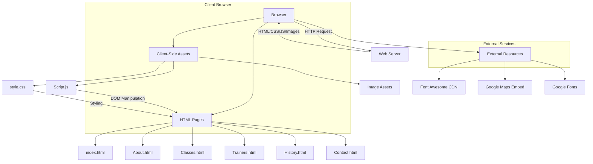
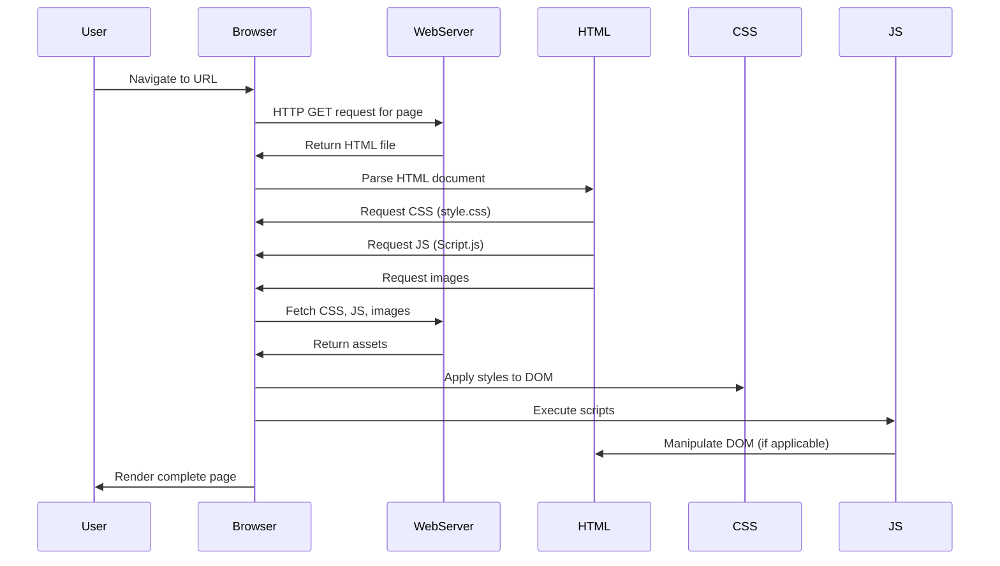
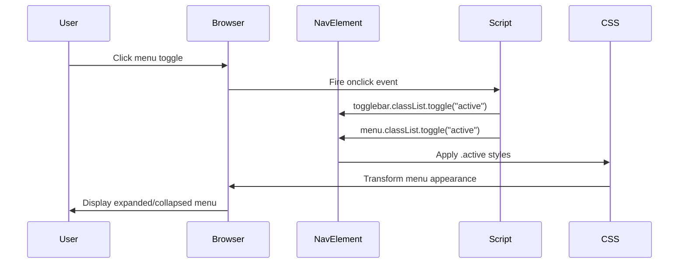
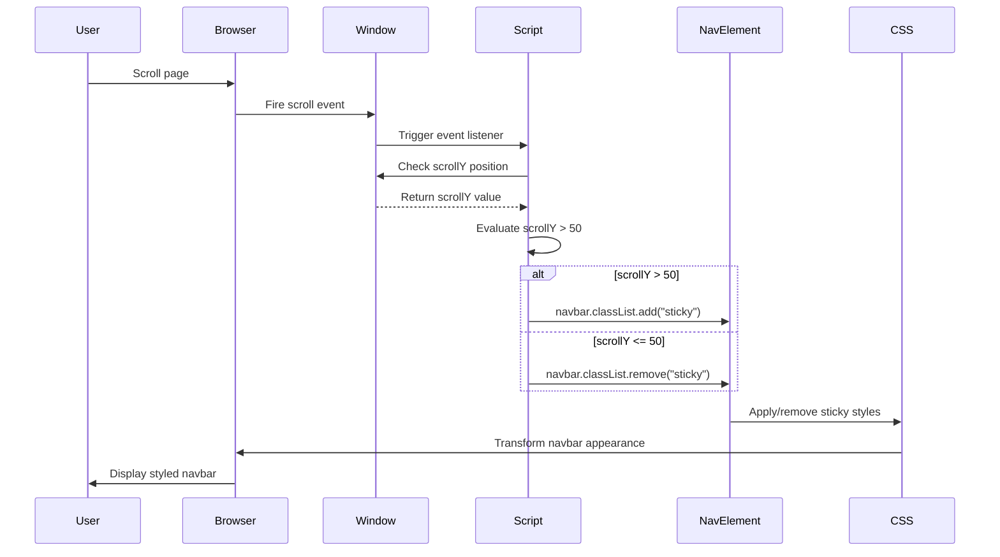
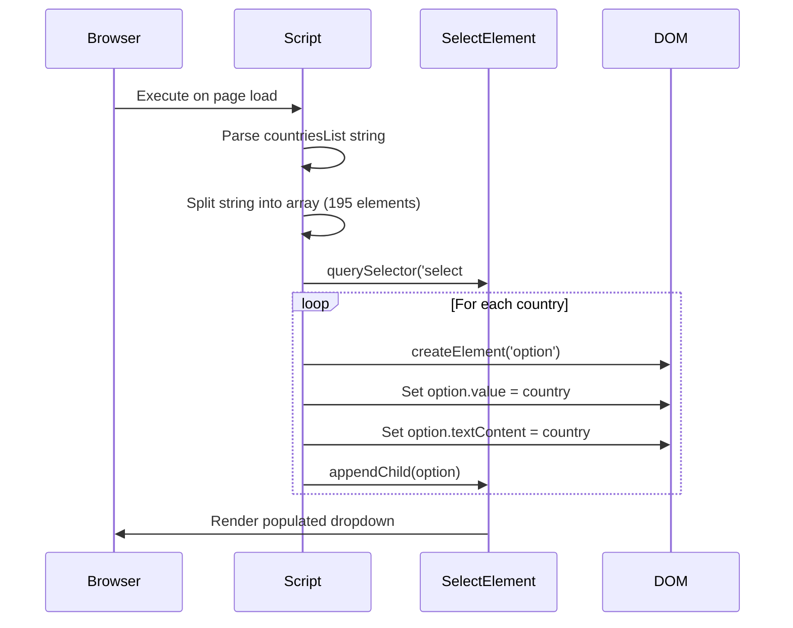

# SBG Doha Website Data Flow Documentation

## Table of Contents

1. [Overview](#overview)
2. [Repo Use Cases](#repo-use-cases)
3. [High-Level Architecture](#high-level-architecture)
4. [Core Components](#core-components)
5. [Data Flow](#data-flow)
6. [Code Implementation](#code-implementation)
7. [Integration Points](#integration-points)
8. [Configuration](#configuration)
9. [Monitoring and Operations](#monitoring-and-operations)

## Overview

The SBG Doha website is a static, client-side rendered web application that serves as an informational platform for a Mixed Martial Arts (MMA) and Brazilian Jiu-Jitsu (BJJ) gym in Doha, Qatar. The website provides information about classes, trainers, gym history, and contact details for potential members.

This subsystem is a pure client-side application with no server-side data processing. Data flow occurs entirely within the browser environment through:

- HTML page navigation
- DOM manipulation via JavaScript
- CSS-based visual transformations
- User interaction event handling

**Key Characteristics:**

1. **Static Content Delivery**: All pages are pre-built HTML files served directly to the browser
2. **Client-Side Interactivity**: JavaScript handles navigation menu toggling and scroll-based styling
3. **No Backend Communication**: The application does not communicate with any server endpoints for data retrieval or persistence
4. **External Dependencies**: Relies on Font Awesome CDN for icons and Google Maps embed for location display
5. **Responsive Design**: CSS media queries handle adaptive layouts for different screen sizes

## Repo Use Cases

The SBG Doha website supports the following primary use cases within the repository:

### 1. Page Navigation Flow

**Trigger**: User clicks navigation links in the header menu or footer links
**Components Involved**: Navigation bar (`navbar`), anchor elements across all HTML pages
**Expected Outcome**: Browser loads the requested HTML page, maintaining consistent navigation structure
**Entry Point**: User interaction with `<a>` elements in `index.html:26-34` or footer links

### 2. Mobile Menu Toggle Interaction

**Trigger**: User clicks the navigation toggle button on mobile devices (screen width < 900px)
**Components Involved**: `navbar_container2` element, `Script.js:10-14`, CSS media queries
**Expected Outcome**: Navigation menu expands or collapses with active state toggling
**Entry Point**: `onclick="navToggle()"` event handler in `index.html:27`

### 3. Sticky Navigation on Scroll

**Trigger**: User scrolls the page beyond 50 pixels from the top
**Components Involved**: Window scroll event listener, `navbar` element, CSS sticky styles
**Expected Outcome**: Navigation bar receives 'sticky' class, applying condensed styling and background
**Entry Point**: Scroll event listener in `Script.js:2-5`

### 4. Contact Form Interaction

**Trigger**: User fills out contact form and clicks submit
**Components Involved**: Contact form in `Contact.html:39-47`, country dropdown populated by `Script.js:15-26`
**Expected Outcome**: Form validation occurs (client-side HTML5 validation), but no data submission is implemented
**Entry Point**: Form element in `Contact.html:39`

### 5. Country Selection Population

**Trigger**: Page load of `Contact.html`
**Components Involved**: Countries list array, dropdown select element, DOM manipulation
**Expected Outcome**: Country dropdown is populated with 195 country options from hardcoded array
**Entry Point**: `Script.js:15-26` executes on page load

## High-Level Architecture



**Architectural Decisions:**

1. **Static Site Architecture**: The decision to use pure HTML/CSS/JavaScript without a backend framework or build process keeps deployment simple and hosting costs minimal. This is evidenced by the direct file structure and lack of build configuration files.

2. **Single JavaScript File**: All client-side logic is consolidated in `Script.js`, containing only 27 lines of code for navigation toggle and scroll handling. This simplicity suggests a deliberate decision to avoid framework overhead for basic interactivity.

3. **CDN Dependencies**: External resources (Font Awesome, Google Fonts) are loaded from CDNs rather than bundled locally, as seen in the `<link>` tags across all HTML files. This reduces repository size but creates external dependencies.

4. **Shared Footer Component**: Each HTML page contains identical footer markup, indicating a design choice to duplicate code rather than use templating or component systems. This pattern is visible across all six HTML files.

## Core Components

### 1. HTML Pages

**Purpose**: Define page structure, content, and semantic markup for each section of the website.

- **`index.html`**: Home page with hero banner and call-to-action
- **`About.html`**: Gym information, description, and embedded Google Maps location
- **`Classes.html`**: Class offerings with schedule and images (6 class types)
- **`Trainers.html`**: Coach profiles with credentials and social links (5 trainers)
- **`History.html`**: Gym achievements, trophies, and embedded video
- **`Contact.html`**: Contact form with user input fields and country selector

### 2. Navigation System

**File**: Shared across all HTML files
**Element**: `.navbar` class structure
**Responsibility**: Provides consistent site-wide navigation with logo, menu items, and mobile toggle

**Key Implementation Details**:
- Fixed positioning with z-index 1111 for overlay behaviour
- Responsive transformation via `navToggle()` function
- State-based styling through `sticky` and `active` CSS classes

### 3. JavaScript Controller

**File**: `Script.js`
**Responsibility**: Handles all client-side interactivity and DOM manipulation

**Functions**:
- Scroll event listener for sticky navigation (`Script.js:2-5`)
- `navToggle()` function for mobile menu toggle (`Script.js:10-14`)
- Country list population for contact form (`Script.js:15-26`)

### 4. Stylesheet

**File**: `style.css`
**Responsibility**: Defines all visual presentation, layouts, and responsive behaviour

**Key Sections**:
- Global resets and root variables (`:root` CSS variable for primary colour)
- Navigation styles with sticky state transformations
- Page-specific section styles (`.Home`, `.About`, `.Classes`, etc.)
- Footer component styles with multi-column layout
- Media queries for responsive design (`@media screen and (max-width: 900px)`)

### 5. Image Assets

**Purpose**: Visual content including trainer photos, class images, banners, and logos

**Format**: JPEG, PNG, WEBP, and MP4 (video) files stored in repository root and `./src/` subdirectory references

### 6. External Integrations

**Font Awesome**: Icon library loaded via CDN for social media and UI icons
**Google Fonts**: Poppins and Nunito Sans font families for typography
**Google Maps**: Embedded iframe for gym location display on About page

## Data Flow

### Overview

Data flow in the SBG Doha website is exclusively client-side, occurring within the browser's JavaScript runtime and DOM. There is no server-side data processing, database queries, or API communication (except for external CDN and embed resources).

### Primary Data Flow Patterns

#### 1. Static Content Loading Flow



**Data Inputs**: None (static HTML content)
**Data Outputs**: Rendered DOM with styled elements
**State Transitions**: HTML parsing → CSS application → JavaScript execution → Rendered page

#### 2. Navigation Menu Toggle Flow

This flow demonstrates how user interaction triggers DOM state changes without any data persistence.



**Data Inputs**: Click event from user interaction
**Data Transformations**: DOM class list modification
**Data Outputs**: Visual state change in navigation menu
**State Storage**: Ephemeral (stored only in DOM, lost on page reload)

#### 3. Scroll-Based Sticky Navigation Flow



**Data Inputs**: Scroll position (window.scrollY)
**Data Transformations**: Boolean evaluation (scrollY > 50) → Class toggle
**Data Outputs**: CSS class application triggering visual changes
**Performance Consideration**: Event fires on every scroll pixel, but DOM manipulation is minimal

#### 4. Contact Form Country Population Flow



**Data Inputs**: Hardcoded string of 195 comma-separated country names
**Data Transformations**: String split → Array iteration → DOM element creation
**Data Outputs**: Populated `<select>` element with country options
**Execution Timing**: Runs once on Contact.html page load

### Data State Management

The application does not implement any persistent state management. All state is ephemeral and exists only in:

1. **DOM State**: CSS classes (`sticky`, `active`) applied to elements
2. **Browser State**: Scroll position (window.scrollY) managed by browser
3. **Session State**: None - no sessionStorage or localStorage usage detected
4. **Form State**: HTML5 form validation state, but no data submission or persistence

### Data Loss Scenarios

Because no data is persisted:

- **Page Refresh**: All ephemeral state (navigation toggle state, scroll position restoration relies on browser behaviour) is reset
- **Form Abandonment**: Contact form data entered by users is lost if they navigate away
- **No Submission Handler**: Form submission has no action attribute or JavaScript handler, so data is not sent anywhere

## Code Implementation

This section traces the complete execution flows from entry point to completion for each major interaction pattern in the website.

### 1. Page Load and Initialisation Flow

**Entry Point**: User navigates to any HTML page (e.g., `index.html`)

**File: `index.html:1-94`**
```html
<!DOCTYPE html>
<html lang="en">
  <head>
    <meta charset="UTF-8" />
    <meta http-equiv="X-UA-Compatible" content="IE=edge" />
    <meta name="viewport" content="width=device-width, initial-scale=1.0" />
    <title>Sbg Doha</title>
    <link rel="stylesheet" type="text/css" href="style.css" />
    <link rel="stylesheet" href="https://cdnjs.cloudflare.com/ajax/libs/font-awesome/4.7.0/css/font-awesome.min.css" />
  </head>
  <body>
    <!-- Navigation and content -->
    <script src="Script.js"></script>
  </body>
</html>
```

**Explanation**: The browser parses HTML from top to bottom. The `<head>` section loads external CSS (`style.css`) and Font Awesome from CDN. The `<script>` tag at line 92 defers JavaScript execution until after the DOM is constructed, ensuring elements exist before manipulation.

**File: `Script.js:2-5`**
```javascript
window.addEventListener('scroll',function (){
    const navbar = document.querySelector('.navbar');
    navbar.classList.toggle("sticky", window.scrollY > 50);
});
```

**Explanation**: This event listener is registered immediately when `Script.js` executes. It attaches to the window's scroll event and creates a persistent listener that evaluates scroll position on every scroll event. The `classList.toggle()` method with a second parameter acts as a conditional: if `window.scrollY > 50` is true, the 'sticky' class is added; otherwise, it's removed. This creates the sticky navigation effect.

**File: `Script.js:7-14`**
```javascript
const togglebar = document.querySelector('.navbar_container2');
const menu = document.querySelector('ol');

function navToggle(){
  togglebar.classList.toggle("active");
  menu.classList.toggle("active");
};
```

**Explanation**: Two DOM elements are selected and stored in constants for later reference. The `navToggle()` function is defined globally, making it accessible to the `onclick` attribute in HTML. When called, it toggles the 'active' class on both the toggle button container and the menu list, which CSS uses to show/hide the menu on mobile devices.

**Execution Order on Page Load**:
1. Browser requests HTML file
2. HTML parser encounters `<link>` tags, triggers CSS file requests
3. CSS files load and CSSOM is constructed
4. HTML parser continues building DOM tree
5. Parser encounters `<script src="Script.js">`, pauses to execute JavaScript
6. JavaScript sets up scroll event listener
7. JavaScript selects navigation DOM elements
8. JavaScript defines `navToggle()` function
9. Page rendering completes with all scripts initialised

### 2. Mobile Navigation Toggle Flow

**Entry Point**: User clicks navigation toggle button on mobile

**File: `index.html:27`**
```html
<div class="navbar_container2" onclick="navToggle()">
  <ol>
    <li><a href="index.html">Home</a></li>
    <li><a href="About.html">About</a></li>
    <!-- More menu items -->
  </ol>
</div>
```

**Explanation**: The `onclick` inline event handler is triggered when the user clicks anywhere within the `.navbar_container2` div. This calls the globally available `navToggle()` function. The `<ol>` list contains all navigation links and is initially hidden on mobile via CSS.

**File: `Script.js:10-14`**
```javascript
function navToggle(){
  togglebar.classList.toggle("active");
  menu.classList.toggle("active");
};
```

**Explanation**: This function executes synchronously when called. The `toggle()` method checks if the 'active' class exists on the element; if present, it removes it; if absent, it adds it. This creates a state flip on each invocation, enabling the toggle behaviour.

**File: `style.css:597-607`**
```css
.navbar ol.active{
    top: 60px;
    left: 0;
    width: 100%;
    display: flex;
    position: fixed;
    background: #222;
    align-items: center;
    justify-content: center;
    flex-direction: column;
    height: calc(100% - 60px);
}
```

**Explanation**: When the `active` class is applied to the `<ol>` element (the menu), CSS overrides the default `display: none` (from line 594) with `display: flex`, making the menu visible. The positioning rules create a full-screen overlay menu below the navbar. This transformation happens purely through CSS, with JavaScript only managing the class toggle.

**Complete Execution Trace**:
1. User clicks `.navbar_container2` div → `onclick` event fires
2. Browser calls `navToggle()` function
3. `togglebar.classList.toggle("active")` executes → Adds/removes 'active' class on toggle button
4. `menu.classList.toggle("active")` executes → Adds/removes 'active' class on `<ol>` menu
5. Browser's CSS engine detects class change
6. CSS rules for `.navbar ol.active` apply (if added) or revert (if removed)
7. Browser repaints the navigation menu in expanded or collapsed state
8. Function completes, returning control to browser

**Edge Case**: The mobile menu is only functional when the viewport width is below 900px due to media query conditions. Above this width, the desktop menu is always visible regardless of the 'active' class state.

### 3. Sticky Navigation on Scroll Flow

**Entry Point**: User scrolls the page

**File: `Script.js:2-5`**
```javascript
window.addEventListener('scroll',function (){
    const navbar = document.querySelector('.navbar');
    navbar.classList.toggle("sticky", window.scrollY > 50);
});
```

**Explanation**: This anonymous function executes on every scroll event. The `window.scrollY` property returns the number of pixels the document has been scrolled vertically. The `classList.toggle()` method's second parameter is a boolean condition: when true, it ensures 'sticky' class is present; when false, it ensures the class is removed. This creates a smooth threshold-based toggle at 50 pixels.

**File: `style.css:31-44`**
```css
.navbar.sticky{
    padding: 6px 60px;
    background: #000;
    box-shadow: 0 0 15px rgba(0,0,0,0.5) ;
}
.navbar.sticky .logo{
    font-size: 2em;
    color: #87CEFA ;
}
.navbar.sticky .logo b{
    color: #fff;
}
```

**Explanation**: When the 'sticky' class is added to `.navbar`, these CSS rules override the default transparent background and larger padding. The logo size reduces from 2.8em to 2em, creating a visual condensing effect. The colour scheme also shifts to improve contrast against the black background.

**Performance Consideration**: The scroll event fires frequently (potentially 60+ times per second during smooth scrolling). However, the DOM manipulation is minimal—only a single class toggle occurs, and the browser's CSS engine efficiently handles the style recalculation.

**Complete Execution Trace**:
1. User scrolls page → Browser fires 'scroll' event
2. Event listener callback executes
3. `document.querySelector('.navbar')` retrieves navbar element (cached by browser optimisation in most engines)
4. `window.scrollY` is read (browser provides current scroll position)
5. Boolean expression `window.scrollY > 50` is evaluated
6. `classList.toggle("sticky", <boolean>)` executes:
   - If scrollY > 50 and 'sticky' not present → Add 'sticky' class
   - If scrollY > 50 and 'sticky' already present → No change (idempotent)
   - If scrollY ≤ 50 and 'sticky' present → Remove 'sticky' class
   - If scrollY ≤ 50 and 'sticky' not present → No change
7. If class changed → Browser marks element for style recalculation
8. Browser layout engine recalculates affected styles
9. Browser repaint occurs on next frame
10. User sees updated navbar styling

### 4. Contact Form Country Population Flow

**Entry Point**: Browser loads `Contact.html`

**File: `Contact.html:42`**
```html
<select id="countries" required>
  <option value="" selected disabled hidden>Select Country:</option>
</select>
```

**Explanation**: The HTML defines a `<select>` element with an initial placeholder option. The `id="countries"` attribute allows JavaScript to target this element. The `required` attribute enforces HTML5 form validation.

**File: `Script.js:15-17`**
```javascript
let countriesList = 'Afghanistan, Albania, Algeria, Andorra, Angola, Antigua & Deps, Argentina, Armenia, Australia, Austria, Azerbaijan, Bahamas, Bahrain, Bangladesh, Barbados, Belarus, Belgium, Belize, Benin, Bhutan, Bolivia, Bosnia Herzegovina, Botswana, Brazil, Brunei, Bulgaria, Burkina, Burundi, Cambodia, Cameroon, Canada, Cape Verde, Central African Rep, Chad, Chile, China, Colombia, Comoros, Congo, Congo (Democratic Rep), Costa Rica, Croatia, Cuba, Cyprus, Czech Republic, Denmark, Djibouti, Dominica, Dominican Republic, East Timor, Ecuador, Egypt, El Salvador, Equatorial Guinea, Eritrea, Estonia, Ethiopia, Fiji, Finland, France, Gabon, Gambia, Georgia, Germany, Ghana, Greece, Grenada, Guatemala, Guinea, Guinea-Bissau, Guyana, Haiti, Honduras, Hungary, Iceland, India, Indonesia, Iran, Iraq, Ireland (Republic Of), Israel, Italy, Ivory Coast, Jamaica, Japan, Jordan, Kazakhstan, Kenya, Kiribati, Korea North, Korea South, Kosovo, Kuwait, Kyrgyzstan, Laos, Latvia, Lebanon, Lesotho, Liberia, Libya, Liechtenstein, Lithuania, Luxembourg, Macedonia, Madagascar, Malawi, Malaysia, Maldives, Mali, Malta, Marshall Islands, Mauritania, Mauritius, Mexico, Micronesia, Moldova, Monaco, Mongolia, Montenegro, Morocco, Mozambique, Myanmar, (Burma), Namibia, Nauru, Nepal, Netherlands, New Zealand, Nicaragua, Niger, Nigeria, Norway, Oman, Pakistan, Palau, Panama, Papua New Guinea, Paraguay, Peru, Philippines, Poland, Portugal, Qatar, Romania, Russian Federation, Rwanda, St Kitts & Nevis, St Lucia, Saint Vincent & the Grenadines, Samoa, San Marino, Sao Tome & Principe, Saudi Arabia, Senegal, Serbia, Seychelles, Sierra Leone, Singapore, Slovakia, Slovenia, Solomon Islands, Somalia, South Africa, South Sudan, Spain, Sri Lanka, Sudan, Suriname, Swaziland, Sweden, Switzerland, Syria, Taiwan, Tajikistan, Tanzania, Thailand, Togo, Tonga, Trinidad & Tobago, Tunisia, Turkey, Turkmenistan, Tuvalu, Uganda, Ukraine, United Arab Emirates, United Kingdom, United States, Uruguay, Uzbekistan, Vanuatu, Vatican City, Venezuela, Vietnam, Yemen, Zambia, Zimbabwe'
countriesList = countriesList.split(', ')
```

**Explanation**: A hardcoded string containing 195 country names is defined and immediately transformed into an array by splitting on the ', ' delimiter. This creates an array where each element is a country name string. The use of `let` allows the variable to be reassigned from string to array.

**File: `Script.js:18-26`**
```javascript
let countriesSelect = document.querySelector('select#countries')

countriesList.forEach(element => {
    let option = document.createElement('option')
    option.value = element
    option.textContent = element

    countriesSelect.appendChild(option)
});
```

**Explanation**: The `<select>` element is retrieved using a CSS selector. The `forEach` method iterates over the 195-element array, executing the callback function for each country. Within the loop:
1. A new `<option>` element is created in memory
2. The `value` attribute is set to the country name
3. The visible text content is set to the country name
4. The option is appended as a child to the `<select>` element

This loop executes 195 times, creating 195 new DOM nodes.

**Complete Execution Trace**:
1. Browser finishes parsing `Contact.html`
2. Browser executes `Script.js`
3. Line 15: String variable `countriesList` initialised with 195 countries
4. Line 16: String is split into array of 195 elements
5. Line 18: `document.querySelector('select#countries')` retrieves select element
6. Line 20: `forEach` iteration begins
7. **First Iteration** (Afghanistan):
   - Line 21: Create `<option>` element
   - Line 22: Set `value = "Afghanistan"`
   - Line 23: Set `textContent = "Afghanistan"`
   - Line 25: Append to select element
8. **Iterations 2-195**: Repeat step 7 for each country
9. Line 26: Loop completes
10. Browser reflows layout to accommodate 195 new options
11. Dropdown is now populated and ready for user interaction

**Performance Note**: Creating 195 DOM elements synchronously could cause a brief layout delay on low-end devices, but this occurs only once on page load.

### 5. Form Validation Flow (No Submission)

**Entry Point**: User fills form and clicks submit button

**File: `Contact.html:39-47`**
```html
<form>
    <input type="text" placeholder="User" required>
    <input type="email" placeholder="Email" required>
    <select id="countries" required>
      <option value="" selected disabled hidden>Select Country:</option>
    </select>
    <textarea rows="5" placeholder="What's on your mind" required></textarea>
    <br>
    <input type="submit" value="send" class="btn">
</form>
```

**Explanation**: The form has no `action` or `method` attributes, and no JavaScript event handler prevents default submission. The `required` attributes on inputs trigger HTML5 validation. When the user clicks the submit button, the browser's built-in validation checks each required field. If any field is empty or invalid (e.g., malformed email), the browser displays native validation messages and prevents submission. If all fields are valid, the form attempts to submit to the current page URL (default behaviour), which would reload the page without sending data anywhere.

**Validation Steps**:
1. User clicks submit button
2. Browser pauses submission to run HTML5 validation
3. Browser checks each input with `required` attribute:
   - Text input: Must not be empty
   - Email input: Must not be empty AND match email pattern
   - Select: Must have a value other than ""
   - Textarea: Must not be empty
4. If validation fails:
   - Browser displays native error message
   - Form does not submit
   - Focus moves to first invalid field
5. If validation passes:
   - Browser attempts GET request to current page URL
   - Page reloads, losing all form data
   - No data is sent to any backend

**Identified Gap**: No form submission handler exists, meaning user data is never captured, sent, or processed. This appears to be incomplete functionality.

### 6. Page Navigation Flow

**Entry Point**: User clicks any navigation link

**File: `index.html:29`**
```html
<li><a href="About.html">About</a></li>
```

**Explanation**: Standard HTML anchor navigation. When clicked, the browser initiates a new HTTP GET request for the specified HTML file. This is a full page load—all JavaScript state is lost, and the new page's scripts execute fresh.

**Navigation Flow**:
1. User clicks link → Browser fires 'click' event
2. Browser default behaviour intercepts event (no `preventDefault()` exists)
3. Browser reads `href` attribute value
4. Browser constructs URL (relative path resolved against current page)
5. Browser unloads current page (all JavaScript variables and DOM state destroyed)
6. Browser sends HTTP GET request to web server for new HTML file
7. Server responds with new HTML document
8. Browser begins parsing new page (returns to Page Load flow)

This creates a traditional multi-page application (MPA) pattern, as opposed to single-page application (SPA) routing.

## Integration Points

The SBG Doha website integrates with several external services and resources. All integrations are client-side, occurring in the user's browser.

### 1. Font Awesome CDN

**Integration Type**: External CSS library for icons
**Implementation**: Loaded via `<link>` tag in HTML `<head>` section
**Versions Used**:
- Font Awesome 4.7.0 (in `index.html:16`, `Trainers.html:16`, `History.html:14`)
- Font Awesome 5.15.1 (in `index.html:21`, `About.html:14`, `Contact.html:14`, `Classes.html:17`)

**File: `index.html:14-22`**
```html
<link rel="stylesheet" href="https://cdnjs.cloudflare.com/ajax/libs/font-awesome/4.7.0/css/font-awesome.min.css" />
<link rel="stylesheet" type="text/css" href="https://cdnjs.cloudflare.com/ajax/libs/font-awesome/5.15.1/css/all.min.css" />
```

**Usage Locations**:
- Footer social media icons (all pages): `<i class="fab fa-facebook-f"></i>`, `<i class="fab fa-twitter"></i>`, etc.
- Trainer social icons (`Trainers.html:47-49`): `<i class="fa fa-facebook"></i>`, etc.

**Dependency Risk**: If the CDN becomes unavailable, icons will not display, but the website remains functional. No fallback or offline caching is implemented.

### 2. Google Fonts

**Integration Type**: External web font resources
**Implementation**: Loaded via `@import` in CSS

**File: `style.css:1-2`**
```css
@import url('https://fonts.googleapis.com/css2?family=Nunito+Sans:wght@200;300;400;600&display=swap');
@import url('https://fonts.googleapis.com/css2?family=Poppins:wght@300;400;500;600;700&display=swap');
```

**Fonts Used**:
- **Poppins**: Primary font family applied globally via `font-family: 'Poppins',sans-serif;`
- **Nunito Sans**: Imported but not evidently used in the stylesheet (potential unused dependency)

**Fallback Behaviour**: If fonts fail to load, the browser falls back to `sans-serif` system fonts due to the font-family stack.

### 3. Google Maps Embed

**Integration Type**: Embedded iframe for location display
**Implementation**: Direct iframe embed in About page

**File: `About.html:65-73`**
```html
<iframe
  src="https://www.google.com/maps/embed?pb=!1m14!1m8!1m3!1d207541.28470808643!2d51.323722977751!3d25.292556004834783!3m2!1i1024!2i768!4f13.1!3m3!1m2!1s0x0%3A0x23085b3e7ba39b44!2sQatar%20MMA!5e0!3m2!1sen!2sie!4v1671114199880!5m2!1sen!2sie"
  width="600"
  height="450"
  style="border: 0"
  allowfullscreen=""
  loading="lazy"
  referrerpolicy="no-referrer-when-downgrade"
></iframe>
```

**Map Details**:
- Location: Qatar MMA (coordinates: 25.292556, 51.323722)
- Features: Lazy loading enabled (`loading="lazy"`), full-screen capability, no-referrer policy

**Privacy Consideration**: The embedded map may send user data (IP address, browser info) to Google for analytics and map functionality.

### 4. External Image References

**Integration Type**: Local image assets referenced in HTML and CSS
**Storage Location**: Repository root directory and `./src/` subdirectory references in CSS

**Referenced Images**:
- Banners: `banner.jpeg`, `banner2.jpeg`, `banner3.jpeg`, `banner4.jpeg`, `banner5.webp`, `banner12.png`
- Trainer photos: `kieran1.jpeg`, `jamall.jpeg`, `boody.JPG`, `trainer2.jpeg`, `trainer3.webp`
- Class images: `classes2.jpeg`, `kids mma.jpeg`, `kids2.jpeg`, `cross.jpeg`, etc.
- Logos and icons: `sbg1.png`, `sbg2.jpeg`, `menubar3.png`, `close.jpeg`
- Team and history: `team.jpeg`, `champ.jpeg`, `sui.jpeg`
- Video: `WhatsApp Video 2022-12-13 at 4.10.45 PM.mp4`

**File: `style.css:95`**
```css
background: url(./src/banner5.webp);
```

**Note**: CSS references use `./src/` path, but the actual file structure shows images in the repository root. This path inconsistency suggests potential deployment configuration or a `src/` directory not visible in the current repository snapshot.

### 5. No Backend API Integration

**Confirmation**: No fetch(), XMLHttpRequest, or AJAX calls are present in the JavaScript code. No API endpoints, GraphQL queries, or WebSocket connections are implemented. The application is entirely static with no server-side data exchange.

## Configuration

### 1. CSS Custom Properties

**File: `style.css:13-16`**
```css
:root{
    --prime: #00ff34;
}
```

**Purpose**: Defines a CSS custom property for the primary colour. However, this variable is **not used anywhere in the stylesheet**. The actual primary colour used throughout is `#87CEFA` (light sky blue), hardcoded in multiple locations.

**Inference**: This may be a remnant from earlier development or intended for future theming capability.

### 2. Responsive Breakpoints

**File: `style.css:589-696`**
```css
@media screen and (max-width: 900px){
    /* Mobile styles */
}

@media(max-width: 767px){
    .footer-col{
      width: 50%;
      margin-bottom: 30px;
    }
}

@media(max-width: 574px){
    .footer-col{
      width: 100%;
    }
}
```

**Breakpoint Configuration**:
- **900px**: Primary mobile breakpoint—navigation menu becomes hamburger, font sizes adjust, layouts change to single column
- **767px**: Footer columns change from 4-column to 2-column layout
- **574px**: Footer columns become full-width single column

These values are hardcoded in CSS and not configurable without modifying the stylesheet.

### 3. Scroll Threshold Configuration

**File: `Script.js:4`**
```javascript
navbar.classList.toggle("sticky", window.scrollY > 50);
```

**Configuration**: Sticky navigation activates at 50 pixels scroll distance. This threshold is hardcoded and would require JavaScript modification to change.

### 4. Meta Viewport Configuration

**File: All HTML files (e.g., `index.html:11`)**
```html
<meta name="viewport" content="width=device-width, initial-scale=1.0" />
```

**Purpose**: Ensures responsive behaviour on mobile devices by setting viewport width to device width and initial zoom to 100%. This is a standard configuration for responsive websites.

### 5. Character Encoding and Compatibility

**File: All HTML files (e.g., `index.html:9-10`)**
```html
<meta charset="UTF-8" />
<meta http-equiv="X-UA-Compatible" content="IE=edge" />
```

**Configuration**:
- **UTF-8 encoding**: Supports international characters
- **IE=edge**: Forces Internet Explorer to use the latest rendering engine (relevant for legacy IE 8-11)

### 6. Environment-Specific Configuration

**Not evident from the provided repository.** There are no build scripts, environment variable files (`.env`), or configuration manifests (e.g., `config.json`, `webpack.config.js`) present in the codebase. The application appears to be deployment-agnostic, suitable for serving from any static web server.

### 7. Deployment Configuration

**Evidence**: Comments in HTML files indicate the website is deployed to Netlify.

**File: `index.html:4`**
```html
<!--
    student name:Abdelrahman Abdalla ,c22323231
    student name:Muhammad Zaid Irfan, C22499352
    website can be found at https://sbgdoha.netlify.app/
-->
```

**Deployment URL**: https://sbgdoha.netlify.app/

**Inference**: The site uses Netlify's continuous deployment from the Git repository. No `netlify.toml` or deployment configuration file is present, suggesting default Netlify settings are used (serving all files from repository root as static assets).

## Monitoring and Operations

### 1. Logging

**No explicit logging is implemented in the codebase.** The JavaScript code does not contain `console.log()`, `console.error()`, or any logging statements. Browser DevTools console would only show errors from:
- Failed resource loading (404 for missing images, CSS, or JS files)
- JavaScript runtime exceptions (e.g., if DOM elements are not found)
- Browser-native warnings (e.g., deprecated APIs, mixed content)

### 2. Error Handling

**No error handling mechanisms are present.** The JavaScript code does not use:
- `try/catch` blocks
- Error event listeners
- Promise rejection handlers
- `onerror` callbacks

**Potential Error Scenarios**:
1. If `.navbar` element doesn't exist, `querySelector()` returns `null`, and `classList.toggle()` would throw a TypeError
2. If `select#countries` element doesn't exist on non-Contact pages, line 18 in `Script.js` returns `null`, causing line 20's `forEach` to fail

**Current Risk**: The script executes globally on all pages, but the country population code (lines 15-26) only applies to `Contact.html`. On other pages, this code would throw an error at runtime because the `#countries` element doesn't exist.

### 3. Performance Monitoring

**Not evident from the provided repository.** There are no:
- Analytics tracking (no Google Analytics, Mixpanel, or similar)
- Performance measurement APIs (no `performance.mark()` or timing calls)
- Custom metrics or telemetry

**Browser-Native Monitoring**: Users and developers can use browser DevTools Performance tab, Lighthouse audits, or Network panel to measure:
- Page load times
- Resource loading waterfall
- JavaScript execution timing
- Layout shifts and paint metrics

### 4. Debugging Capabilities

**Limited debugging support beyond standard browser DevTools:**
- No source maps (not applicable for non-transpiled code)
- No debug mode toggle or verbose logging flags
- No feature flags for testing

**Developer Workflow**: Debugging would rely entirely on:
- Browser DevTools JavaScript debugger
- Manual breakpoints in `Script.js`
- DOM inspection in Elements panel
- Network request monitoring

### 5. Health Checks

**Not applicable.** As a static website with no backend services, there are no:
- Health check endpoints (e.g., `/health`, `/status`)
- Uptime monitoring integrations
- Service availability indicators

**Uptime Monitoring**: Would be handled at the hosting level (Netlify's infrastructure monitoring), not within the application code.

### 6. Operational Concerns

#### Image Optimisation
**Observation**: Images have varying formats (JPEG, PNG, WEBP) and potentially large file sizes. The file listing shows:
- `boody.JPG` (387 KB)
- `cross.jpeg` (149 KB)
- `kids3.jpeg` (1,009 KB - over 1 MB)

**Operational Impact**: Large images may cause slow initial page loads, especially on mobile networks. No image optimisation, lazy loading (except for Google Maps iframe), or responsive image techniques (e.g., `srcset`) are implemented.

#### Mobile Menu State Bug
**Potential Issue**: The mobile menu toggle state is not persisted. If a user expands the menu and then resizes the browser window from mobile to desktop width, the menu state could become inconsistent because the media query CSS overrides the JavaScript-controlled state.

#### Form Submission Gap
**Critical Operational Issue**: The contact form has no submission handler. When users fill out the form and click "send", their data is lost. This represents incomplete functionality that would likely result in user frustration and lost leads for the gym.

**File: `Contact.html:39-47`** (no action attribute or JavaScript handler)

#### Cross-Page Script Errors
**Risk**: `Script.js` is loaded on all pages, but the country population logic (lines 15-26) assumes the `#countries` select element exists. On all pages except `Contact.html`, this code will execute and attempt to call `forEach` on `null`, causing a JavaScript error.

**Mitigation Recommendation**: Add a null check:
```javascript
let countriesSelect = document.querySelector('select#countries')
if (countriesSelect) {
    countriesList.forEach(element => {
        // ... population logic
    });
}
```

This issue is not currently fixed in the codebase.

### 7. Deployment and Build Process

**Not evident from the provided repository.** There are no:
- Build scripts (`package.json`, `gulpfile.js`, `webpack.config.js`)
- Continuous integration configuration (`.github/workflows`, `.gitlab-ci.yml`)
- Pre-deployment tests or validation steps

**Deployment Model**: Direct file serving. The repository's files are served as-is without transpilation, minification, or bundling. This simplifies deployment but misses opportunities for performance optimisation (e.g., asset minification, tree shaking, cache busting).

### 8. Browser Compatibility

**Targeted Compatibility**: The code uses modern JavaScript (ES6 arrow functions, `const`/`let`, `forEach`) and CSS (flexbox, CSS custom properties, `classList` API). These features are supported in:
- Chrome 49+
- Firefox 44+
- Safari 10+
- Edge 14+

**Legacy Browser Support**: The `<meta http-equiv="X-UA-Compatible" content="IE=edge" />` tag attempts to force modern rendering in Internet Explorer, but the JavaScript would fail in IE 11 and below due to arrow functions without transpilation.

**Operational Consideration**: If the target audience includes users on older browsers (particularly older mobile devices or enterprise environments with legacy IE), the site would experience JavaScript failures and broken interactivity.

---

**Document Version**: 1.0
**Last Updated**: Based on repository state as of commit d885a47
**Maintained By**: Technical documentation for SBG Doha website codebase
