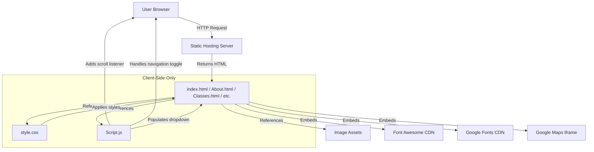
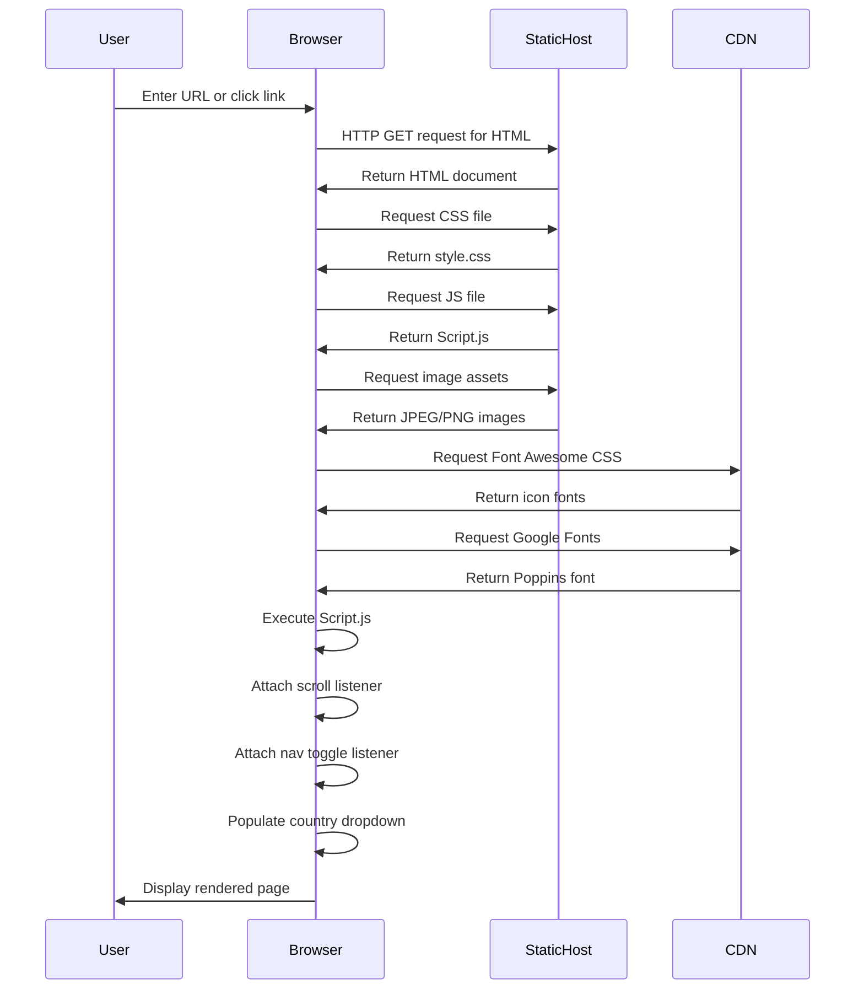

# SBG Doha Website System Overview

## Table of Contents

1. [Overview](#overview)
2. [Repo Use Cases](#repo-use-cases)
3. [High-Level Architecture](#high-level-architecture)
4. [Core Components](#core-components)
5. [Data Flow](#data-flow)
6. [Code Implementation](#code-implementation)
7. [Integration Points](#integration-points)
8. [Configuration](#configuration)
9. [Monitoring and Operations](#monitoring-and-operations)

## Overview

The SBG Doha website is a static multi-page informational website for a mixed martial arts (MMA) gym located in Doha, Qatar. The website provides prospective and existing members with information about the gym's facilities, class schedules, trainers, history, and contact details. The system is built using vanilla HTML5, CSS3, and JavaScript without any framework dependencies, making it a straightforward client-side web application suitable for static hosting.

The website sits within a single repository as a standalone web application with no backend server components. It was developed as a student project by Abdelrahman Abdalla (c22323231) and Muhammad Zaid Irfan (C22499352) and is deployed at https://sbgdoha.netlify.app/.

**Key Characteristics:**

- Static multi-page website architecture with six distinct HTML pages
- Responsive design with mobile-friendly navigation menu
- Pure vanilla JavaScript implementation without framework dependencies
- Client-side form handling and dynamic content generation
- CSS-based styling with custom animations and transitions
- External CDN dependencies for Font Awesome icons only

## Repo Use Cases

### 1. Browse Gym Information

**Trigger:** User navigates to the website homepage or clicks navigation links

**Outcome:** User views gym information including about section, class schedules, trainer profiles, and historical achievements

**Components Involved:** All HTML pages (index.html, About.html, Classes.html, Trainers.html, History.html), style.css for presentation, Script.js for navigation behaviour

**Description:** Visitors access the website to learn about the SBG Doha MMA gym. The navigation bar provides access to six pages: Home (landing page with call-to-action), About (gym description and location map), Classes (six class types with schedules), Trainers (five trainer profiles with credentials), History (gym awards and achievements), and Contact (enquiry form). Each page maintains consistent branding with the "sbgDh." logo and footer navigation.

### 2. Navigate Between Pages on Desktop

**Trigger:** User clicks a navigation link in the horizontal menu bar

**Outcome:** Browser navigates to the selected HTML page

**Components Involved:** Navigation bar HTML structure (`.navbar`), navigation links (`<ol>` with `<li><a>` elements), Script.js sticky navbar behaviour

**Description:** On desktop viewports (>900px width), the navigation menu displays horizontally in the navbar. Clicking any link triggers standard browser navigation to load the corresponding HTML file. As the user scrolls, a scroll event listener in Script.js adds the "sticky" class to the navbar after scrolling 50 pixels, changing its appearance to indicate the current scroll position.

### 3. Use Mobile Navigation Menu

**Trigger:** User on mobile device (<900px viewport width) clicks the hamburger menu icon

**Outcome:** Navigation menu expands vertically to show all page links; clicking again collapses the menu

**Components Involved:** `.navbar_container2` click handler, `navToggle()` function in Script.js, CSS media queries in style.css

**Description:** On smaller screens, the navigation links are hidden by default via CSS media queries (defined at line 589 of style.css). A hamburger menu icon appears in the navbar. When clicked, the `navToggle()` function toggles the "active" class on both the menu container and the ordered list, triggering CSS transitions that display the menu vertically in a full-screen overlay.

### 4. Submit Contact Form

**Trigger:** User fills out and submits the contact form on Contact.html

**Outcome:** Form submission triggers browser default form handling (no custom submission logic implemented)

**Components Involved:** Contact.html form element with text input, email input, country dropdown, and textarea

**Description:** The contact page provides a form with fields for username, email, country selection, and a message textarea. The country dropdown is populated dynamically by Script.js from a hardcoded list of 195 countries. All fields have HTML5 `required` attributes for client-side validation. However, the form element lacks an `action` or `method` attribute, and no JavaScript prevents the default submission or handles the data, meaning actual form submission behaviour is not implemented in the codebase.

### 5. View Embedded Location Map

**Trigger:** User navigates to the About page

**Outcome:** Google Maps iframe displays the gym's location in Doha

**Components Involved:** About.html iframe element at lines 65-73

**Description:** The About page embeds a Google Maps iframe pointing to "Qatar MMA" location (coordinates: 25.292556004834783, 51.323722977751). The iframe is configured with a width of 600px, height of 450px, lazy loading enabled, and standard security attributes.

## High-Level Architecture



The website follows a traditional static multi-page architecture where each HTML file is a separate, independently loadable document. There is no client-side routing or single-page application (SPA) behaviour. Navigation between pages uses standard HTML anchor tags that trigger full page reloads.

**Architectural Characteristics:**

- **Static Architecture:** All pages are pre-rendered HTML files with no server-side rendering or build process
- **Multi-Page Application:** Each route corresponds to a separate HTML file
- **Client-Side Enhancement:** JavaScript provides progressive enhancement for navigation behaviour and form elements
- **CDN Dependencies:** Font Awesome and Google Fonts are loaded from external CDNs
- **No Backend Integration:** No API calls, database connections, or server-side logic evident in the codebase
- **Responsive Design:** CSS media queries adjust layout for mobile devices at 900px and below breakpoints

## Core Components

### 1. HTML Page Templates

**Files:** `index.html`, `About.html`, `Classes.html`, `Trainers.html`, `History.html`, `Contact.html`, `Gallery.html`

**Purpose:** Define the content structure and semantic markup for each page of the website

**Key Structure:** Each HTML file follows a consistent structure:
- DOCTYPE and HTML5 boilerplate with meta viewport for responsive design
- Common navigation bar with logo and six navigation links
- Page-specific `<section>` element with unique ID and class (e.g., `class="About view"`)
- Common footer with four columns containing company info, help links, class listings, and social media icons
- Script tag loading `Script.js` at the end of body

**Notable Details:**
- All pages include HTML comments identifying the student developers and deployed URL
- Gallery.html exists but contains no content (0 bytes)
- Navigation structure is duplicated across all pages (no templating system)

### 2. Stylesheet

**File:** `style.css`

**Purpose:** Provides all visual styling, layout, animations, and responsive behaviour

**Key Style Groups:**
- **Global Styles (lines 4-20):** Reset margins/padding, set Poppins font family, dark blue background (#131b2b), white text color, smooth scrolling
- **Navigation Bar (lines 21-75):** Fixed positioning, transparent background, sticky behaviour with `.sticky` class, logo styling with skyblue accent (#87CEFA)
- **View Sections (lines 77-159):** Full-width sections with minimum height, banner backgrounds with darkened filter
- **Page-Specific Styles:** Separate style blocks for About, Classes, Trainers, History, and Contact sections
- **Footer Styles (lines 368-569):** Four-column responsive layout with hover effects and social media icons
- **Responsive Media Query (lines 589-696):** Adjusts layout for screens under 900px width, hides desktop menu, shows hamburger icon

**Design Decisions:**
- Consistent color scheme using skyblue (#87CEFA) as accent color throughout
- Dark theme with #131b2b background and white text for contrast
- Image hover effects with grayscale filters on trainer photos
- Box shadows for depth on cards and frames

### 3. JavaScript Module

**File:** `Script.js`

**Purpose:** Provides interactive behaviour for navigation and form population

**Functions and Features:**

1. **Sticky Navbar Scroll Listener (lines 2-5):** Adds/removes "sticky" class based on scroll position
2. **Mobile Navigation Toggle (lines 7-14):** Toggles "active" class on menu for mobile hamburger menu
3. **Country Dropdown Population (lines 15-26):** Dynamically creates option elements for 195 countries

**Notable Implementation Details:**
- No module system or imports used
- Direct DOM manipulation without any library
- Event listeners attached on page load
- Global variables used for DOM element references

### 4. Static Assets

**Image Files:** 42 image files in JPEG, PNG, and WEBP formats located in the repository root

**Purpose:** Provide visual content for banners, trainer profiles, class illustrations, and branding

**Key Assets:**
- Banner images (banner.jpeg, banner2.jpeg, banner3.jpeg, banner5.webp, banner12.png)
- Trainer photos (boody.JPG, jamall.jpeg, kieran1.jpeg, trainer2.jpeg, trainer3.webp)
- Class images (classes2.jpeg, men2.jpeg, cross.jpeg, kids mma.jpeg, kids2.jpeg, kids3.jpeg, kidscross.png)
- Logo files (sbg.jpeg, sbg1.png, sbg2.jpeg)
- Menu icons (menubar.jpeg, menubar2.jpeg, menubar3.png, menubar4.png, close.jpeg)
- Video file (WhatsApp Video 2022-12-13 at 4.10.45 PM.mp4) embedded in History page

**Implementation Note:** Images are referenced using relative paths with `./src/` prefix in HTML, but files are actually located in the repository root, not in a `src/` directory. This suggests either a misconfiguration or the hosting platform may be remapping these paths.

### 5. Navigation Component

**Location:** Duplicated in all HTML files within `.navbar` div

**Structure:**
- Logo link (`<a class="logo">`) with "sbgDh." text
- Container div (`.navbar_container2`) with `onclick="navToggle()"`
- Ordered list with six navigation items

**Behaviour:**
- Desktop: Horizontal flex layout with hover effects (color changes to skyblue)
- Mobile: Hidden by default, toggles to full-screen vertical menu overlay when hamburger icon clicked
- Sticky: Changes background to black and adjusts padding when scrolled past 50px

### 6. Footer Component

**Location:** Duplicated in all HTML files within `.footer` element

**Structure:** Four-column layout with:
1. **Company:** Links to About, Classes, Contact, History
2. **Get Help:** Links to FAQ, registration, History, socials
3. **Classes:** Links to six class types (kickboxing and BJJ for kids and adults, crossfit)
4. **Follow Us:** Social media icon links for Facebook, Twitter, Instagram, LinkedIn

**Styling:** Dark background matching body, skyblue accents on hover, responsive collapse to 2 columns at 767px width and single column at 574px width

## Data Flow

The website follows a simple request-response pattern for static content delivery with no complex data transformations. All data flow is unidirectional from the server to the client, with no data persistence mechanisms.



### Page Load Flow

1. **Initial Request:** User navigates to website or clicks internal link
2. **HTML Delivery:** Static hosting server returns requested HTML file
3. **Resource Discovery:** Browser parses HTML and discovers linked resources (CSS, JS, images)
4. **Stylesheet Loading:** Browser requests and applies style.css for visual rendering
5. **JavaScript Execution:** Browser downloads and executes Script.js after DOM content loaded
6. **Event Listener Attachment:** Scroll listener for sticky navbar and click listener for mobile menu attached
7. **Dynamic Content Generation:** Country list string split and iterated to create dropdown options
8. **External Resource Loading:** Font Awesome icons and Google Fonts loaded from CDNs asynchronously
9. **Complete Rendering:** Browser renders final page with all assets loaded

### User Interaction Flow

**Scroll Interaction:**
1. User scrolls page vertically
2. Scroll event fires continuously
3. Event listener callback executes in Script.js (line 2-5)
4. Conditional check: `window.scrollY > 50`
5. If true, add "sticky" class; if false, remove it
6. CSS transitions apply styling changes to navbar

**Navigation Toggle (Mobile):**
1. User clicks hamburger menu icon (`.navbar_container2` div)
2. `onclick` attribute fires `navToggle()` function
3. Function toggles "active" class on both togglebar and menu elements (Script.js lines 10-13)
4. CSS media query styles show/hide menu based on "active" class presence
5. Full-screen overlay menu displays or hides with transition effects

**Country Dropdown Population:**
1. Page loads and Script.js executes
2. Countries string variable contains comma-separated list of 195 countries (line 15)
3. String split into array by ", " delimiter (line 16)
4. DOM query selects `select#countries` element (line 18)
5. forEach loop iterates array (lines 20-26)
6. For each country, creates `<option>` element, sets value and textContent, appends to select element
7. Dropdown rendered with all countries available for selection

### Form Submission Flow

**Observed Behaviour:**
1. User fills form fields on Contact.html
2. User clicks submit button
3. HTML5 validation checks required fields
4. If validation fails, browser shows validation messages
5. If validation passes, form attempts submission

**Implementation Gap:** The form element in Contact.html (lines 39-47) has no `action` or `method` attributes, and no JavaScript prevents the default submission behaviour or handles the data. This means form submissions will either trigger a page reload or result in a browser error. No data is sent to any backend service or stored anywhere based on the provided codebase.

## Code Implementation

This section traces the complete execution flows for the key features of the SBG Doha website, from entry points through to completion.

### Navigation System Implementation

The navigation system provides two modes of operation: desktop horizontal menu and mobile hamburger menu with overlay. The implementation is split between HTML structure, CSS styling, and JavaScript behaviour.

#### Entry Point: Page Load

**File: `index.html` (lines 25-37)**

```html
<div class="navbar">
  <a href="index.html" class="logo">sbg<b>Dh</b>.</a>
  <div class="navbar_container2" onclick="navToggle()">
    <ol>
      <li><a href="index.html">Home</a></li>
      <li><a href="About.html">About</a></li>
      <li><a href="Classes.html">Classes</a></li>
      <li><a href="Trainers.html">Trainers</a></li>
      <li><a href="History.html">History</a></li>
      <li><a href="Contact.html">Contact</a></li>
    </ol>
  </div>
</div>
```

**Explanation:** This navigation structure is present in all HTML pages. The outer div has class "navbar" for styling. The logo is a link to the homepage. The `navbar_container2` div contains the ordered list of navigation links and has an `onclick` attribute that calls the `navToggle()` function. This structure supports both desktop (links always visible) and mobile (links hidden behind hamburger menu) layouts.

#### Desktop Navigation Styling

**File: `style.css` (lines 21-75)**

```css
.navbar{
    width: 100%;
    display: flex;
    position: fixed;
    padding: 30px 120px;
    background-color: transparent;
    justify-content: space-between;
    z-index: 1111;
    transition: 0.5s ease;
}

.navbar_container2 ol{
    display: flex;
    margin: auto 0;
}
.navbar_container2 ol li{
    list-style: none;
    margin-right: 20px;
}
.navbar_container2 ol li a{
    font-size: 20px;
    font-weight: 500;
    text-decoration: none;
    text-transform: capitalize;
}
.navbar_container2 ol li:hover a{
    color: #87CEFA;
}
```

**Explanation:** On desktop viewports, the navbar is fixed at the top with transparent background. Flexbox is used to arrange items horizontally with space-between justification. The navigation links are displayed in a horizontal flex row with no list styling. Hover effects change link color to skyblue. The navbar has a high z-index (1111) to ensure it stays above other content.

#### Mobile Navigation Styling

**File: `style.css` (lines 589-634)**

```css
@media screen and (max-width: 900px){
    .navbar{
        padding: 0 60px;
    }
    .navbar ol{
        display: none;
    }
    .navbar ol.active{
        top: 60px;
        left: 0;
        width: 100%;
        display: flex;
        position: fixed;
        background: #222;
        align-items: center;
        justify-content: center;
        flex-direction: column;
        height: calc(100% - 60px);
    }
    .navbar ol.active li{
        margin: 8px;
    }
    .navbar ol.active li a{
        font-size: 25px;
    }
    .navbar .navbar_container2{
        height: 25px;
        width: 25px;
        margin: auto 0;
        cursor: pointer;
        background:  url(menubar3.png) ;
        background-size: 25px ;
        background-position: center;
        background-repeat: no-repeat;
        color: white;
    }
}
```

**Explanation:** The media query activates for screens 900px or narrower. By default, the ordered list is hidden with `display: none`. The `navbar_container2` div becomes a visible hamburger icon using `menubar3.png` as a background image. When the "active" class is added to the ordered list, it transforms into a full-screen overlay menu positioned below the navbar, with links stacked vertically in a flex column layout with centered alignment.

#### Mobile Menu Toggle Function

**File: `Script.js` (lines 7-14)**

```javascript
const togglebar = document.querySelector('.navbar_container2');
const menu = document.querySelector('ol');

function navToggle(){
  togglebar.classList.toggle("active");
  menu.classList.toggle("active");
};
```

**Explanation:** The function is defined globally and called via the `onclick` attribute when the hamburger icon is clicked. It selects the menu container and the ordered list, then toggles the "active" class on both elements. This triggers the CSS transitions defined in the media query, causing the menu to expand or collapse. The toggle method adds the class if it's not present, or removes it if it is, allowing the same function to both open and close the menu.

### Sticky Navigation Implementation

The sticky navigation feature changes the navbar appearance when the user scrolls down the page, providing visual feedback about scroll position.

#### Scroll Event Listener

**File: `Script.js` (lines 2-5)**

```javascript
window.addEventListener('scroll',function (){
    const navbar = document.querySelector('.navbar');
    navbar.classList.toggle("sticky", window.scrollY > 50);
});
```

**Explanation:** An event listener is attached to the window scroll event when the page loads. On every scroll event, the function selects the navbar element and uses the `classList.toggle()` method with a conditional second parameter. If `window.scrollY` (the vertical scroll position) is greater than 50 pixels, the "sticky" class is added; otherwise, it's removed. This provides a threshold effect where the navbar style changes only after scrolling past a certain point.

#### Sticky Navbar Styles

**File: `style.css` (lines 31-44)**

```css
.navbar.sticky{
    padding: 6px 60px;
    background: #000;
    box-shadow: 0 0 15px rgba(0,0,0,0.5) ;
}
.navbar.sticky .logo{
    font-size: 2em;
    color: #87CEFA ;
}
.navbar.sticky .logo b{
    color: #fff;
}
```

**Explanation:** When the "sticky" class is present, the navbar's appearance changes significantly: padding is reduced to make it more compact, the background changes from transparent to solid black, a box shadow is added for depth, and the logo size decreases from 2.8em to 2em while changing color to skyblue. The transition property on the base navbar class (line 29) ensures these changes animate smoothly over 0.5 seconds.

### Contact Form Implementation

The contact form provides a user enquiry interface with dynamic country selection. The implementation is split between HTML form structure and JavaScript dropdown population.

#### Form Structure

**File: `Contact.html` (lines 38-49)**

```html
<div class="content">
  <form>
      <input type="text" placeholder="User" required>
      <input type="email" placeholder="Email" required>
      <select  id="countries" required>
        <option value="" selected disabled hidden>Select Country:</option>
      </select>
      <textarea rows="5" placeholder="What's on your mind" required ></textarea>
      <br>
      <input type="submit" value="send" class="btn">
      </br>
    </form>
    <div class="./src/bg.img"></div>
</div>
```

**Explanation:** The form contains four input fields: text input for username, email input for email address, a select dropdown for country selection (initially contains only a placeholder option), and a textarea for the user's message. All fields have the `required` attribute for HTML5 client-side validation. The submit button has class "btn" for styling. Notable limitation: the form element has no `action` or `method` attribute, meaning form submission behaviour is not defined.

#### Country Dropdown Population

**File: `Script.js` (lines 15-26)**

```javascript
let countriesList = 'Afghanistan, Albania, Algeria, Andorra, Angola, Antigua & Deps, Argentina, Armenia, Australia, Austria, Azerbaijan, Bahamas, Bahrain, Bangladesh, Barbados, Belarus, Belgium, Belize, Benin, Bhutan, Bolivia, Bosnia Herzegovina, Botswana, Brazil, Brunei, Bulgaria, Burkina, Burundi, Cambodia, Cameroon, Canada, Cape Verde, Central African Rep, Chad, Chile, China, Colombia, Comoros, Congo, Congo (Democratic Rep), Costa Rica, Croatia, Cuba, Cyprus, Czech Republic, Denmark, Djibouti, Dominica, Dominican Republic, East Timor, Ecuador, Egypt, El Salvador, Equatorial Guinea, Eritrea, Estonia, Ethiopia, Fiji, Finland, France, Gabon, Gambia, Georgia, Germany, Ghana, Greece, Grenada, Guatemala, Guinea, Guinea-Bissau, Guyana, Haiti, Honduras, Hungary, Iceland, India, Indonesia, Iran, Iraq, Ireland (Republic Of), Israel, Italy, Ivory Coast, Jamaica, Japan, Jordan, Kazakhstan, Kenya, Kiribati, Korea North, Korea South, Kosovo, Kuwait, Kyrgyzstan, Laos, Latvia, Lebanon, Lesotho, Liberia, Libya, Liechtenstein, Lithuania, Luxembourg, Macedonia, Madagascar, Malawi, Malaysia, Maldives, Mali, Malta, Marshall Islands, Mauritania, Mauritius, Mexico, Micronesia, Moldova, Monaco, Mongolia, Montenegro, Morocco, Mozambique, Myanmar, (Burma), Namibia, Nauru, Nepal, Netherlands, New Zealand, Nicaragua, Niger, Nigeria, Norway, Oman, Pakistan, Palau, Panama, Papua New Guinea, Paraguay, Peru, Philippines, Poland, Portugal, Qatar, Romania, Russian Federation, Rwanda, St Kitts & Nevis, St Lucia, Saint Vincent & the Grenadines, Samoa, San Marino, Sao Tome & Principe, Saudi Arabia, Senegal, Serbia, Seychelles, Sierra Leone, Singapore, Slovakia, Slovenia, Solomon Islands, Somalia, South Africa, South Sudan, Spain, Sri Lanka, Sudan, Suriname, Swaziland, Sweden, Switzerland, Syria, Taiwan, Tajikistan, Tanzania, Thailand, Togo, Tonga, Trinidad & Tobago, Tunisia, Turkey, Turkmenistan, Tuvalu, Uganda, Ukraine, United Arab Emirates, United Kingdom, United States, Uruguay, Uzbekistan, Vanuatu, Vatican City, Venezuela, Vietnam, Yemen, Zambia, Zimbabwe'
countriesList = countriesList.split(', ')

let countriesSelect = document.querySelector('select#countries')

countriesList.forEach(element => {
    let option = document.createElement('option')
    option.value = element
    option.textContent = element

    countriesSelect.appendChild(option)
});
```

**Explanation:** A hardcoded string containing 195 country names separated by commas and spaces is defined. This string is split into an array using `split(', ')`. The script then queries the DOM for the select element with id "countries". For each country in the array, a new option element is created dynamically, with both its value and textContent set to the country name. The option is then appended to the select dropdown. This executes on page load, populating the dropdown before the user interacts with it.

#### Form Styling

**File: `style.css` (lines 414-467)**

```css
.Contact .content form{
    margin: auto;
    width: 400px;
    height: 500px;
    padding: 20px;
    background: #fff;
    box-shadow: 0 10px 15px rgba(0,0,0,0.5);
    z-index: 1;
}
.Contact .content select{
    color: #555;
    width: 100%;
    padding: 10px;
    margin: 15px 0;
    font-size: 18px;
}
.Contact .content form input{
    color: #222;
    width: 100%;
    height: 50px;
    padding: 0 10px;
    font-size: 18px;
    border: 1px solid #878787;
    border-radius: 4px;
    margin: 15px 0;
    background: transparent;
}
.Contact .content form textarea{
    width: 100%;
    padding: 10px;
    color: #222;
    background: transparent;
}
.Contact .content form .btn{
    letter-spacing: 1px;
    width: 100px;
    display: inline-block;
    color: #87CEFA;
    border-color: #87CEFA;
    cursor: pointer;
    transition: 0.2s ease;
}
.Contact .content form .btn:hover{
    background: #87CEFA;
    color: #fff;
}
```

**Explanation:** The form is styled with a white background contrasting against the dark page theme. It's centered with a fixed width of 400px and has a box shadow for depth. All input fields are full-width with consistent spacing and styling. Text inside inputs is dark (#222) for readability against the white background. The submit button has skyblue border and text color, with a hover effect that inverts to skyblue background with white text.

### Classes Page Implementation

The Classes page displays information about six different class types offered by the gym, using a card-based layout with images and schedules.

#### Classes Section Structure

**File: `Classes.html` (lines 34-87)**

```html
<section id="Classes" class="Classes view">
  <div class="main">
    <h2><span>C</span>lasses</h2>
    <h6>Classes that are running in Sbg Doha</h6>
  </div>
  <div class="content">
    <div class="frame">
      <div class="box">
        
      </div>
      <div class="title">kickboxing</div>
      <p>Monday to Friday at 5pm</p>
    </div>

    <div class="frame">
      <div class="box">
        
      </div>
      <div class="title">Brazilian Jiu-Jitsu</div>
      <p>Monday to Friday at 6pm</p>
    </div>

    <!-- Additional frames for crossfit, kids kickboxing, kids BJJ, kids crossfit -->
  </div>
</section>
```

**Explanation:** The section contains a main heading with a subtitle, followed by a content area with six frame divs. Each frame represents one class type and contains a box div with an image, a title div with the class name, and a paragraph with the schedule. The frame structure is repeated six times for adult kickboxing, adult BJJ, adult crossfit, kids kickboxing, kids BJJ, and kids crossfit. Images are referenced with relative paths using the `./src/` prefix.

#### Classes Card Styling

**File: `style.css` (lines 247-283)**

```css
.Classes .content{
    flex-wrap: wrap;
}
.Classes .content .frame{
    position: relative;
    width: 350px;
    padding: 20px;
    margin: 10px;
    background: #222;
    box-shadow: 0 10px 15px rgba(0,0,0,0.5);
}
.Classes .content .frame .box{
    position: relative;
    height: 200px;
    width: 100%;
    overflow: hidden;
}
.Classes .content .frame .box img{
    position: absolute;
    height: 100%;
    width: 100%;
    object-fit: cover;
    filter: brightness(80%);
    transition: 0.2s ease-in;
}
.Classes .content .frame .box:hover img{
    filter: brightness(100%);
    transform: scale(1.08);
}
.Classes .content .frame .title{
    color: #87CEFA;
    padding: 5px 0;
}
.Classes .content .frame p{
    font-size: 0.8em;
}
```

**Explanation:** The content container uses flex-wrap to allow frames to wrap onto multiple rows. Each frame is a fixed-width (350px) card with dark background (#222), padding, and box shadow. The box container constrains the image to 200px height with overflow hidden. Images are set to cover the entire box using `object-fit: cover` and start at 80% brightness. On hover, the brightness increases to 100% and the image scales to 1.08x with a smooth transition, creating a subtle zoom effect. Class titles are styled in skyblue to match the site's color scheme.

### Trainers Page Implementation

The Trainers page showcases the gym's five coaches with profile cards containing images, names, credentials, social media links, and explore buttons.

#### Trainer Profile Structure

**File: `Trainers.html` (lines 40-60)**

```html
<div class="frame">
  <div class="box">
    
  </div>
  <div class="headline">
    <div class="title">Keiran davern</div>
    <div class="icons">
      <i class="fa fa-facebook"></i>
      <i class="fa fa-twitter"></i>
      <i class="fa fa-linkedin"></i>
    </div>
  </div>
  <p>
    Kieran davern is the main coach in Sbg Hoha .He runs the gym and he
    is also the main kickboxing coach for the mens . He has 13 years of
    experince in the kickboxing fiel and also for the bjj and mma field
    he has repersented ireland in the euros in 2020 which he won a
    gloden medal in bjj.
  </p>
  <a href="#"> Explore</a>
</div>
```

**Explanation:** Each trainer profile is contained in a frame div. The structure includes a box with the trainer's photo, a headline div containing the name as a title and social media icons, a paragraph with biographical information and credentials, and an explore link. The pattern repeats for all five trainers: Kieran Davern (head coach), Jamall Camilo (kids BJJ), Boody Abdalla (kids kickboxing), Jack Gallaher (crossfit), and Seon Kelly (adult BJJ).

#### Trainer Card Styling with Grayscale Effect

**File: `style.css` (lines 284-367)**

```css
.Trainers .content .frame{
    position: relative;
    width: 500px;
    padding: 30px 30px 40px 30px;
    box-shadow: 0 10px 15px rgba(0,0,0,0.5);
    margin: 10px;
    background: #222;
}
.Trainers .content .frame .box{
    position: relative;
    height: 300px;
    width: 100%;
    overflow: hidden;
}
.Trainers .content .frame .box img{
    position: absolute;
    height: auto;
    width: 100%;
    filter: grayscale(1);
    object-fit: cover;
    transition: 0.2s ease-in;
}
.Trainers .content .frame .box:hover img{
    filter: grayscale(0);
    transform: scale(1.08);
}
.Trainers .content .frame .headline{
    display: flex;
    justify-content: space-between;
    align-items: center;
    margin: 8px 0;
}
.Trainers .content .frame .headline i{
    height: 22px;
    width: 22px;
    border: 1.5px solid #fff;
    border-radius: 50%;
    text-align: center;
    font-size: 12px;
    margin-right: 5px;
    cursor: pointer;
    line-height: 22px;
}
.Trainers .content .frame .headline i:hover{
    border: 1.5px;
    color: #87CEFA;
    background: white;
}
```

**Explanation:** Trainer cards are wider than class cards (500px vs 350px) to accommodate more content. A distinctive visual feature is the grayscale filter applied to trainer photos by default (`filter: grayscale(1)`), which removes color completely. On hover, the grayscale filter is removed (`grayscale(0)`) and the image scales up, revealing the photo in full color. The headline uses flexbox to position the trainer name on the left and social media icons on the right. Icons are styled as circular bordered elements that change color on hover.

### History Page Implementation

The History page presents the gym's achievements, awards, and coach statistics using a two-column layout that alternates on each row.

#### History Row Structure

**File: `History.html` (lines 39-76)**

```html
<div class="row">
  <div class="cols a">
    <div class="heading">Sbg DOHA</div>
    <p></p>
    <h2>Trophies</h2>
    <ul>
      <li>-6 Times MMA club of the year</li>
      <li>-4 Times bjj club of the year</li>
      <li>-8 Times gym of the year</li>
    </ul>
  </div>
  <div class="cols b">
    <div class="boxes">
      
    </div>
  </div>
</div>
```

**Explanation:** The History page uses a row-based layout where each row contains two columns (cols). One column contains text content (headings, lists, or tables) while the other contains an image in a boxes container. The first column has class "a" while the second has class "b". This structure repeats three times for different content sections: gym trophies, Kieran's achievements, and coach statistics table.

#### Alternating Layout with CSS

**File: `style.css` (lines 374-413)**

```css
.History .content{
    flex-direction: column;
}
.History .content .row{
    display: flex;
    position: relative;
    width: 100%;
    padding: 20px;
    justify-content: center;
}
.History .content .row:nth-child(odd) .a{
    order: 2;
}
.History .content .row .cols{
    position: relative;
    width: 600px;
    padding: 20px 50px;
}
.History .content .row .cols .heading{
    font-size: 2em;
    color: #87CEFA;
}
.History .content .row .cols:nth-child(odd) .heading{
    color: #02a3ff;
}
.History .content .row .cols .boxes{
    position: relative;
    width: 100%;
    height: 350px;
    padding: 20px;
    border-radius: 8px;
    background:#87CEFA ;
    box-shadow: 0 10px 15px rgba(0,0,0,0.5);
}
```

**Explanation:** The content container uses flex-direction column to stack rows vertically. Each row uses flexbox to arrange two columns side-by-side. The key layout feature is the `:nth-child(odd)` selector which applies `order: 2` to column "a" on odd-numbered rows, causing text and image positions to swap on alternating rows. This creates a visually interesting zigzag pattern. The boxes containers have a skyblue background and contain achievement-related images.

#### Coach Statistics Table

**File: `History.html` (lines 84-116)**

```html
<table>
  <tr>
    <th>Name</th>
    <th>Country</th>
    <th>number of medals</th>
  </tr>
  <tr>
    <td>Jamall </td>
    <td>portugual</td>
    <td>27</td>
  </tr>
  <tr>
    <td>Boody </td>
    <td>Egypt</td>
    <td>22</td>
  </tr>
  <!-- Additional rows for Jack, Seon, and Kieran -->
</table>
```

**Explanation:** A standard HTML table presents coach statistics with three columns: name, country, and medal count. Five rows display data for each of the gym's trainers. The table has basic styling defined globally in the stylesheet.

#### Table Styling

**File: `style.css` (lines 570-584)**

```css
table {
  font-family: arial, sans-serif;
  border-collapse: collapse;
  width: 100%;
}

td, th {
  border: 1px solid #87CEFA;
  text-align: left;
  padding: 8px;
}

tr:nth-child(even) {
  background-color: #87CEFA;
}
```

**Explanation:** The table uses border-collapse for clean borders. All cells have skyblue borders matching the site theme. A zebra-striping effect is applied where even-numbered rows have a skyblue background, improving readability and visual interest.

#### Video Embed

**File: `History.html` (lines 124-130)**

```html
<div class="video">
 <video width="400" controls>
  <source src="./src/WhatsApp Video 2022-12-13 at 4.10.45 PM.mp4" type="video/mp4">
  <source src="./src/WhatsApp Video 2022-12-13 at 4.10.45 PM.mp4" type="video/ogg">
  Your browser does not support HTML video.
 </video>
</div>
```

**Explanation:** An HTML5 video element is embedded at the bottom of the History page with native browser controls enabled. The video file is a WhatsApp video dated December 13, 2022. Two source elements are provided (both pointing to the same MP4 file, with different type attributes) for cross-browser compatibility, though the second source claiming ogg type is misconfigured. A fallback message displays for browsers without HTML5 video support.

## Integration Points

The SBG Doha website has minimal external integrations, as it is a static client-side application with no backend services. The integrations present are limited to external CDN resources and embedded third-party content.

### 1. Font Awesome Icon Library

**Integration Type:** CDN stylesheet inclusion

**Location:** All HTML files include Font Awesome CSS via `<link>` tag in the `<head>` section

**File References:**
- `index.html` line 16: `https://cdnjs.cloudflare.com/ajax/libs/font-awesome/4.7.0/css/font-awesome.min.css`
- Other pages: `https://cdnjs.cloudflare.com/ajax/libs/font-awesome/5.15.1/css/all.min.css`

**Usage:** Font Awesome icons are used in two places:
1. Social media icons in the footer (Facebook, Twitter, Instagram, LinkedIn) using classes like `fab fa-facebook-f`
2. Social media icons in trainer profile cards using classes like `fa fa-facebook`

**Implementation Note:** The repository includes two different Font Awesome versions across pages (4.7.0 vs 5.15.1), suggesting inconsistent implementation. No JavaScript initialization or custom configuration is used—icons are purely CSS-based.

### 2. Google Fonts

**Integration Type:** CDN stylesheet inclusion

**Location:** All HTML files include Google Fonts CSS in the `<head>` section

**File Reference:**
- `style.css` lines 1-2:
  - `https://fonts.googleapis.com/css2?family=Nunito+Sans:wght@200;300;400;600&display=swap`
  - `https://fonts.googleapis.com/css2?family=Poppins:wght@300;400;500;600;700&display=swap`

**Usage:** Poppins font is set as the primary font-family for the entire website in the global CSS reset (style.css line 7). Nunito Sans is imported but not used anywhere in the codebase. The Poppins font is loaded with weights 300, 400, 500, 600, and 700, providing a range of font weights for different text elements.

### 3. Google Maps Embed

**Integration Type:** Embedded iframe

**Location:** About.html page

**File Reference:** `About.html` lines 65-73

**Configuration:**
```html
<iframe
  src="https://www.google.com/maps/embed?pb=!1m14!1m8!1m3!1d207541.28470808643!2d51.323722977751!3d25.292556004834783!3m2!1i1024!2i768!4f13.1!3m3!1m2!1s0x0%3A0x23085b3e7ba39b44!2sQatar%20MMA!5e0!3m2!1sen!2sie!4v1671114199880!5m2!1sen!2sie"
  width="600"
  height="450"
  style="border: 0"
  allowfullscreen=""
  loading="lazy"
  referrerpolicy="no-referrer-when-downgrade"
></iframe>
```

**Usage:** Displays an interactive map showing the gym location (Qatar MMA) at coordinates approximately 25.29°N, 51.32°E in Doha, Qatar. The iframe uses lazy loading for performance and includes security attributes. Users can interact with the map to zoom, pan, and get directions.

### 4. Social Media Links

**Integration Type:** Static hyperlinks (non-functional in codebase)

**Location:** Footer component on all pages, trainer profile cards on Trainers.html

**File References:**
- Footer: All HTML files, lines 82-86 (varies by file)
- Trainer profiles: `Trainers.html` lines 46-51 (repeated for each trainer)

**Implementation:** Social media links use `href="#"` placeholder values, indicating they are not connected to actual social media profiles. The links are styled with Font Awesome icons for visual representation but do not navigate to functional destinations. This suggests the links are placeholder implementations awaiting real social media URLs.

**Example from Footer:**
```html
<div class="social-links">
  <a href="#"><i class="fab fa-facebook-f"></i></a>
  <a href="#"><i class="fab fa-twitter"></i></a>
  <a href="#"><i class="fab fa-instagram"></i></a>
  <a href="#"><i class="fab fa-linkedin-in"></i></a>
</div>
```

### No Backend Integration

**Important Note:** Contrary to the existing documentation file found at `/tmp/SBG-Doha-website/doc/doc`, there is no evidence of any backend API integration in the codebase. Specifically:

- No AJAX requests or fetch calls are present in Script.js
- No API endpoint configuration variables or constants exist
- The contact form has no submission handler or action attribute
- No database connections, authentication systems, or data persistence mechanisms are implemented
- No API client libraries or HTTP request utilities are included

The existing documentation file contains inaccurate claims about a "RESTful API for class booking management", "backend database via AJAX request", "Google Analytics tracking", and environment configuration with `API_BASE_URL`. These claims are not supported by any code evidence in the repository.

### No Analytics Integration

No Google Analytics, tracking pixels, or analytics SDKs are present in the HTML files or JavaScript code. Analytics integration mentioned in the existing documentation is not evidenced by the codebase.

## Configuration

The SBG Doha website has minimal configuration requirements due to its static nature. All configuration is embedded directly in the code rather than externalized to configuration files or environment variables.

### Site Metadata Configuration

**File:** All HTML files in `<head>` section

```html
<meta charset="UTF-8" />
<meta http-equiv="X-UA-Compatible" content="IE=edge" />
<meta name="viewport" content="width=device-width, initial-scale=1.0" />
<title>Sbg Doha</title>
```

**Configuration Options:**
- **Character Encoding:** UTF-8 for international character support
- **IE Compatibility:** Edge mode for Internet Explorer rendering
- **Viewport:** Device-width with initial scale 1.0 for responsive design
- **Page Title:** "Sbg Doha" is consistent across all pages (not customised per page)

### CSS Color Scheme Configuration

**File:** `style.css` lines 13-16

```css
:root{
    --prime: #00ff34;
}
```

**Configuration Note:** A CSS custom property named `--prime` is defined with a bright green color value (#00ff34), but this variable is never used anywhere in the stylesheet. The actual primary accent color used throughout the site is skyblue (#87CEFA), which is hardcoded directly in the styles rather than referenced as a variable. This suggests incomplete implementation of a CSS custom property system.

### Responsive Breakpoint Configuration

**File:** `style.css` lines 559-696

**Configured Breakpoints:**
- **900px:** Main mobile breakpoint where navigation changes from horizontal to hamburger menu
- **767px:** Footer columns reduce from 4 columns to 2 columns (line 560)
- **574px:** Footer columns reduce from 2 columns to single column (line 565)

**Configuration Note:** These breakpoints are hardcoded in the media queries and cannot be changed without modifying the CSS directly.

### CDN Resource Configuration

**Font Awesome Versions:**
- Version 4.7.0 used in `index.html` and some other pages
- Version 5.15.1 used in `About.html`, `Classes.html`, and other pages

**Google Fonts Configuration:**
- Poppins font: weights 300, 400, 500, 600, 700
- Nunito Sans font: weights 200, 300, 400, 600 (imported but unused)

**Configuration Note:** The inconsistent Font Awesome versions suggest uncoordinated development. Best practice would be to standardise on a single version across all pages.

### Image Path Configuration

All images are referenced using relative paths with the `./src/` prefix (e.g., `./src/banner5.webp`), but the actual files are located in the repository root directory without a `src/` subdirectory. This indicates either:
1. A deployment process that remaps these paths
2. A hosting platform configuration that serves root files from a `/src/` route
3. A misconfiguration that should be corrected

**Examples from HTML:**
```html
  <!-- Trainers.html -->
  <!-- Classes.html -->
```

**Actual File Locations:**
```
/tmp/SBG-Doha-website/kieran1.jpeg
/tmp/SBG-Doha-website/classes2.jpeg
```

### Deployment Configuration

**Hosting Platform:** Netlify (based on comments in HTML and README)

**Deployed URL:** https://sbgdoha.netlify.app/

**Configuration Note:** No Netlify configuration file (`netlify.toml`) is present in the repository. Deployment likely uses Netlify's default settings for static sites, serving files directly from the repository root.

### No Environment-Specific Configuration

The existing documentation file at `/tmp/SBG-Doha-website/doc/doc` mentions environment configuration with `API_BASE_URL=https://sbgdoha-api.herokuapp.com/`, but this is not evidenced anywhere in the codebase. No environment variables, configuration files, or conditional logic for different environments (development, staging, production) exist in the repository.

### Country List Configuration

**File:** `Script.js` line 15

The list of 195 countries for the contact form dropdown is hardcoded as a comma-separated string directly in the JavaScript file. To modify the country list, the string must be edited manually. This is not externalized to a data file or API endpoint.

### Navigation Links Configuration

Navigation links are hardcoded identically in all HTML files. To modify the navigation structure (add/remove pages, change labels), all HTML files must be updated individually. No templating system or shared navigation component exists.

## Monitoring and Operations

Due to the static nature of the SBG Doha website with no backend services or server-side logic, operational monitoring capabilities are extremely limited. The repository contains no logging, metrics, error tracking, or operational tooling.

### No Application Logging

No logging statements are present in the JavaScript code. No console.log, console.error, or other console methods are used in `Script.js`. The existing documentation at `/tmp/SBG-Doha-website/doc/doc` claims "Basic console logging for debugging: `console.log('Form submitted successfully');`" but this code does not exist in the actual codebase.

### No Error Handling

The JavaScript code in `Script.js` contains no try-catch blocks, error handlers, or validation logic. Potential runtime errors (e.g., DOM elements not found, null reference errors) are not caught or handled. The code assumes that:
- DOM elements will always be present when selectors run
- The scroll event will always fire correctly
- The country list will always be valid and parsable

### No Analytics or Monitoring Integration

Contrary to claims in the existing documentation, no analytics tracking code is present in the repository. Specifically:
- No Google Analytics tracking script or measurement ID
- No custom event tracking or page view tracking
- No performance monitoring tools
- No error tracking services (e.g., Sentry, Rollbar)

### Browser DevTools Dependency

All debugging and operational monitoring must be performed using browser developer tools:
- **Network Tab:** Monitor resource loading, check for 404 errors on images
- **Console Tab:** View JavaScript runtime errors
- **Elements Tab:** Inspect DOM state and CSS application
- **Performance Tab:** Analyze page load performance

### Static Hosting Logs

Operational monitoring is limited to hosting platform logs provided by Netlify (the deployment platform identified in comments). Netlify provides:
- **Access Logs:** HTTP requests to the site
- **Build Logs:** Deployment history (though no build process is required for this static site)
- **Form Submissions:** If Netlify Forms were enabled (not configured in this codebase)

### Known Failure Modes

Based on code analysis, potential failure modes include:

1. **Image Loading Failures:** If the image path mapping (./src/ prefix) is not correctly configured in the hosting environment, all images will fail to load with 404 errors

2. **Font Loading Failures:** If CDN resources (Font Awesome, Google Fonts) are unavailable, the site will fall back to system fonts and social media icons will not display

3. **JavaScript Errors on Page Load:** If DOM elements expected by Script.js are missing or renamed, the querySelector calls will fail silently, breaking navigation toggle and country dropdown population

4. **Form Submission Errors:** The contact form has no action attribute, so form submission will either reload the page or fail silently depending on browser behaviour

5. **Google Maps Embed Blocking:** If Google Maps iframes are blocked by browser privacy settings or ad blockers, the map on the About page will not display

### No Health Checks

No health check endpoints, status pages, or availability monitoring are implemented. Site availability can only be monitored through external uptime monitoring services that ping the hosted URL.

### No Deployment Validation

No automated tests, validation checks, or smoke tests are present in the repository to verify successful deployment. Deployments can be validated only through manual testing or visual regression testing tools external to the codebase.

### Performance Characteristics

Based on the static architecture:

**Positive Performance Factors:**
- No server-side processing reduces latency
- Static files can be served from CDN with caching
- Minimal JavaScript execution required
- CSS and JavaScript files are small (<14KB and <3KB respectively)

**Performance Concerns:**
- Unoptimised images (some files over 5MB like kids3.jpeg at 1009614 bytes)
- No image lazy loading implemented (except on Google Maps iframe)
- No minification of CSS or JavaScript files
- Multiple large banner images loaded on home page
- Font Awesome entire icon set loaded even though only 4 icons are used

### Operational Recommendations

While not implemented in the codebase, the following operational practices would be beneficial:

1. Implement error tracking with a service like Sentry to catch client-side JavaScript errors
2. Add Google Analytics or similar for traffic monitoring and user behaviour insights
3. Optimise and compress image assets to reduce page load times
4. Implement image lazy loading for below-the-fold content
5. Add automated visual regression testing for deployment validation
6. Configure proper form submission handling or remove the form if not functional
7. Standardise Font Awesome version across all pages
8. Add uptime monitoring with a service like Pingdom or UptimeRobot
9. Implement Content Security Policy headers for security
10. Add structured data markup for SEO

These recommendations are inferred from best practices for static websites and are not based on any configuration, comments, or implementation hints in the existing codebase.
