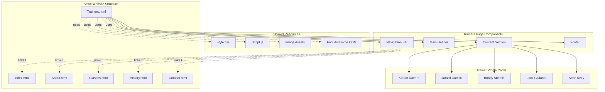
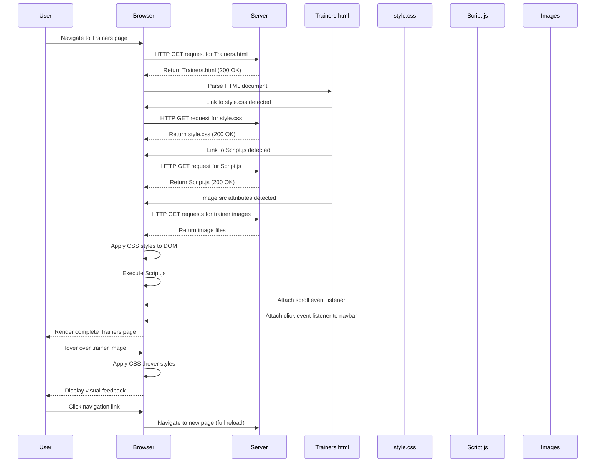

# Trainers Feature Documentation

## Table of Contents

1. [Overview](#overview)
2. [Repo Use Cases](#repo-use-cases)
3. [High-Level Architecture](#high-level-architecture)
4. [Core Components](#core-components)
5. [Data Flow](#data-flow)
6. [Code Implementation](#code-implementation)
7. [Integration Points](#integration-points)
8. [Configuration](#configuration)
9. [Monitoring and Operations](#monitoring-and-operations)

---

## Overview

The Trainers feature is a presentational module within the SBG Doha website that displays information about the coaching staff at the SBG Doha MMA gym. This feature serves as a dedicated page (`Trainers.html`) within the static website, providing visitors with detailed profiles of the five coaches who lead various martial arts programmes at the gym.

The feature sits within a multi-page static website structure, accessible through the main navigation bar. It is positioned as one of six primary sections: Home, About, Classes, Trainers, History, and Contact. The Trainers page is implemented as a standalone HTML document that shares common styling and navigation components with other pages in the site.

Key characteristics of the Trainers feature include:

- **Static HTML presentation**: Pure HTML structure with no dynamic data fetching or server-side processing
- **Responsive card-based layout**: Five trainer profile cards displayed in a flexbox grid layout
- **Visual enhancement on interaction**: Image hover effects that transition from greyscale to colour
- **Social media integration**: Placeholder social media icons for Facebook, Twitter, and LinkedIn on each trainer profile
- **Consistent navigation**: Shared navigation bar and footer components across all pages

---

## Repo Use Cases

### Use Case 1: Display Trainer Profiles to Site Visitors

**Trigger**: User navigates to the Trainers page by clicking the "Trainers" link in the navigation bar from any page on the website.

**Expected Outcome**: The browser renders the Trainers page displaying five coach profiles, each containing a profile photograph, name, social media icons, biographical description, and an "Explore" link.

**Main Components Involved**:
- `Trainers.html` (lines 33-140): Main page structure
- `style.css` (lines 284-367): Trainers-specific CSS styling
- `Script.js` (lines 2-5, 10-14): Navigation functionality

**Important Constraints**: The page relies on external image assets located in a `./src/` directory. If images are missing or paths are incorrect, broken image placeholders will appear.

---

### Use Case 2: Navigate Between Website Sections

**Trigger**: User clicks on any navigation link in the navbar whilst viewing the Trainers page.

**Expected Outcome**: Browser navigates to the selected page (Home, About, Classes, History, or Contact) whilst maintaining consistent navigation and footer elements.

**Main Components Involved**:
- Navigation bar structure in `Trainers.html` (lines 20-32)
- `Script.js` (lines 10-14): `navToggle()` function for mobile menu
- `style.css` (lines 21-75): Navigation styling

---

### Use Case 3: View Trainer Profiles on Mobile Devices

**Trigger**: User accesses the Trainers page on a screen width of 900px or less.

**Expected Outcome**: The layout adapts to smaller screen sizes with adjusted trainer card dimensions, hamburger menu navigation, and responsive typography.

**Main Components Involved**:
- `style.css` (lines 660-673): Media query adjustments for Trainers section
- `style.css` (lines 589-696): General mobile responsive styles
- `Script.js` (lines 10-14): Mobile navigation toggle function

---

### Use Case 4: Interact with Trainer Profile Cards

**Trigger**: User hovers their cursor over a trainer profile image or social media icon.

**Expected Outcome**: Visual feedback is provided through CSS transitions—the greyscale filter is removed from images, images scale up slightly, and social media icons change colour.

**Main Components Involved**:
- `style.css` (lines 303-316): Image hover effects
- `style.css` (lines 324-340): Social media icon hover effects

---

## High-Level Architecture



**Architectural Decisions**:

1. **Static Multi-Page Application**: The website employs a traditional multi-page architecture rather than a single-page application (SPA). Each section is a separate HTML file, requiring full page reloads on navigation. This decision is evident from the presence of six separate HTML files with identical navigation structures.

2. **Shared Component Pattern via Duplication**: Navigation bars and footers are duplicated across all HTML files rather than being loaded dynamically. This approach sacrifices maintainability for simplicity and eliminates runtime dependencies.

3. **CSS-Driven Styling**: All visual presentation is handled through a single centralised CSS file (`style.css`) with class-based selectors. The Trainers section uses the `.Trainers` class namespace for scoped styling (lines 284-367).

4. **External CDN Dependencies**: The site relies on Font Awesome CDN for social media icons rather than bundling icon assets locally.

---

## Core Components

### 1. Trainers HTML Structure (`Trainers.html`)

**Purpose**: Serves as the main entry point and structural template for the Trainers page.

**Responsibility**: Defines the semantic HTML structure, links to external stylesheets and scripts, and contains the markup for all five trainer profile cards.

**Key Sections**:
- **Document Head** (lines 8-18): Metadata, viewport configuration, and external resource links
- **Navigation Bar** (lines 20-32): Site-wide navigation menu with links to all pages
- **Trainers Section** (lines 33-140): Main content area containing header and trainer cards
- **Footer** (lines 141-173): Site-wide footer with company information and links

**File Reference**: `Trainers.html`

---

### 2. Trainer Profile Card Component

**Purpose**: Displays individual trainer information in a consistent card-based format.

**Responsibility**: Each card contains a trainer photograph, name, social media icons, biography, and exploration link.

**Structure** (repeated five times):
- **Box Container** (`.box`): Wraps the trainer photograph
- **Headline Section** (`.headline`): Contains trainer name and social media icons
- **Biography Paragraph** (`<p>`): Descriptive text about the trainer's experience
- **Explore Link** (`<a>`): Call-to-action link (mostly pointing to `#`, except the last one points to `Classes.html`)

**File References**:
- HTML: `Trainers.html:40-139`
- CSS: `style.css:288-367`

---

### 3. Navigation Bar Module

**Purpose**: Provides consistent site-wide navigation across all pages.

**Responsibility**: Displays the SBG Doha logo and navigation links, supports mobile responsive menu toggling, and maintains sticky positioning on scroll.

**Implementation Details**:
- **Desktop Layout**: Horizontal navigation bar with inline links
- **Mobile Layout**: Hamburger menu icon that toggles a full-screen overlay menu
- **Sticky Behaviour**: Navigation bar transitions to a sticky position with modified styling when user scrolls past 50 pixels

**File References**:
- HTML: `Trainers.html:20-32`
- CSS: `style.css:21-75` (general navbar), `style.css:589-635` (mobile responsive)
- JavaScript: `Script.js:2-5` (sticky scroll), `Script.js:10-14` (mobile toggle)

---

### 4. CSS Styling System (`style.css`)

**Purpose**: Centralised stylesheet providing all visual presentation for the website.

**Responsibility**: Defines typography, colours, layouts, responsive behaviour, and interactive states for all components.

**Trainers-Specific Styling**:
- **Base Layout** (lines 284-295): Flexbox wrapper with flex-wrap enabled
- **Card Styling** (lines 288-295): Individual card dimensions, padding, and box shadows
- **Image Container** (lines 296-316): Image sizing, greyscale filter, and hover transitions
- **Headline Layout** (lines 317-345): Flexbox layout for name and social icons
- **Responsive Adjustments** (lines 660-673): Mobile-specific overrides for smaller screens

**File Reference**: `style.css`

---

### 5. JavaScript Interactivity (`Script.js`)

**Purpose**: Provides minimal client-side interactivity for navigation behaviour.

**Responsibility**: Implements sticky navigation bar on scroll and mobile menu toggle functionality.

**Key Functions**:
- **Scroll Listener** (lines 2-5): Adds/removes 'sticky' class based on scroll position
- **navToggle Function** (lines 10-14): Toggles 'active' class for mobile menu display

**File Reference**: `Script.js`

---

### 6. Footer Component

**Purpose**: Provides site-wide footer with links and social media icons.

**Responsibility**: Displays company links, help resources, class information, and social media links in a four-column layout.

**File References**:
- HTML: `Trainers.html:141-173`
- CSS: `style.css:498-569` (footer layout and styling)

---

## Data Flow

The Trainers feature operates as a purely static client-side presentation layer with no dynamic data fetching or state management. The data flow is unidirectional and occurs entirely within the browser environment.



### Data Flow Stages

#### 1. Initial Page Load

When a user navigates to the Trainers page, the browser requests `Trainers.html` from the server. The HTML document is parsed sequentially, and the browser discovers linked resources (CSS, JavaScript, images) through `<link>`, `<script>`, and `` tags.

#### 2. Resource Loading

The browser makes parallel requests for:
- `style.css`: Stylesheet containing all visual presentation rules
- `Script.js`: JavaScript file with minimal interactivity
- Font Awesome CSS from CDN: Icon library for social media icons
- Five trainer images from the `./src/` directory

#### 3. DOM Construction and Rendering

Once the HTML is parsed and resources are loaded, the browser constructs the Document Object Model (DOM) and applies CSS styles. The CSSOM (CSS Object Model) is merged with the DOM to create the render tree, which is then painted to the screen.

#### 4. JavaScript Execution

After DOM construction, `Script.js` executes and attaches event listeners:
- A scroll event listener on the `window` object monitors scroll position
- A click event listener on `.navbar_container2` enables mobile menu toggling

#### 5. User Interaction

User interactions trigger CSS pseudo-class state changes:
- Hovering over trainer images removes the greyscale filter and scales the image
- Hovering over social media icons changes their background and border colours
- Clicking navigation links triggers full-page navigation (browser handles this natively)

### Data Transformations

There are no data transformations in the traditional sense, as the feature does not process, validate, or persist any data. All trainer information is hardcoded in the HTML as static text content.

**Observed Static Data**:
- Trainer names: Embedded as text within `.title` divs
- Trainer biographies: Embedded as text within `<p>` tags
- Trainer images: Referenced via relative file paths in `src` attributes
- Social media links: Placeholder `href="#"` attributes (non-functional)

---

## Code Implementation

This section traces the complete rendering and interaction flow of the Trainers feature from initial page load through user interactions.

### Entry Point: HTML Document Structure

The Trainers feature begins with the HTML document declaration and head configuration.

**File: `Trainers.html`**
```html
<!DOCTYPE html>
<html lang="en">
  <head>
    <meta charset="UTF-8" />
    <meta http-equiv="X-UA-Compatible" content="IE=edge" />
    <meta name="viewport" content="width=device-width, initial-scale=1.0" />
    <title>Sbg Doha</title>
    <link rel="stylesheet" type="text/css" href="style.css" />
    <link
      rel="stylesheet"
      href="https://cdnjs.cloudflare.com/ajax/libs/font-awesome/4.7.0/css/font-awesome.min.css"
    />
  </head>
```

**Explanation**: The document head establishes character encoding, viewport configuration for responsive design, and links to external resources. The `<link>` tags trigger browser requests for `style.css` and the Font Awesome icon library from a CDN. This configuration ensures proper rendering across devices and provides access to social media icons used in trainer profiles.

---

### Navigation Bar Implementation

The shared navigation bar provides site-wide navigation functionality.

**File: `Trainers.html`**
```html
<div class="navbar">
  <a href="index.html" class="logo">sbg<b>Dh</b>.</a>
  <div class="navbar_container2" onclick="navToggle()">
    <ol>
      <li><a href="index.html">Home</a></li>
      <li><a href="About.html">About</a></li>
      <li><a href="Classes.html">Classes</a></li>
      <li><a href="Trainers.html">Trainers</a></li>
      <li><a href="History.html">History</a></li>
      <li><a href="Contact.html">Contact</a></li>
    </ol>
  </div>
</div>
```

**Explanation**: The navigation structure consists of a logo link and an ordered list of navigation links. The `onclick="navToggle()"` attribute on the container element enables mobile menu toggling. Each link uses relative paths to navigate between HTML files. This structure is duplicated across all pages to maintain consistent navigation.

---

### Sticky Navigation Behaviour

JavaScript implements scroll-based sticky navigation behaviour.

**File: `Script.js`**
```javascript
window.addEventListener('scroll', function (){
    const navbar = document.querySelector('.navbar');
    navbar.classList.toggle("sticky", window.scrollY > 50);
});
```

**Explanation**: An event listener attached to the `window` object monitors scroll events. When the vertical scroll position exceeds 50 pixels, the 'sticky' class is added to the navbar element. This triggers CSS rules that modify the navbar's appearance and positioning.

**File: `style.css`**
```css
.navbar{
    width: 100%;
    display: flex;
    position: fixed;
    padding: 30px 120px;
    background-color: transparent;
    justify-content: space-between;
    z-index: 1111;
    transition: 0.5s ease;
}
.navbar.sticky{
    padding: 6px 60px;
    background: #000;
    box-shadow: 0 0 15px rgba(0,0,0,0.5);
}
```

**Explanation**: The base `.navbar` class uses fixed positioning with a transparent background. When the `.sticky` class is applied, the navbar's padding is reduced, the background becomes solid black, and a box shadow is added. The `transition: 0.5s ease` property smoothly animates these changes.

---

### Mobile Navigation Toggle

The mobile menu toggle function controls navigation visibility on smaller screens.

**File: `Script.js`**
```javascript
const togglebar = document.querySelector('.navbar_container2');
const menu = document.querySelector('ol');

function navToggle(){
  togglebar.classList.toggle("active");
  menu.classList.toggle("active");
}
```

**Explanation**: The `navToggle()` function is called when users click the hamburger menu icon on mobile devices. It toggles the 'active' class on both the navigation container and the ordered list, triggering CSS rules that display the full-screen menu overlay.

**File: `style.css`**
```css
@media screen and (max-width: 900px){
    .navbar ol{
        display: none;
    }
    .navbar ol.active{
        top: 60px;
        left: 0;
        width: 100%;
        display: flex;
        position: fixed;
        background: #222;
        align-items: center;
        justify-content: center;
        flex-direction: column;
        height: calc(100% - 60px);
    }
}
```

**Explanation**: The media query targets screens narrower than 900 pixels. By default, the navigation list is hidden (`display: none`). When the 'active' class is applied, it becomes a full-screen fixed overlay with vertical flex layout, centring navigation links.

---

### Main Trainers Section Structure

The main content section contains the heading and trainer profile cards.

**File: `Trainers.html`**
```html
<section id="Trainers" class="Trainers view">
  <div class="main">
    <h2><span>B</span>est<span> T</span>rainers</h2>
    <h6>These are the coaches for Sbg Doha</h6>
  </div>

  <div class="content">
    <!-- Trainer profile cards rendered here -->
  </div>
</section>
```

**Explanation**: The section uses the `Trainers` and `view` classes for styling. The `.main` div contains the page heading with stylised span elements for the first letters. The `.content` div serves as a flex container for the trainer profile cards.

**File: `style.css`**
```css
.main{
    width: 100%;
    text-align: center;
    padding-bottom: 20px;
    padding-top: 100px;
}
.main h2{
    font-size: 2.5vw;
    position: relative;
    text-align: center;
    padding-top: 100px;
    display: inline-block;
}
span{
    color: #87CEFA;
}
```

**Explanation**: The `.main` section is centred with substantial top padding to account for the fixed navigation bar. The heading uses viewport-relative sizing (2.5vw) for responsive typography. The `<span>` elements are styled with the theme's accent colour (#87CEFA, sky blue).

---

### Trainer Profile Card Implementation

Each trainer profile is rendered as a card with consistent structure.

**File: `Trainers.html`**
```html
<div class="frame">
  <div class="box">
    
  </div>
  <div class="headline">
    <div class="title">Keiran davern</div>
    <div class="icons">
      <i class="fa fa-facebook"></i>
      <i class="fa fa-twitter"></i>
      <i class="fa fa-linkedin"></i>
    </div>
  </div>
  <p>
    Kieran davern is the main coach in Sbg Hoha .He runs the gym and he
    is also the main kickboxing coach for the mens . He has 13 years of
    experince in the kickboxing fiel and also for the bjj and mma field
    he has repersented ireland in the euros in 2020 which he won a
    gloden medal in bjj.
  </p>
  <a href="#"> Explore</a>
</div>
```

**Explanation**: Each `.frame` div represents a complete trainer profile card. The `.box` div wraps the trainer photograph, implementing the image container with overflow handling. The `.headline` div uses flexbox to position the trainer's name and social media icons horizontally. The paragraph contains biographical information, and the anchor tag provides a call-to-action link.

---

### Card Layout and Styling

CSS defines the visual presentation and layout of trainer cards.

**File: `style.css`**
```css
.Trainers .content{
    flex-wrap: wrap;
}
.Trainers .content .frame{
    position: relative;
    width: 500px;
    padding: 30px 30px 40px 30px;
    box-shadow: 0 10px 15px rgba(0,0,0,0.5);
    margin: 10px;
    background: #222;
}
```

**Explanation**: The `.content` div uses flexbox with wrapping enabled, allowing cards to flow to new rows as needed. Each `.frame` card has a fixed width of 500 pixels, substantial padding, and a dark background (#222). The box shadow creates depth and visual separation.

**File: `style.css`**
```css
.content{
    position: relative;
    display: flex;
    width: 100%;
    padding:0 30px;
    justify-content: center;
}
```

**Explanation**: The parent `.content` container is a flex container with centred justification, ensuring that trainer cards are horizontally centred within the page. Horizontal padding provides spacing from the viewport edges.

---

### Image Container and Hover Effects

The image container implements visual effects on user interaction.

**File: `style.css`**
```css
.Trainers .content .frame .box{
    position: relative;
    height: 300px;
    width: 100%;
    overflow: hidden;
}
.Trainers .content .frame .box img{
    position: absolute;
    height: auto;
    width: 100%;
    filter: grayscale(1);
    object-fit: cover;
    transition: 0.2s ease-in;
}
.Trainers .content .frame .box:hover img{
    filter: grayscale(0);
    transform: scale(1.08);
}
```

**Explanation**: The `.box` container has a fixed height of 300 pixels with hidden overflow, ensuring images are clipped to the container dimensions. Images are positioned absolutely within the container, use `object-fit: cover` to maintain aspect ratio whilst filling the space, and have a full greyscale filter applied (`grayscale(1)`). On hover, the greyscale filter is removed and the image scales to 108% with a smooth 0.2-second transition.

---

### Headline Layout and Social Icons

The headline section positions the trainer's name and social media icons.

**File: `style.css`**
```css
.Trainers .content .frame .headline{
    display: flex;
    justify-content: space-between;
    align-items: center;
    margin: 8px 0;
}
.Trainers .content .frame .headline .title{
    color: #87CEFA;
    font-size: 1.2em;
}
.Trainers .content .frame .headline i{
    height: 22px;
    width: 22px;
    border: 1.5px solid #fff;
    border-radius: 50%;
    text-align: center;
    font-size: 12px;
    margin-right: 5px;
    cursor: pointer;
    line-height: 22px;
}
.Trainers .content .frame .headline i:hover{
    border: 1.5px;
    color: #87CEFA;
    background: white;
}
```

**Explanation**: The `.headline` div uses flexbox with space-between justification, pushing the name to the left and icons to the right. The trainer's name uses the theme accent colour and larger font size. Social media icons are styled as circular buttons with borders, centred text, and hover effects that change the background to white and text colour to sky blue.

---

### Biography and Action Link

The biography paragraph and exploration link complete the card.

**File: `style.css`**
```css
.Trainers .content .frame p{
    font-size: 0.8em;
    position: relative;
    bottom: 5px;
}
.Trainers .content .frame a{
    top: 20px;
    color: #87CEFA;
    background: transparent;
    padding: 5px 20px;
    border: 1.5px skyblue;
    border-radius: 5px;
    text-decoration: none;
    position: relative;
    text-transform: capitalize;
    transition: 0.2s ease;
}
.Trainers .content .frame a:hover{
    color: #fff;
    background: #87CEFA;
}
```

**Explanation**: The biography paragraph uses a smaller font size (0.8em) for readability within the card. The "Explore" link is styled as a button with transparent background, sky blue text, and rounded corners. On hover, the colours invert—the background becomes sky blue and the text becomes white—creating a clear interactive affordance.

---

### Responsive Adjustments for Mobile

Media queries adjust the layout for smaller screens.

**File: `style.css`**
```css
@media screen and (max-width: 900px){
    .Trainers .content .frame{
        width: 350px;
        padding: 15px 15px 40px 15px;
        margin: 10px 5px;
    }
    .Trainers .content .frame .box{
        height: 200px;
    }
    .Trainers .content .frame a{
        border: 1.5px #87CEFA;
        padding: 3px 15px;
    }
}
```

**Explanation**: On screens narrower than 900 pixels, trainer cards are reduced to 350 pixels width with decreased padding to fit smaller viewports. Image container height is reduced from 300px to 200px, and button padding is minimised. These adjustments ensure the layout remains functional and visually balanced on mobile devices.

---

### Footer Implementation

The footer provides site-wide links and social media connections.

**File: `Trainers.html`**
```html
<footer class="footer">
  <div class="container">
    <div class="row">
      <div class="footer-col">
        <h4>company</h4>
        <ul>
          <li><a href="About.html">about us</a></li>
          <li><a href="Classes.html">our services</a></li>
          <li><a href="Contact.html">Contact</a></li>
          <li><a href="History.html">History</a></li>
        </ul>
      </div>
      <!-- Additional footer columns omitted for brevity -->
    </div>
  </div>
</footer>
```

**Explanation**: The footer uses a multi-column layout with four sections: company information, help resources, class listings, and social media links. Each column contains an unordered list of links. The footer structure is duplicated across all pages, maintaining consistency.

**File: `style.css`**
```css
.footer{
    background-color: #131b2b;
    padding: 70px 0;
}
.footer-col{
    width: 25%;
    padding: 0 15px;
}
.footer-col h4::before{
    content: '';
    position: absolute;
    left:0;
    bottom: -10px;
    background-color: #87CEFA;
    height: 2px;
    box-sizing: border-box;
    width: 50px;
}
```

**Explanation**: The footer uses the same dark background as the site body (#131b2b) with generous vertical padding. Each column occupies 25% of the width, creating an even four-column layout. Section headings use a pseudo-element (`::before`) to create an underline effect in the theme accent colour.

---

## Integration Points

The Trainers feature has minimal external integration dependencies, consistent with its static presentation nature.

### Font Awesome CDN

**Integration Type**: External CSS library for icon fonts

**Usage**: Provides social media icons displayed in each trainer profile card.

**Implementation**:
- Linked via CDN in the document head: `https://cdnjs.cloudflare.com/ajax/libs/font-awesome/4.7.0/css/font-awesome.min.css`
- Icons referenced using `<i>` tags with Font Awesome classes: `fa fa-facebook`, `fa fa-twitter`, `fa fa-linkedin`

**File References**:
- HTML link: `Trainers.html:14-17`
- Icon usage: `Trainers.html:47-50` (and repeated in each trainer card)

**Failure Behaviour**: If the CDN is unavailable or blocked, social media icons will not render. The layout will remain intact, but circular border outlines will be visible without icon glyphs inside.

---

### Image Assets

**Integration Type**: Local file system references

**Usage**: Trainer profile photographs displayed in each card.

**Implementation**:
- Images are referenced via relative paths in `` tags: `./src/kieran1.jpeg`, `./src/jamall.jpeg`, `./src/boody.JPG`, `./src/trainer2.jpeg`, `./src/trainer3.webp`
- The `./src/` directory prefix indicates images are expected in a subdirectory relative to the HTML file

**File References**: `Trainers.html:42, 64, 84, 103, 123`

**Important Note**: Based on the file system listing, images are actually stored in the root directory (e.g., `/tmp/SBG-Doha-website/kieran1.jpeg`) rather than in a `src/` subdirectory. The HTML references `./src/` paths, which suggests either:
1. A symbolic link or directory named `src` exists at runtime that was not visible in the initial directory listing
2. The paths are incorrect and images would fail to load
3. The deployment process moves images to a `src/` directory

**Failure Behaviour**: If images cannot be loaded, the browser displays broken image placeholders. The card layout remains functional, but visual appeal is significantly degraded.

---

### Google Fonts

**Integration Type**: External CSS import for custom typography

**Usage**: Provides the 'Poppins' font family used throughout the site.

**Implementation**:
- Imported at the top of `style.css` via `@import` directive: `@import url('https://fonts.googleapis.com/css2?family=Poppins:wght@300;400;500;600;700&display=swap');`
- Applied globally: `font-family: 'Poppins',sans-serif;`

**File References**: `style.css:2, 7`

**Failure Behaviour**: If Google Fonts is unavailable, the browser falls back to the generic sans-serif font family. Visual appearance changes but functionality remains intact.

---

### Internal Page Navigation

**Integration Type**: Internal HTML file references

**Usage**: Navigation links connect the Trainers page to other pages in the website.

**Implementation**:
- Navigation links: `index.html`, `About.html`, `Classes.html`, `History.html`, `Contact.html`
- Footer links: Similar references to various pages
- "Explore" links within trainer cards: Most use `href="#"` (placeholder), except the last card which links to `Classes.html`

**File References**:
- Navigation: `Trainers.html:24-29`
- Footer: `Trainers.html:147-170`
- Card links: `Trainers.html:59, 79, 98, 118, 137`

**Failure Behaviour**: If linked HTML files are missing, navigation will result in 404 errors. The Trainers page itself remains functional in isolation.

---

## Configuration

The Trainers feature does not use dynamic configuration files, environment variables, or feature flags. All configuration is hardcoded within the HTML and CSS files.

### Hardcoded Configuration Values

#### Trainer Information

**Location**: `Trainers.html:40-139`

**Configuration**: Five trainer profiles are hardcoded with the following data:
1. **Kieran Davern** (Lines 40-60): Main coach, kickboxing instructor
2. **Jamall Camilo** (Lines 62-80): BJJ kids coach
3. **Boody Abdalla** (Lines 82-99): Kids kickboxing coach
4. **Jack Gallaher** (Lines 101-119): Crossfit coach
5. **Seon Kelly** (Lines 121-138): Adult BJJ coach

**Modification Impact**: To add, remove, or modify trainer profiles, developers must directly edit the HTML file. There is no database or CMS backing this content.

---

#### Styling Constants

**Location**: `style.css:13-16`

**Configuration**: CSS custom properties define theme colours:
```css
:root{
    --prime: #00ff34;
}
```

**Usage**: The `--prime` variable is defined but not used in the Trainers feature. The actual accent colour used throughout is `#87CEFA` (sky blue), which is hardcoded in multiple locations rather than referenced as a variable.

**Modification Impact**: Changing the theme colour requires find-and-replace across the stylesheet, as the colour is not consistently managed through CSS variables.

---

#### Responsive Breakpoint

**Location**: `style.css:589, 660`

**Configuration**: Mobile responsive behaviour triggers at 900px viewport width:
```css
@media screen and (max-width: 900px){
    /* Mobile styles */
}
```

**Modification Impact**: Changing this breakpoint requires updating both media query declarations. There is no centralised breakpoint configuration.

---

#### Card Dimensions

**Location**: `style.css:288-295, 660-673`

**Configuration**:
- Desktop card width: `500px`
- Mobile card width: `350px`
- Desktop image height: `300px`
- Mobile image height: `200px`

**Modification Impact**: Adjusting card or image dimensions requires CSS modifications. These values are not parameterised or derived from variables.

---

#### Animation Timing

**Location**: `style.css:309, 361`

**Configuration**:
- Image hover transition: `0.2s ease-in`
- Link hover transition: `0.2s ease`
- Navbar transition: `0.5s ease`

**Modification Impact**: Animation speeds are hardcoded. Consistent animation timing could be improved by using CSS custom properties.

---

### Configuration Limitations

The static nature of this feature means:
- **No runtime configuration**: All settings are baked into the HTML/CSS at build time
- **No feature toggles**: Trainers cannot be enabled/disabled without code changes
- **No A/B testing**: Different layouts or content cannot be tested without deploying separate versions
- **No content management**: Non-technical users cannot update trainer information without developer assistance
- **No environment-specific behaviour**: The same code runs identically across all deployment environments

---

## Monitoring and Operations

The Trainers feature, being a static client-side presentation module, has no inherent server-side monitoring, logging, or operational instrumentation. All monitoring and operational concerns occur at the web server and browser level rather than within the application code itself.

### Observable Client-Side Behaviour

#### Browser Developer Tools

**Evidence**: Standard HTML/CSS/JavaScript implementation allows debugging through browser developer tools.

**Operational Use**: Developers and operators can:
- Inspect DOM structure and applied CSS rules
- Monitor network requests for resources (HTML, CSS, JS, images)
- Check console for JavaScript errors
- Analyse page load performance using the Performance tab
- Verify responsive behaviour using device emulation

**Limitations**: No custom logging or instrumentation is implemented in the JavaScript code. The `Script.js` file contains no `console.log` statements or error handling.

---

#### Network Request Monitoring

**Evidence**: The browser makes multiple HTTP requests that can be monitored:
- Initial HTML document request
- CSS file request (`style.css`)
- JavaScript file request (`Script.js`)
- Font Awesome CDN request
- Google Fonts CDN request
- Five trainer image requests

**Operational Use**: Web server access logs will record:
- Request paths and response codes
- Request timing and byte sizes
- User agent and referrer information
- Geographic origin (if logging is configured)

**Failure Modes**:
- **404 errors**: Indicate missing files (likely images if paths are incorrect)
- **CDN failures**: External dependencies (Font Awesome, Google Fonts) may be unavailable
- **Slow image loading**: Large image file sizes may impact page load performance

---

#### Performance Considerations

**Evidence**: Image file sizes visible in the repository range from small (6KB for `close.jpeg`) to very large (5.2MB for the video file, and 1MB for `kids3.jpeg`).

**Operational Concern**: Large image files will impact page load performance, particularly on slower network connections. The trainer images referenced include:
- `kieran1.jpeg`: 729,611 bytes (729KB) based on file listing
- Other image sizes vary

**Monitoring Approach**: Operators should monitor:
- Time to First Contentful Paint (FCP)
- Largest Contentful Paint (LCP) - likely the trainer images
- Total page weight and request count

**Potential Improvements**: Image optimisation, compression, and responsive image techniques (using `<picture>` or `srcset`) are not currently implemented but would improve performance.

---

#### Error Handling

**Evidence**: The JavaScript code (`Script.js`) contains no error handling, try-catch blocks, or null checks.

**Operational Risk**: If DOM elements are not found (e.g., due to HTML structure changes), JavaScript errors will occur:
```javascript
const navbar = document.querySelector('.navbar'); // May return null
navbar.classList.toggle("sticky", window.scrollY > 50); // Will throw if navbar is null
```

**Failure Mode**: If the `.navbar` element is missing, the script will throw an error, but this will not prevent page rendering. The sticky navigation feature simply will not function.

---

#### Accessibility Monitoring

**Evidence**: Image `alt` attributes are present but contain some formatting issues (extra spaces, typos):
```html

```

**Operational Concern**: Screen readers will announce these alt texts, including grammatical errors. This impacts accessibility compliance.

**Monitoring Approach**: Automated accessibility testing tools (e.g., Lighthouse, axe) can identify:
- Missing alt attributes
- Insufficient colour contrast
- Missing semantic HTML elements
- Keyboard navigation issues

---

#### Deployment Health Checks

**Evidence**: There are no health check endpoints, status pages, or application-level monitoring instrumentation in the codebase.

**Operational Approach**: Health monitoring must occur at the web server level:
- HTTP 200 response for `Trainers.html` indicates the page is accessible
- Monitoring systems can perform synthetic transactions (automated browser tests) to verify full page rendering

---

#### Failure Modes and Debugging

**Known Failure Scenarios**:

1. **Missing Image Files**: If the `./src/` directory or images do not exist, broken image placeholders appear. Operators should verify:
   - Image files exist at referenced paths
   - File permissions allow read access
   - MIME types are correctly configured

2. **CDN Unavailability**: If Font Awesome or Google Fonts CDNs are unreachable:
   - Icons fail to render (visible as empty circular borders)
   - Fonts fall back to sans-serif (minimal visual impact)
   - No functional degradation occurs

3. **JavaScript Errors**: If `Script.js` fails to load or execute:
   - Sticky navigation does not activate on scroll
   - Mobile menu toggle does not function
   - Page remains functional but interactivity is reduced

4. **CSS Loading Failure**: If `style.css` fails to load:
   - Page renders with unstyled HTML
   - Layout breaks completely
   - This is a critical failure requiring immediate remediation

**Debugging Approach**: Operators should:
1. Check browser console for JavaScript errors
2. Verify network tab shows successful resource loading (200 responses)
3. Inspect applied CSS rules to confirm stylesheet loading
4. Test mobile responsive behaviour at the 900px breakpoint
5. Verify image paths and file existence on the server

---

### Operational Recommendations

Based on the evidence in the codebase:

1. **Add Error Handling**: Implement null checks in JavaScript to prevent runtime errors
2. **Optimise Images**: Compress trainer photographs to reduce page weight
3. **Implement Monitoring**: Add server-side monitoring for page load times and error rates
4. **Fix Image Paths**: Verify the `./src/` directory structure matches HTML references
5. **Improve Accessibility**: Correct alt text grammar and verify colour contrast ratios
6. **Add Logging**: Consider adding basic JavaScript error logging to a remote endpoint
7. **Create Health Checks**: Implement a simple endpoint or synthetic test to verify page rendering

These recommendations are inferred from best practices rather than observed deficiencies, as the codebase contains no existing monitoring or operational tooling.

---

## Summary

The Trainers feature is a static, client-side presentation module within the SBG Doha website. It displays profiles of five coaches through a card-based layout with responsive design and basic interactive effects. The implementation uses pure HTML, CSS, and minimal JavaScript without dynamic data fetching, backend services, or complex state management.

Key architectural characteristics include hardcoded content, duplicated navigation components across pages, and reliance on external CDNs for typography and icons. The feature has no inherent monitoring or operational instrumentation, relying instead on standard browser developer tools and web server logs for debugging and performance analysis.

Operational concerns centre on image loading performance, correct file path references, and CDN availability. The static nature of the implementation means configuration changes require code modifications and redeployment rather than runtime adjustments.
