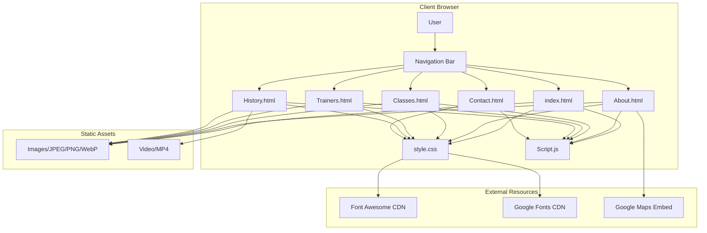
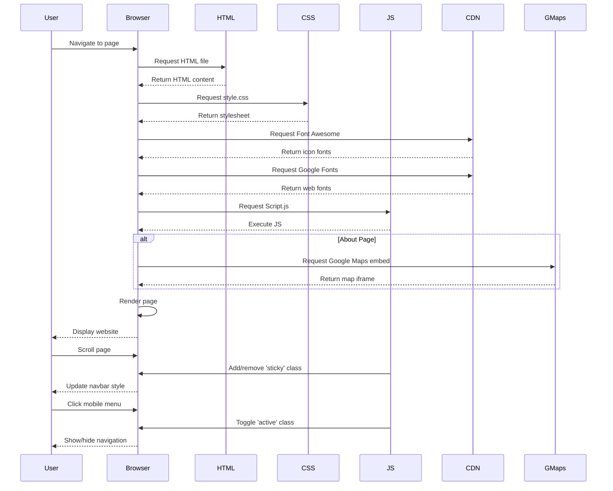

# SBG Doha MMA Gym Website

## Table of Contents

1. [Overview](#overview)
2. [Repo Use Cases](#repo-use-cases)
3. [High-Level Architecture](#high-level-architecture)
4. [Core Components](#core-components)
5. [Data Flow](#data-flow)
6. [Code Implementation](#code-implementation)
7. [Integration Points](#integration-points)
8. [Configuration](#configuration)
9. [Monitoring and Operations](#monitoring-and-operations)

## Overview

The SBG Doha website is a static, client-side marketing and information website for a mixed martial arts (MMA) and Brazilian Jiu-Jitsu (BJJ) gym located in Doha, Qatar. The website provides comprehensive information about the gym's classes, trainers, history, and contact details for prospective and current members.

The website is a standalone front-end application built with vanilla HTML5, CSS3, and JavaScript. It consists of six interconnected pages that present different aspects of the gym's offerings. According to the repository README and HTML comments, the website is deployed at `https://sbgdoha.netlify.app/` and was developed by students Abdelrahman Abdalla (C22323231) and Muhammad Zaid Irfan (C22499352).

**Key characteristics:**

- **Static Multi-Page Architecture**: Six HTML pages with shared navigation and styling
- **Responsive Design**: Mobile-first approach with media queries for various screen sizes
- **Client-Side Interactivity**: JavaScript-based navigation toggle and dynamic form population
- **Third-Party CDN Dependencies**: Font Awesome icons for social media and UI elements
- **Embedded Content**: Google Maps integration and promotional video content
- **Modern Styling**: Custom CSS with Google Fonts (Poppins, Nunito Sans) and CSS variables

## Repo Use Cases

### 1. Browse Gym Information
**Trigger**: User navigates to the website via browser
**Flow**: User lands on the home page (`index.html`) and can explore gym offerings through the navigation menu
**Components**: Navigation bar, home banner, footer with quick links
**Outcome**: User gains awareness of SBG Doha's martial arts programmes

### 2. Discover Available Classes
**Trigger**: User clicks "Join Now" on home page or navigates to Classes page
**Flow**: User views class cards displaying six different martial arts programmes (adult and kids kickboxing, BJJ, and crossfit) with schedules
**Components**: `Classes.html` page, `.frame` styled cards, class images
**Outcome**: User understands class offerings and training schedule

### 3. Learn About Trainers
**Trigger**: User navigates to Trainers section via main menu
**Flow**: User views trainer profiles with photos, credentials, and social media links
**Components**: `Trainers.html` page, trainer cards with biographical information
**Outcome**: User evaluates trainer experience and expertise

### 4. Submit Contact Enquiry
**Trigger**: User navigates to Contact page and completes form
**Flow**: User fills in name, email, country selection, and message; submits form
**Components**: `Contact.html` form, JavaScript country list population
**Outcome**: Form submission (note: actual backend processing is not evident in repository)

### 5. View Gym Location
**Trigger**: User navigates to About page
**Flow**: User reads gym description and views embedded Google Maps location
**Components**: `About.html` page, embedded iframe with Google Maps
**Outcome**: User locates gym's physical address in Doha

### 6. Explore Gym History and Achievements
**Trigger**: User navigates to History page
**Flow**: User views trophy list, trainer achievements table, and promotional video
**Components**: `History.html` page, structured content rows, HTML5 video element
**Outcome**: User understands gym's competitive pedigree and reputation

## High-Level Architecture



The architecture is a traditional static website pattern with no server-side processing evident in the repository. All six HTML pages share:

- **Common navigation structure**: Fixed navbar with logo and six menu items
- **Shared stylesheet**: Single `style.css` file with responsive breakpoints
- **Common JavaScript**: `Script.js` providing navigation toggle and form enhancement
- **Consistent footer**: Four-column footer with company links, help links, class links, and social media icons

**Architectural decisions visible in codebase:**

1. **No build process**: Plain HTML/CSS/JS without compilation or bundling
2. **Inline navigation structure**: Each page duplicates the navbar HTML rather than using a templating system
3. **CDN-based dependencies**: External libraries loaded via CDN rather than npm/package management
4. **Image co-location**: All images stored in repository root alongside HTML files
5. **Mobile-first responsive design**: Media queries at 900px, 767px, and 574px breakpoints

## Core Components

### 1. Navigation System

**Files**: All HTML files (lines 21-33), `style.css` (lines 21-75), `Script.js` (lines 2-14)

**Purpose**: Provides consistent site-wide navigation with responsive mobile menu

**Responsibilities**:
- Display logo and navigation links on desktop
- Transform into hamburger menu on mobile (<900px)
- Apply sticky behaviour on scroll
- Toggle mobile menu visibility via JavaScript

### 2. Home Page Hero Section

**Files**: `index.html` (lines 39-48), `style.css` (lines 77-159)

**Purpose**: Landing page call-to-action with prominent branding

**Responsibilities**:
- Display large hero banner with tagline "Get stronger with SBG DOHA"
- Provide "Join Now" button linking to Classes page
- Show background image with darkening filter

### 3. About Section

**Files**: `About.html` (lines 34-74), `style.css` (lines 202-243)

**Purpose**: Gym description and location information

**Responsibilities**:
- Present gym history (founded 2010) and offerings
- Display training facilities description
- Embed Google Maps iframe showing gym location
- Link to Classes page for more information

### 4. Classes Display

**Files**: `Classes.html` (lines 34-88), `style.css` (lines 247-283)

**Purpose**: Showcase six class types with schedules

**Responsibilities**:
- Display class cards in responsive grid layout
- Show class images with hover effects (brightness increase, zoom)
- List class names and weekly schedules
- Cover both adult and kids programmes

### 5. Trainer Profiles

**Files**: `Trainers.html` (lines 33-140), `style.css` (lines 284-367)

**Purpose**: Present coach credentials and experience

**Responsibilities**:
- Display five trainer profiles with photos
- Show grayscale images that become colour on hover
- List trainer achievements and experience
- Provide social media icon placeholders

### 6. History Timeline

**Files**: `History.html` (lines 33-137), `style.css` (lines 374-413)

**Purpose**: Document gym achievements and competitive history

**Responsibilities**:
- Display club trophies and accolades
- Show main coach achievements
- Present coach statistics in tabular format
- Embed promotional video

### 7. Contact Form

**Files**: `Contact.html` (lines 31-50), `style.css` (lines 414-477), `Script.js` (lines 15-26)

**Purpose**: Collect user enquiries

**Responsibilities**:
- Capture user name, email, country, and message
- Dynamically populate country dropdown from JavaScript array
- Validate required fields (HTML5 validation)
- Submit form (backend processing not evident)

### 8. Footer Component

**Files**: All HTML files (footer sections), `style.css` (lines 368-569)

**Purpose**: Provide site-wide secondary navigation and social links

**Responsibilities**:
- Display four columns: Company, Get Help, Classes, Follow Us
- Link to all major pages
- Show social media icons (Facebook, Twitter, Instagram, LinkedIn)
- Responsive collapse to 2 columns at 767px, 1 column at 574px

### 9. Responsive Utilities

**Files**: `style.css` (lines 589-696), `Script.js` (lines 2-5)

**Purpose**: Enable mobile-friendly experience

**Responsibilities**:
- Apply media queries for three breakpoints
- Implement sticky navbar on scroll
- Toggle mobile menu visibility
- Adjust typography and spacing for small screens

## Data Flow

### Page Load Sequence



### Contact Form Data Flow

When a user submits the contact form, the following flow occurs within the browser:

1. **Page Load**: `Contact.html` loads with empty country dropdown
2. **Form Initialisation**: `Script.js` lines 15-26 execute
   - Country list string is split into array
   - Each country is converted to `<option>` element
   - Options are appended to `#countries` select element
3. **User Input**: User fills form fields with HTML5 validation
4. **Form Submission**: User clicks "send" button
   - Browser validates required fields
   - Form submits (action/method not specified in HTML)
   - **Note**: Backend processing is not evident in repository

### Navigation State Flow

The navigation component maintains state through CSS classes:

1. **Initial State**: Navbar renders with `.navbar` class
2. **Scroll Event**: Window scroll listener fires (Script.js:2-5)
   - If `window.scrollY > 50`, adds `.sticky` class
   - CSS applies background colour, padding, and shadow changes
3. **Mobile Menu Toggle**: User clicks menu icon (Script.js:10-14)
   - Toggles `.active` class on menu container
   - Toggles `.active` class on `<ol>` menu list
   - CSS transforms menu from hidden to full-screen overlay

### Image Loading Flow

Images are loaded directly from the repository root via relative paths:

- Home banner: `background: url(./src/banner5.webp)` (style.css:95)
- Class images: `` pattern
- Trainer photos: `` pattern
- All images use `./src/` prefix despite files being in root directory (path mismatch observed)

**Note**: The CSS references `./src/banner5.webp` but the file listing shows `banner5.webp` in root directory, suggesting a potential path resolution issue or missing `src/` directory.

## Code Implementation

This section traces key implementation flows from entry points through to completion.

### Navigation Menu Toggle (Mobile)

**Entry Point**: User clicks on mobile menu icon

**File: `index.html:27`**
```html
<div class="navbar_container2" onclick="navToggle()">
  <ol>
    <li><a href="index.html">Home</a></li>
    <li><a href="About.html">About</a></li>
    <!-- ... more menu items ... -->
  </ol>
</div>
```

**Explanation**: The navigation container has an inline `onclick` handler that invokes the `navToggle()` JavaScript function when clicked. This pattern is repeated across all six HTML pages.

**File: `Script.js:7-14`**
```javascript
const togglebar = document.querySelector('.navbar_container2');
const menu = document.querySelector('ol');

function navToggle(){
  togglebar.classList.toggle("active");
  menu.classList.toggle("active");
};
```

**Explanation**: The `navToggle()` function selects both the container and the ordered list, then toggles the `active` class on each. This causes the CSS to apply transformation styles that show/hide the mobile menu overlay.

**File: `style.css:597-615`**
```css
.navbar ol{
    display: none;
}
.navbar ol.active{
    top: 60px;
    left: 0;
    width: 100%;
    display: flex;
    position: fixed;
    background: #222;
    align-items: center;
    justify-content: center;
    flex-direction: column;
    height: calc(100% - 60px);
}
```

**Explanation**: By default on mobile (<900px), the navigation list is hidden. When the `active` class is toggled on, the menu becomes a fixed full-screen overlay with centered vertical layout. This creates the mobile hamburger menu experience.

### Sticky Navbar on Scroll

**Entry Point**: User scrolls the page

**File: `Script.js:2-5`**
```javascript
window.addEventListener('scroll',function (){
    const navbar = document.querySelector('.navbar');
    navbar.classList.toggle("sticky", window.scrollY > 50);
});
```

**Explanation**: A scroll event listener checks the vertical scroll position. When scrolling exceeds 50 pixels, the `sticky` class is added to the navbar; scrolling back up removes it. This provides visual feedback that the user has scrolled down.

**File: `style.css:31-44`**
```css
.navbar.sticky{
    padding: 6px 60px;
    background: #000;
    box-shadow: 0 0 15px rgba(0,0,0,0.5) ;
}
.navbar.sticky .logo{
    font-size: 2em;
    color: #87CEFA ;
}
.navbar.sticky .logo b{
    color: #fff;
}
```

**Explanation**: When the `sticky` class is applied, the navbar receives reduced padding, a black background, and a drop shadow. The logo size is also reduced from 2.8em to 2em, and the colour scheme changes to light blue on white.

### Country Dropdown Population

**Entry Point**: Contact page loads

**File: `Contact.html:42`**
```html
<select id="countries" required>
  <option value="" selected disabled hidden>Select Country:</option>
</select>
```

**Explanation**: The select element is initially rendered with only a placeholder option. The `required` attribute ensures HTML5 validation will prevent submission without selection.

**File: `Script.js:15-26`**
```javascript
let countriesList = 'Afghanistan, Albania, Algeria, Andorra, Angola, Antigua & Deps, Argentina, Armenia, Australia, Austria, Azerbaijan, Bahamas, Bahrain, Bangladesh, Barbados, Belarus, Belgium, Belize, Benin, Bhutan, Bolivia, Bosnia Herzegovina, Botswana, Brazil, Brunei, Bulgaria, Burkina, Burundi, Cambodia, Cameroon, Canada, Cape Verde, Central African Rep, Chad, Chile, China, Colombia, Comoros, Congo, Congo (Democratic Rep), Costa Rica, Croatia, Cuba, Cyprus, Czech Republic, Denmark, Djibouti, Dominica, Dominican Republic, East Timor, Ecuador, Egypt, El Salvador, Equatorial Guinea, Eritrea, Estonia, Ethiopia, Fiji, Finland, France, Gabon, Gambia, Georgia, Germany, Ghana, Greece, Grenada, Guatemala, Guinea, Guinea-Bissau, Guyana, Haiti, Honduras, Hungary, Iceland, India, Indonesia, Iran, Iraq, Ireland (Republic Of), Israel, Italy, Ivory Coast, Jamaica, Japan, Jordan, Kazakhstan, Kenya, Kiribati, Korea North, Korea South, Kosovo, Kuwait, Kyrgyzstan, Laos, Latvia, Lebanon, Lesotho, Liberia, Libya, Liechtenstein, Lithuania, Luxembourg, Macedonia, Madagascar, Malawi, Malaysia, Maldives, Mali, Malta, Marshall Islands, Mauritania, Mauritius, Mexico, Micronesia, Moldova, Monaco, Mongolia, Montenegro, Morocco, Mozambique, Myanmar, (Burma), Namibia, Nauru, Nepal, Netherlands, New Zealand, Nicaragua, Niger, Nigeria, Norway, Oman, Pakistan, Palau, Panama, Papua New Guinea, Paraguay, Peru, Philippines, Poland, Portugal, Qatar, Romania, Russian Federation, Rwanda, St Kitts & Nevis, St Lucia, Saint Vincent & the Grenadines, Samoa, San Marino, Sao Tome & Principe, Saudi Arabia, Senegal, Serbia, Seychelles, Sierra Leone, Singapore, Slovakia, Slovenia, Solomon Islands, Somalia, South Africa, South Sudan, Spain, Sri Lanka, Sudan, Suriname, Swaziland, Sweden, Switzerland, Syria, Taiwan, Tajikistan, Tanzania, Thailand, Togo, Tonga, Trinidad & Tobago, Tunisia, Turkey, Turkmenistan, Tuvalu, Uganda, Ukraine, United Arab Emirates, United Kingdom, United States, Uruguay, Uzbekistan, Vanuatu, Vatican City, Venezuela, Vietnam, Yemen, Zambia, Zimbabwe'
countriesList = countriesList.split(', ')

let countriesSelect = document.querySelector('select#countries')

countriesList.forEach(element => {
    let option = document.createElement('option')
    option.value = element
    option.textContent = element

    countriesSelect.appendChild(option)
});
```

**Explanation**: On page load, the script defines a comprehensive comma-separated string of 196 countries. It splits this string into an array, then iterates through each country. For each iteration, it creates a new `<option>` element, sets both the value and display text to the country name, and appends it to the select dropdown. This provides a complete country selection without hardcoding hundreds of HTML option tags.

### Responsive Image Hover Effects

**Entry Point**: User hovers over a class or trainer image

**File: `Classes.html:41-43`**
```html
<div class="frame">
  <div class="box">
    
  </div>
  <div class="title">kickboxing</div>
  <p>Monday to Friday at 5pm</p>
</div>
```

**Explanation**: Each class is structured as a `.frame` container with an inner `.box` holding the image, followed by title and schedule text. This consistent structure enables uniform styling and hover effects.

**File: `style.css:259-276`**
```css
.Classes .content .frame .box{
    position: relative;
    height: 200px;
    width: 100%;
    overflow: hidden;
}
.Classes .content .frame .box img{
    position: absolute;
    height: 100%;
    width: 100%;
    object-fit: cover;
    filter: brightness(80%);
    transition: 0.2s ease-in;
}
.Classes .content .frame .box:hover img{
    filter: brightness(100%);
    transform: scale(1.08);
}
```

**Explanation**: The box container uses `overflow: hidden` to clip the image during zoom. The image is initially dimmed to 80% brightness. On hover, the brightness increases to 100% and the image scales to 108%, creating a zoom effect. The `transition` property provides smooth animation over 0.2 seconds. The `object-fit: cover` ensures images fill the container regardless of aspect ratio.

**File: `style.css:302-315`** (Trainers variant)
```css
.Trainers .content .frame .box img{
    position: absolute;
    height: auto;
    width: 100%;
    filter: grayscale(1);
    object-fit: cover;
    transition: 0.2s ease-in;
}
.Trainers .content .frame .box:hover img{
    filter: grayscale(0);
    transform: scale(1.08);
}
```

**Explanation**: Trainer images use a similar hover effect but with grayscale conversion instead of brightness adjustment. Images are fully grayscale (`filter: grayscale(1)`) by default and become full colour on hover (`grayscale(0)`), combined with the same 1.08 zoom effect.

### Form Validation and Submission

**Entry Point**: User clicks "send" button after filling form

**File: `Contact.html:39-47`**
```html
<form>
    <input type="text" placeholder="User" required>
    <input type="email" placeholder="Email" required>
    <select id="countries" required>
      <option value="" selected disabled hidden>Select Country:</option>
    </select>
    <textarea rows="5" placeholder="What's on your mind" required></textarea>
    <br>
    <input type="submit" value="send" class="btn">
</form>
```

**Explanation**: The form uses HTML5 validation attributes (`required` on all inputs, `type="email"` for email validation). When the submit button is clicked, the browser performs built-in validation. If any field is empty or the email format is invalid, the browser displays a validation message and prevents submission.

**Important note**: The form element has no `action` or `method` attributes defined. This means submission will reload the current page by default. No backend processing, AJAX submission, or form handling logic is present in the repository. The form provides client-side validation but does not actually transmit data to a server.

### Google Maps Embed Integration

**Entry Point**: User navigates to About page

**File: `About.html:65-73`**
```html
<iframe
  src="https://www.google.com/maps/embed?pb=!1m14!1m8!1m3!1d207541.28470808643!2d51.323722977751!3d25.292556004834783!3m2!1i1024!2i768!4f13.1!3m3!1m2!1s0x0%3A0x23085b3e7ba39b44!2sQatar%20MMA!5e0!3m2!1sen!2sie!4v1671114199880!5m2!1sen!2sie"
  width="600"
  height="450"
  style="border: 0"
  allowfullscreen=""
  loading="lazy"
  referrerpolicy="no-referrer-when-downgrade"
></iframe>
```

**Explanation**: The Google Maps embed is loaded via iframe with coordinates embedded in the URL query string. The `loading="lazy"` attribute defers loading until the iframe is near the viewport, improving initial page load performance. The `referrerpolicy="no-referrer-when-downgrade"` ensures the referring page URL is sent to Google over HTTPS. The map displays the location of "Qatar MMA" in Doha.

**File: `About.html:232-235`** (CSS for iframe)
```css
.About iframe{
    display: block;
    margin: 20px auto;
}
```

**Explanation**: The iframe is styled as a block element with automatic horizontal centering, appearing below the gym description text.

### Video Playback Component

**Entry Point**: User navigates to History page

**File: `History.html:124-130`**
```html
<div class="video">
 <video width="400" controls>
  <source src="./src/WhatsApp Video 2022-12-13 at 4.10.45 PM.mp4" type="video/mp4">
  <source src="./src/WhatsApp Video 2022-12-13 at 4.10.45 PM.mp4" type="video/ogg">
  Your browser does not support HTML video.
 </video>
</div>
```

**Explanation**: The HTML5 video element provides native video playback with browser controls. Two source elements are provided for fallback, though both reference the same MP4 file (the second source's `type="video/ogg"` appears to be incorrect). The fallback text displays for browsers without HTML5 video support. The video file appears to be promotional content featuring coach Kieran Davern.

**File: `style.css:585-588`**
```css
.video{
    text-align: center;
    height: 50%;
}
```

**Explanation**: The video container centres the video element horizontally and sets the container height to 50% of its parent.

### Responsive Breakpoint Implementation

**Entry Point**: Browser viewport width changes

**File: `style.css:589-696`**
```css
@media screen and (max-width: 900px){
    .navbar{
        padding: 0 60px;
    }
    .navbar ol{
        display: none;
    }
    .navbar ol.active{
        top: 60px;
        left: 0;
        width: 100%;
        display: flex;
        position: fixed;
        background: #222;
        align-items: center;
        justify-content: center;
        flex-direction: column;
        height: calc(100% - 60px);
    }
    /* ... additional responsive styles ... */
}
```

**Explanation**: The primary breakpoint at 900px transforms the navigation from horizontal desktop layout to mobile hamburger menu. The navigation list is hidden by default (`display: none`) and only becomes visible when the `active` class is added via JavaScript. This media query also adjusts navbar padding, hero text sizes, and component dimensions for tablet and mobile devices.

**File: `style.css:559-569`** (Footer responsive breakpoints)
```css
@media(max-width: 767px){
  .footer-col{
    width: 50%;
    margin-bottom: 30px;
  }
}
@media(max-width: 574px){
  .footer-col{
    width: 100%;
  }
}
```

**Explanation**: The footer implements two additional breakpoints. At 767px, the four-column layout collapses to two columns (50% width each). At 574px, the layout becomes a single column (100% width). This progressive enhancement ensures footer content remains readable on all device sizes.

## Integration Points

### 1. Font Awesome CDN

**Integration**: CSS icon library loaded via CDN

**File: `index.html:14-22`**
```html
<link
  rel="stylesheet"
  href="https://cdnjs.cloudflare.com/ajax/libs/font-awesome/4.7.0/css/font-awesome.min.css"
/>
<link
  rel="stylesheet"
  type="text/css"
  href="https://cdnjs.cloudflare.com/ajax/libs/font-awesome/5.15.1/css/all.min.css"
/>
```

**Usage**: Social media icons in footer and trainer profile sections. The website loads both Font Awesome 4.7.0 and 5.15.1, suggesting version inconsistency. Icons used include:
- `fab fa-facebook-f`
- `fab fa-twitter`
- `fab fa-instagram`
- `fab fa-linkedin-in`

**Location in code**: Footer sections across all HTML files (e.g., `index.html:82-86`), Trainer headline icons (`Trainers.html:46-50`)

### 2. Google Fonts

**Integration**: Web typography loaded via CDN

**File: `style.css:1-2`**
```css
@import url('https://fonts.googleapis.com/css2?family=Nunito+Sans:wght@200;300;400;600&display=swap');
@import url('https://fonts.googleapis.com/css2?family=Poppins:wght@300;400;500;600;700&display=swap');
```

**Usage**: Poppins is the primary font family applied globally (`font-family: 'Poppins',sans-serif`). Nunito Sans is imported but not visibly used in the stylesheet, suggesting it may be vestigial from earlier development.

### 3. Google Maps Embed API

**Integration**: Embedded map iframe showing gym location

**File**: `About.html:65-73` (detailed in Code Implementation section)

**Usage**: Displays interactive map pinpointing "Qatar MMA" in Doha at coordinates approximately 25.29°N, 51.32°E. The embed URL includes parameters for zoom level, map type, and locale (English, Ireland).

**Data flow**: One-way embed from Google to client browser; no data sent from website to Google beyond standard referrer information.

### 4. Netlify Hosting

**Integration**: Website deployment platform (inferred from URL in HTML comments)

**Evidence**: `index.html:4` comments state "website can be found at https://sbgdoha.netlify.app/"

**Deployment**: No build configuration files (e.g., `netlify.toml`) are present in the repository, suggesting deployment uses Netlify defaults for static sites (serving files as-is from repository root).

### 5. Git Version Control

**Integration**: Repository hosted on GitHub (inferred from README image URLs)

**Evidence**: `README.md:5-9` contains GitHub-hosted screenshot URLs in the format `https://github.com/tboody/SBG-Doha-website/assets/73035492/...`

**Repository URL**: `https://github.com/tboody/SBG-Doha-website` (inferred from image URLs)

### No Backend Integration

**Important**: No server-side processing, database connections, API calls, authentication systems, or data persistence mechanisms are evident in the repository. The contact form does not submit to any backend service. All functionality is client-side only.

## Configuration

### CSS Custom Properties

**File: `style.css:13-16`**
```css
:root{
    --prime: #00ff34;
}
```

**Purpose**: Defines a CSS variable for the primary brand colour. However, this variable is not referenced elsewhere in the stylesheet. The actual primary colour used throughout the site is `#87CEFA` (light blue/sky blue), applied directly via colour values rather than the custom property.

### Colour Scheme

**Primary colours** (hardcoded in `style.css`):
- Brand accent: `#87CEFA` (light blue) - used for logo, headings, buttons, links
- Background: `#131b2b` (dark navy) - page background
- Card background: `#222` (dark grey) - used for class cards, trainer cards, mobile menu
- Text: `#fff` (white) - primary text colour
- Secondary text: `#d7d7d7`, `#bbbbbb` (light greys)

### Responsive Breakpoints

Configured in `style.css:589-696`:

1. **900px**: Primary mobile breakpoint - enables hamburger menu, hides desktop navigation
2. **767px**: Tablet breakpoint - footer collapses to two columns
3. **574px**: Small mobile breakpoint - footer becomes single column, further typography adjustments

### Typography Settings

**Font families**:
- Primary: `'Poppins', sans-serif`
- Secondary (unused): `'Nunito Sans'`

**Font weights used**:
- Poppins: 300 (light), 400 (regular), 500 (medium), 600 (semi-bold), 700 (bold)
- Nunito Sans: 200, 300, 400, 600 (imported but not applied)

### Navigation Behaviour

**Scroll threshold** (`Script.js:4`): `window.scrollY > 50`
- Navbar becomes sticky when user scrolls more than 50 pixels vertically

### Form Configuration

**Country list** (`Script.js:15`): Hardcoded string of 196 countries, split into array on page load

**Validation**: HTML5 `required` attributes on all form fields, `type="email"` for email field

**Submission behaviour**: No action/method configured - defaults to page reload with no data transmission

### Image Paths

**Asset directory reference**: All image paths use `./src/` prefix (e.g., `./src/banner5.webp`, `./src/classes2.jpeg`)

**Actual file location**: Files appear to be in repository root based on directory listing

**Potential configuration issue**: Path mismatch may cause image loading failures unless a `src/` directory exists with symlinks or duplicates

### Video Configuration

**Video file**: `./src/WhatsApp Video 2022-12-13 at 4.10.45 PM.mp4`
**Dimensions**: `width="400"` (height auto-calculated)
**Controls**: Native browser controls enabled

### Environment-Specific Configuration

No environment-based configuration (development vs. production) is evident. All resource URLs, paths, and settings are hardcoded in source files.

## Monitoring and Operations

### Logging

No application-level logging, error tracking, or analytics integration is evident in the repository. The website does not implement:

- Console logging for debugging
- Error event listeners
- Analytics tracking (Google Analytics, Matomo, etc.)
- Performance monitoring

### Error Handling

**Client-side error handling**: Not evident in JavaScript files. No try-catch blocks, error event listeners, or fallback mechanisms are implemented.

**Form validation errors**: Handled by browser's native HTML5 validation (automatic display of validation messages for required fields and email format)

**Image loading failures**: No fallback handling. If images fail to load, broken image icons will display.

**Video loading failures**: Fallback text "Your browser does not support HTML video." displays for unsupported browsers (`History.html:128`)

### Performance Considerations

**Lazy loading**: Google Maps iframe uses `loading="lazy"` attribute (`About.html:71`) to defer loading until near viewport

**Image optimisation**: No evidence of responsive images (srcset), progressive JPEGs, or WebP conversion (though one banner uses WebP format: `banner5.webp`)

**CSS/JS minification**: Not evident - files use unminified, formatted code

**Caching headers**: Not configurable from repository - dependent on hosting provider (Netlify) defaults

### Browser Compatibility

**HTML5 features used**:
- `<video>` element with controls
- `<iframe>` with lazy loading attribute
- HTML5 form validation (required, type="email")
- CSS3 transforms, transitions, media queries, flexbox

**Vendor prefixes**: Not used - relies on modern browser support

**Fallback mechanisms**:
- Video fallback text for non-HTML5 browsers
- Sans-serif font stack fallback if Google Fonts fail to load
- FontAwesome icon fallbacks not implemented (will show empty space if CDN fails)

### Operational Health Checks

No health check endpoints, status pages, or monitoring hooks are present. The website has no server-side component to monitor.

### Deployment

**Hosting**: Netlify (inferred from URL)

**Build process**: None evident - static file serving from repository

**Deployment triggers**: Not evident from repository - likely configured in Netlify dashboard

### Accessibility

**Alt text**: Present on most images (e.g., `alt=" a picture of two fighters doing kickboxing"` in `Classes.html:42`)

**Semantic HTML**: Partial usage - uses `<section>`, `<nav>`, `<footer>` but navigation is implemented with `<ol>` instead of `<nav><ul>`

**Keyboard navigation**: Standard browser behaviour - no custom focus management

**ARIA labels**: Not implemented

**Colour contrast**: Dark background (#131b2b) with white text meets WCAG contrast requirements; light blue (#87CEFA) on dark background also meets standards

### Known Operational Concerns

1. **Broken form submission**: Contact form has no backend endpoint or JavaScript handler - submissions will reload page without capturing data
2. **Image path inconsistency**: CSS/HTML reference `./src/` directory that may not exist based on file listing
3. **Duplicate Font Awesome versions**: Loading both v4.7.0 and v5.15.1 increases page weight unnecessarily
4. **Unused CSS variable**: `--prime` colour variable defined but never used
5. **Unused Google Font**: Nunito Sans imported but not applied
6. **No HTTPS enforcement**: No redirect configuration evident (dependent on hosting provider)
7. **Social media links non-functional**: All social links point to `#` placeholder
8. **Video file size**: 5MB MP4 file in repository may cause slow loading on mobile connections
